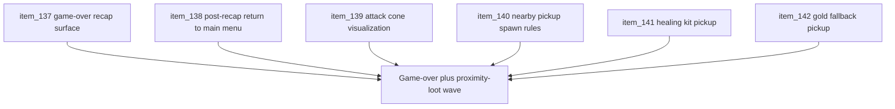

## task_040_orchestrate_game_over_recap_and_proximity_loot_wave - Orchestrate game-over recap and proximity-loot wave
> From version: 0.2.3
> Status: Draft
> Understanding: 100%
> Confidence: 97%
> Progress: 0%
> Complexity: High
> Theme: Gameplay
> Reminder: Update status/understanding/confidence/progress and dependencies/references when you edit this doc.

# Context
- Derived from backlog items `item_137_define_a_game_over_recap_surface_for_defeated_runs`, `item_138_define_post_recap_return_to_main_menu_and_reentry_options`, `item_139_define_a_player_attack_cone_visualization_aligned_with_runtime_combat_geometry`, `item_140_define_nearby_pickup_spawn_rules_around_the_player`, `item_141_define_a_first_healing_kit_pickup_that_restores_25_percent_health`, and `item_142_define_gold_as_the_default_fallback_pickup_and_first_runtime_currency_counter`.
- Related request(s): `req_037_define_a_game_over_recap_flow_and_player_attack_cone_visualization`, `req_038_define_a_first_proximity_loot_spawn_wave_with_healing_kits_and_gold`.
- The repository now has the first hostile combat loop and defeat routing, but the failure surface still needs a product-grade recap while the live world still lacks a first pickup/recovery loop.
- This orchestration task groups the next survival loop wave so defeat closure, post-defeat re-entry, attack readability, and nearby pickups land as one coherent gameplay/product step instead of disconnected slices.

# Dependencies
- Blocking: `task_036_orchestrate_main_menu_new_game_and_character_name_entry_wave`, `task_037_orchestrate_single_slot_persistence_and_pseudo_physics_foundations`, `task_039_orchestrate_the_first_hostile_combat_loop_wave`.
- Unblocks: first readable game-over loop, post-defeat replay flow, first nearby reward/recovery loop, and follow-up work around drops, economy, or richer combat feedback.

# Plan
- [ ] 1. Define and implement a shell-owned `Game over` recap surface for defeated runs with bounded first-slice summary data.
- [ ] 2. Define and implement post-recap routing back to `Main menu`, with clear re-entry options around `Load game` and `Start new game`.
- [ ] 3. Define and implement a player attack-cone visualization aligned with the real combat geometry and bounded display timing.
- [ ] 4. Define and implement nearby pickup spawn rules around the player, respecting local caps, safe spawn distance, and traversable world space.
- [ ] 5. Define and implement a first healing-kit pickup that restores `25%` of player max health with a max-health clamp.
- [ ] 6. Define and implement gold as the default fallback pickup plus a first runtime currency counter or count posture.
- [ ] 7. Validate the resulting loop end to end so defeat, re-entry, and nearby pickups all behave coherently.
- [ ] 8. Update linked requests, backlog, task, and supporting notes so the wave remains traceable.
- [ ] FINAL: Create dedicated git commit(s) for this orchestration scope.

# Links
- Backlog item(s): `item_137_define_a_game_over_recap_surface_for_defeated_runs`, `item_138_define_post_recap_return_to_main_menu_and_reentry_options`, `item_139_define_a_player_attack_cone_visualization_aligned_with_runtime_combat_geometry`, `item_140_define_nearby_pickup_spawn_rules_around_the_player`, `item_141_define_a_first_healing_kit_pickup_that_restores_25_percent_health`, `item_142_define_gold_as_the_default_fallback_pickup_and_first_runtime_currency_counter`
- Request(s): `req_037_define_a_game_over_recap_flow_and_player_attack_cone_visualization`, `req_038_define_a_first_proximity_loot_spawn_wave_with_healing_kits_and_gold`

# Validation
- `npm run ci`
- `npm run test:browser:smoke`
- `python3 logics/skills/logics-doc-linter/scripts/logics_lint.py`

# Definition of Done (DoD)
- [ ] Covered backlog items are implemented or explicitly split further with updated traceability.
- [ ] Defeat resolves through a readable game-over recap and returns cleanly to `Main menu`.
- [ ] The player’s attack cone is visually readable in runtime and aligned with the actual combat geometry.
- [ ] Nearby pickups can appear near the player without spawning inside blocked space or directly on top of the player.
- [ ] Healing kits and gold both work inside the first pickup loop with bounded behavior.
- [ ] Linked requests, backlog, and task docs are updated with proofs and status.
- [ ] Dedicated git commit(s) have been created for the completed orchestration scope.
- [ ] Status is `Done` and progress is `100%`.
