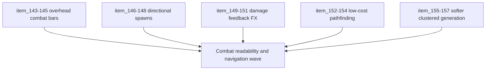

## task_041_orchestrate_combat_readability_spawn_direction_pathfinding_and_map_generation_wave - Orchestrate combat readability, spawn direction, pathfinding, and map-generation wave
> From version: 0.2.3
> Status: Done
> Understanding: 100%
> Confidence: 100%
> Progress: 100%
> Complexity: High
> Theme: Gameplay
> Reminder: Update status/understanding/confidence/progress and dependencies/references when you edit this doc.

# Context
- Derived from backlog items `item_143_define_overhead_health_bars_for_runtime_combatants`, `item_144_define_overhead_attack_charge_bars_for_runtime_combatants`, `item_145_define_world_space_layout_rules_for_stacked_combat_bars_above_entities`, `item_146_define_forward_biased_spawn_sampling_for_moving_player_states`, `item_147_define_fallback_spawn_sector_rules_when_preferred_forward_positions_fail`, `item_148_define_neutral_spawn_behavior_when_player_motion_is_not_meaningful`, `item_149_define_a_first_hit_reaction_fx_posture_for_damaged_runtime_combatants`, `item_150_define_floating_damage_numbers_above_damaged_entities`, `item_151_define_upward_fade_and_cleanup_rules_for_damage_number_lifetimes`, `item_152_define_a_bounded_obstacle_aware_route_finding_posture_for_hostile_pursuit`, `item_153_define_low_cost_search_and_refresh_rules_for_runtime_entity_pathfinding`, `item_154_define_direct_pursuit_fallback_and_waypoint_following_integration_for_hostiles`, `item_155_define_a_reduced_wall_generation_density_for_runtime_world_chunks`, `item_156_define_a_reduced_surface_modifier_generation_density_for_runtime_world_chunks`, and `item_157_define_blob_like_clustering_rules_for_obstacles_and_surface_modifier_patches`.
- Related request(s): `req_039_define_overhead_health_and_attack_charge_bars_for_runtime_combatants`, `req_040_define_directionally_biased_hostile_spawns_ahead_of_player_movement`, `req_041_define_damage_reaction_fx_and_floating_damage_numbers_for_runtime_combat`, `req_042_define_a_low_cost_first_pathfinding_slice_for_runtime_entities`, `req_043_define_a_softer_and_more_clustered_blocking_and_surface_generation_posture`.
- This orchestration task groups the next runtime wave so combat readability, spawn direction, hostile navigation, and softer world generation land as one coherent improvement instead of disconnected slices.

# Dependencies
- Blocking: `task_039_orchestrate_the_first_hostile_combat_loop_wave`, `task_040_orchestrate_game_over_recap_and_proximity_loot_wave`.
- Unblocks: richer combat feedback, smarter hostile pursuit, more intentional spawn pressure, and cleaner generated traversal space.

# Plan
- [x] 1. Define and implement overhead health bars, attack-charge bars, and stacked layout rules for combatants.
- [x] 2. Define and implement forward-biased hostile spawning with bounded side/rear fallback and neutral low-motion behavior.
- [x] 3. Define and implement first damage-reaction FX and floating damage numbers with upward fade/cleanup behavior.
- [x] 4. Define and implement a low-cost hostile pathfinding slice with bounded search, refresh rules, and pursuit fallback integration.
- [x] 5. Define and implement softer world generation with reduced obstacle/modifier density and blob-like clustering.
- [x] 6. Validate the resulting runtime end to end so readability, navigation, and traversal remain coherent and performant.
- [x] 7. Update linked requests, backlog, task, and supporting notes so the wave remains traceable.
- [x] FINAL: Create dedicated git commit(s) for this orchestration scope.

# Links
- Backlog item(s): `item_143_define_overhead_health_bars_for_runtime_combatants`, `item_144_define_overhead_attack_charge_bars_for_runtime_combatants`, `item_145_define_world_space_layout_rules_for_stacked_combat_bars_above_entities`, `item_146_define_forward_biased_spawn_sampling_for_moving_player_states`, `item_147_define_fallback_spawn_sector_rules_when_preferred_forward_positions_fail`, `item_148_define_neutral_spawn_behavior_when_player_motion_is_not_meaningful`, `item_149_define_a_first_hit_reaction_fx_posture_for_damaged_runtime_combatants`, `item_150_define_floating_damage_numbers_above_damaged_entities`, `item_151_define_upward_fade_and_cleanup_rules_for_damage_number_lifetimes`, `item_152_define_a_bounded_obstacle_aware_route_finding_posture_for_hostile_pursuit`, `item_153_define_low_cost_search_and_refresh_rules_for_runtime_entity_pathfinding`, `item_154_define_direct_pursuit_fallback_and_waypoint_following_integration_for_hostiles`, `item_155_define_a_reduced_wall_generation_density_for_runtime_world_chunks`, `item_156_define_a_reduced_surface_modifier_generation_density_for_runtime_world_chunks`, `item_157_define_blob_like_clustering_rules_for_obstacles_and_surface_modifier_patches`
- Request(s): `req_039_define_overhead_health_and_attack_charge_bars_for_runtime_combatants`, `req_040_define_directionally_biased_hostile_spawns_ahead_of_player_movement`, `req_041_define_damage_reaction_fx_and_floating_damage_numbers_for_runtime_combat`, `req_042_define_a_low_cost_first_pathfinding_slice_for_runtime_entities`, `req_043_define_a_softer_and_more_clustered_blocking_and_surface_generation_posture`

# Validation
- `npm run ci`
- `npm run test:browser:smoke`
- `python3 logics/skills/logics-doc-linter/scripts/logics_lint.py`

# Implementation notes
- `a27102c` introduced the gameplay/runtime wave:
  - overhead health and charge bars for player and hostile combatants
  - damage hit pulses plus floating damage numbers with upward fade/cleanup
  - forward-biased hostile spawn sectors using movement intent, heading memory, and safe fallback sectors
  - bounded tile-based hostile pathfinding that activates when direct pursuit is blocked
  - softer obstacle and modifier generation with more compact clustered patches

# Definition of Done (DoD)
- [x] Covered backlog items are implemented or explicitly split further with updated traceability.
- [x] Combatants expose readable overhead bars and hit feedback in runtime.
- [x] Hostile spawns bias forward when the player is moving without breaking spawn safety.
- [x] Hostiles route around blocked spaces through a bounded low-cost pathfinding posture.
- [x] Map generation is softer and more clustered while remaining deterministic and playable.
- [x] Linked requests, backlog, and task docs are updated with proofs and status.
- [x] Dedicated git commit(s) have been created for the completed orchestration scope.
- [x] Status is `Done` and progress is `100%`.
