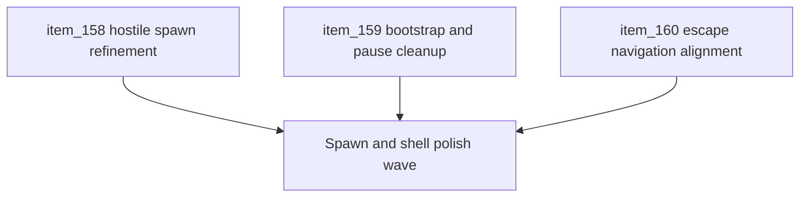

## task_042_orchestrate_spawn_bootstrap_pause_and_escape_polish_wave - Orchestrate spawn, bootstrap, pause, and escape polish wave
> From version: 0.2.3
> Status: Draft
> Understanding: 100%
> Confidence: 98%
> Progress: 0%
> Complexity: High
> Theme: Gameplay
> Reminder: Update status/understanding/confidence/progress and dependencies/references when you edit this doc.

# Context
- Derived from backlog items `item_158_refine_forward_biased_hostile_spawns_and_increase_spawn_distance`, `item_159_remove_fake_bootstrap_entities_and_pause_overlay_surface`, and `item_160_align_escape_navigation_with_visible_back_and_resume_actions`.
- Related request(s): `req_044_refine_spawn_bootstrap_pause_surface_and_escape_navigation_behaviors`.
- The repository now has first-pass hostile spawning, shell-owned pause/settings/main-menu flows, and command-deck submenu navigation, but several product-facing rough edges remain in spawn feel, pause presentation, runtime bootstrap cleanliness, and `Escape` navigation.
- This orchestration task groups these fixes as one focused polish wave so runtime entry, pressure readability, and shell navigation improve together.

# Dependencies
- Blocking: `task_041_orchestrate_combat_readability_spawn_direction_pathfinding_and_map_generation_wave`.
- Unblocks: tighter spawn feel, cleaner runtime startup presentation, lighter pause handling, and more predictable keyboard shell navigation.

# Plan
- [ ] 1. Define and implement refined forward-biased hostile spawning with increased spawn distance.
- [ ] 2. Define and implement removal of fake/bootstrap entities from normal player-facing runtime presentation.
- [ ] 3. Define and implement removal of the dedicated `Runtime paused` panel while preserving pause ownership.
- [ ] 4. Define and implement `Escape` behavior that mirrors visible `Back` actions and available `Resume runtime` actions.
- [ ] 5. Validate the resulting runtime and shell behavior end to end so spawning, pause, and keyboard navigation remain coherent.
- [ ] 6. Update linked requests, backlog, task, and supporting notes so the wave remains traceable.
- [ ] FINAL: Create dedicated git commit(s) for this orchestration scope.

# Links
- Backlog item(s): `item_158_refine_forward_biased_hostile_spawns_and_increase_spawn_distance`, `item_159_remove_fake_bootstrap_entities_and_pause_overlay_surface`, `item_160_align_escape_navigation_with_visible_back_and_resume_actions`
- Request(s): `req_044_refine_spawn_bootstrap_pause_surface_and_escape_navigation_behaviors`

# Validation
- `npm run ci`
- `npm run test:browser:smoke`
- `python3 logics/skills/logics-doc-linter/scripts/logics_lint.py`

# Definition of Done (DoD)
- [ ] Covered backlog items are implemented or explicitly split further with updated traceability.
- [ ] Hostile spawns feel correctly front-biased and appear farther out when the player is moving.
- [ ] Fake/bootstrap runtime entities no longer pollute the normal player-facing start state.
- [ ] Pause no longer renders a dedicated `Runtime paused` panel.
- [ ] `Escape` mirrors visible `Back` and `Resume runtime` actions without bypassing local input/capture handling.
- [ ] Linked requests, backlog, and task docs are updated with proofs and status.
- [ ] Dedicated git commit(s) have been created for the completed orchestration scope.
- [ ] Status is `Done` and progress is `100%`.
