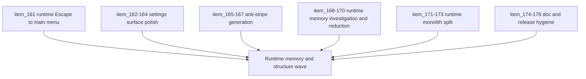

## task_043_orchestrate_runtime_memory_structure_generation_and_settings_polish_wave - Orchestrate runtime memory, structure, generation, and settings polish wave
> From version: 0.2.3
> Status: Draft
> Understanding: 99%
> Confidence: 95%
> Progress: 0%
> Complexity: High
> Theme: Tech Debt
> Reminder: Update status/understanding/confidence/progress and dependencies/references when you edit this doc.

# Context
- Derived from backlog items `item_161_define_escape_from_live_runtime_to_main_menu_with_session_preservation`, `item_162_define_clearer_movement_and_camera_grouping_inside_desktop_controls_settings`, `item_163_define_a_denser_binding_row_posture_for_desktop_controls_settings`, `item_164_define_a_clearer_action_hierarchy_between_apply_reset_revert_and_back_navigation`, `item_165_define_an_anti_stripe_generation_posture_for_special_tiles`, `item_166_define_blob_first_sampling_rules_for_non_base_tile_clusters`, `item_167_define_runtime_safe_deterministic_sampling_that_reduces_visible_column_artifacts`, `item_168_profile_runtime_memory_growth_during_normal_play_sessions`, `item_169_reduce_world_render_preparation_churn_and_retained_chunk_data`, `item_170_reduce_entity_overlay_and_pixi_render_allocation_pressure`, `item_171_extract_runtime_spawn_logic_out_of_entity_simulation`, `item_172_extract_runtime_combat_and_damage_resolution_out_of_entity_simulation`, `item_173_extract_runtime_pathfinding_pickups_and_presentation_state_out_of_entity_simulation`, `item_174_synchronize_readme_and_release_facing_repository_status`, `item_175_clean_up_request_and_task_status_drift_in_recent_waves`, and `item_176_define_lightweight_logics_navigation_and_hygiene_rules_for_the_growing_corpus`.
- Related request(s): `req_044_refine_spawn_bootstrap_pause_surface_and_escape_navigation_behaviors`, `req_045_define_a_clearer_and_more_compact_desktop_controls_settings_surface`, `req_046_define_a_non_linear_tile_generation_posture_that_avoids_stripes_and_columns`, `req_047_define_a_runtime_memory_growth_investigation_and_reduction_wave`, `req_048_define_a_structural_runtime_refactor_wave_to_split_the_entity_simulation_monolith`, and `req_049_define_a_documentation_release_and_logics_hygiene_wave_for_repository_coherence`.
- The repository now has a broader playable runtime, but the next wave needs to stabilize memory/performance, reduce the structural risk of the runtime monolith, improve map-generation readability, polish the settings surface, finish the reopened `Escape -> Main menu` behavior, and clean the growing documentation corpus.
- This orchestration groups these efforts so the project improves along product, technical, and operational axes without letting the runtime structure or doc hygiene drift further.

# Dependencies
- Blocking: `task_042_orchestrate_spawn_bootstrap_pause_and_escape_polish_wave`.
- Unblocks: runtime memory investigation and reduction, safer runtime feature work through refactoring, cleaner world generation readability, more legible settings UX, and stronger documentation/release coherence.

# Plan
- [ ] 1. Define and implement the remaining `Escape -> Main menu` behavior from live runtime while preserving shell priority rules.
- [ ] 2. Define and implement the `Desktop controls` settings polish wave with clearer grouping, denser rows, and a sharper action hierarchy.
- [ ] 3. Define and implement anti-stripe tile generation so special tiles form more clustered, non-linear patches.
- [ ] 4. Profile runtime memory growth and identify whether the dominant cost comes from retained heap, render churn, or Pixi/canvas resources.
- [ ] 5. Define and implement world-render and entity-overlay reductions that materially lower runtime memory pressure.
- [ ] 6. Refactor `entitySimulation` by extracting spawn, combat, pathfinding, pickup, and presentation responsibilities into narrower runtime modules.
- [ ] 7. Synchronize README/release-facing docs and clean recent request/task/logics hygiene drift.
- [ ] 8. Validate runtime behavior, browser memory posture, shell UX, and docs traceability end to end.
- [ ] FINAL: Create dedicated git commit(s) for this orchestration scope.

# Links
- Backlog item(s): `item_161_define_escape_from_live_runtime_to_main_menu_with_session_preservation`, `item_162_define_clearer_movement_and_camera_grouping_inside_desktop_controls_settings`, `item_163_define_a_denser_binding_row_posture_for_desktop_controls_settings`, `item_164_define_a_clearer_action_hierarchy_between_apply_reset_revert_and_back_navigation`, `item_165_define_an_anti_stripe_generation_posture_for_special_tiles`, `item_166_define_blob_first_sampling_rules_for_non_base_tile_clusters`, `item_167_define_runtime_safe_deterministic_sampling_that_reduces_visible_column_artifacts`, `item_168_profile_runtime_memory_growth_during_normal_play_sessions`, `item_169_reduce_world_render_preparation_churn_and_retained_chunk_data`, `item_170_reduce_entity_overlay_and_pixi_render_allocation_pressure`, `item_171_extract_runtime_spawn_logic_out_of_entity_simulation`, `item_172_extract_runtime_combat_and_damage_resolution_out_of_entity_simulation`, `item_173_extract_runtime_pathfinding_pickups_and_presentation_state_out_of_entity_simulation`, `item_174_synchronize_readme_and_release_facing_repository_status`, `item_175_clean_up_request_and_task_status_drift_in_recent_waves`, `item_176_define_lightweight_logics_navigation_and_hygiene_rules_for_the_growing_corpus`
- Request(s): `req_044_refine_spawn_bootstrap_pause_surface_and_escape_navigation_behaviors`, `req_045_define_a_clearer_and_more_compact_desktop_controls_settings_surface`, `req_046_define_a_non_linear_tile_generation_posture_that_avoids_stripes_and_columns`, `req_047_define_a_runtime_memory_growth_investigation_and_reduction_wave`, `req_048_define_a_structural_runtime_refactor_wave_to_split_the_entity_simulation_monolith`, `req_049_define_a_documentation_release_and_logics_hygiene_wave_for_repository_coherence`

# Validation
- `npm run ci`
- `npm run test:browser:smoke`
- `python3 logics/skills/logics-doc-linter/scripts/logics_lint.py`

# Definition of Done (DoD)
- [ ] Covered backlog items are implemented or explicitly split further with updated traceability.
- [ ] `Escape` from live runtime opens `Main menu` without bypassing higher-priority local capture/deck handling.
- [ ] `Desktop controls` settings are more compact, more clearly grouped, and easier to navigate.
- [ ] Tile generation no longer reads primarily as visible stripes or columns for special tiles.
- [ ] Runtime memory growth has been profiled and materially reduced through targeted fixes.
- [ ] `entitySimulation` no longer remains a single monolithic runtime owner for all gameplay responsibilities.
- [ ] README/release-facing docs and recent planning docs are synchronized and coherent.
- [ ] Dedicated git commit(s) have been created for the completed orchestration scope.
- [ ] Status is `Done` and progress is `100%`.

# Outcome
- Pending implementation.

# Commits
- Pending.
