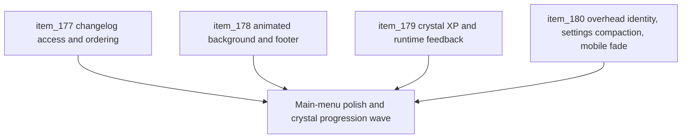

## task_044_orchestrate_main_menu_polish_and_first_crystal_progression_wave - Orchestrate main-menu polish and first crystal progression wave
> From version: 0.5.0
> Status: Done
> Understanding: 100%
> Confidence: 100%
> Progress: 100%
> Complexity: High
> Theme: UI
> Reminder: Update status/understanding/confidence/progress and dependencies/references when you edit this doc.

# Context
- Derived from backlog items `item_177_define_a_main_menu_changelog_surface_and_release_history_entry`, `item_178_define_a_more_atmospheric_main_menu_presentation_with_footer_version_linking`, `item_179_define_first_crystal_xp_level_and_runtime_progression_feedback`, and `item_180_define_player_overhead_identity_and_compact_settings_mobile_control_polish`.
- Related request(s): `req_050_define_a_main_menu_polish_and_first_crystal_xp_progression_wave`.
- The repository now has a published `0.3.0` release and a playable combat loop, so the next product-facing wave should strengthen the entry surface, add first progression rewards, and tighten shell/mobile control readability.

# Dependencies
- Blocking: `task_043_orchestrate_runtime_memory_structure_generation_and_settings_polish_wave`.
- Unblocks: a more showcase-ready main menu, first crystal-based progression, richer runtime identity feedback, and a more practical settings/mobile-control surface.

# Plan
- [x] 1. Define and implement the `Main menu` changelog entry, changelog-reading surface, and `Load game` action ordering.
- [x] 2. Define and implement the animated `Main menu` background and bottom-anchored version footer linking to GitHub.
- [x] 3. Define and implement first hostile crystal drops, XP gain, and level progression feedback in runtime.
- [x] 4. Define and implement player overhead identity, settings compaction, and mobile joystick fade-out polish.
- [x] 5. Validate shell UX, runtime progression readability, and docs traceability end to end.
- [x] FINAL: Create dedicated git commit(s) for this orchestration scope.

# Request AC Traceability
- req_050_define_a_main_menu_polish_and_first_crystal_xp_progression_wave coverage: AC1, AC10, AC11, AC12, AC2, AC3, AC4, AC5, AC6, AC7, AC8, AC9. Proof: `task_044_orchestrate_main_menu_polish_and_first_crystal_progression_wave` closes the linked request chain for `req_050_define_a_main_menu_polish_and_first_crystal_xp_progression_wave` and carries the delivery evidence for `item_180_define_player_overhead_identity_and_compact_settings_mobile_control_polish`.

# Links
- Backlog item(s): `item_177_define_a_main_menu_changelog_surface_and_release_history_entry`, `item_178_define_a_more_atmospheric_main_menu_presentation_with_footer_version_linking`, `item_179_define_first_crystal_xp_level_and_runtime_progression_feedback`, `item_180_define_player_overhead_identity_and_compact_settings_mobile_control_polish`
- Request(s): `req_050_define_a_main_menu_polish_and_first_crystal_xp_progression_wave`

# Validation
- `npm run ci`
- `npm run test:browser:smoke`
- `python3 logics/skills/logics-doc-linter/scripts/logics_lint.py`

# Definition of Done (DoD)
- [x] Covered backlog items are implemented or explicitly split further with updated traceability.
- [x] `Main menu` exposes changelog reading and prioritizes `Load game` ahead of `Start new game`.
- [x] `Main menu` gains a stronger atmospheric background and a bottom-anchored version footer linking to GitHub without layout shift.
- [x] Defeated hostiles drop crystals and the player can gain XP and levels from collecting them.
- [x] Runtime feedback shows level plus XP progress and the player overhead shows name plus level.
- [x] `Settings` fits more comfortably inside the page height and the mobile joystick background fades progressively.
- [x] Dedicated git commit(s) have been created for the completed orchestration scope.
- [x] Status is `Done` and progress is `100%`.

# Outcome
- The `Main menu` now exposes a dedicated `Changelogs` scene, prioritizes `Load game`, and presents a stronger ambient identity with an in-surface version footer linking to GitHub.
- The runtime now drops crystals from defeated hostiles, converts crystal pickups into XP and levels, and surfaces level progression in both the runtime HUD and player overhead identity.
- The `Settings` surface is denser and viewport-safe, while the mobile joystick base now fades progressively after touch interaction.

# Commits
- `67f3115` `Add main menu changelog and presentation polish`
- `4f9676f` `Add crystal drops and first player progression`
- `0cecf2f` `Compact settings and fade mobile joystick`
