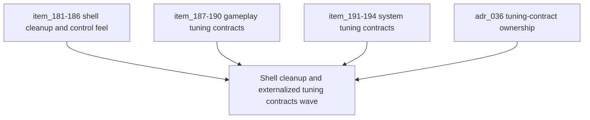

## task_045_orchestrate_shell_cleanup_and_externalized_tuning_contracts_wave - Orchestrate shell cleanup and externalized tuning contracts wave
> From version: 0.5.0
> Status: Done
> Understanding: 100%
> Confidence: 100%
> Progress: 100%
> Complexity: High
> Theme: Architecture
> Reminder: Update status/understanding/confidence/progress and dependencies/references when you edit this doc.

# Context
- Derived from backlog items `item_181_define_a_cleaner_main_menu_surface_without_meta_or_session_residue`, `item_182_define_stateful_apply_revert_and_reset_action_rules_for_settings_controls`, `item_183_define_a_structured_markdown_rendering_posture_for_shell_changelogs`, `item_184_define_randomized_initial_character_name_suggestions_for_new_game`, `item_185_define_command_deck_open_behavior_as_a_runtime_pause_trigger`, `item_186_define_view_relative_player_movement_under_camera_rotation`, `item_187_define_a_json_owned_gameplay_tuning_surface_for_first_wave_balance_values`, `item_188_define_validation_and_adapter_rules_for_externalized_gameplay_tuning_json`, `item_189_define_a_migration_boundary_between_runtime_contract_constants_and_authored_tuning_data`, `item_190_define_a_single_source_of_truth_rule_for_future_gameplay_balance_numbers`, `item_191_define_a_json_owned_system_tuning_surface_for_externalizable_technical_constants`, `item_192_define_validation_and_adapter_rules_for_externalized_system_tuning_json`, `item_193_define_clear_boundaries_between_system_tuning_gameplay_tuning_structural_constants_and_env_config`, and `item_194_define_a_first_rollout_for_input_viewport_pathfinding_and_runtime_presentation_tuning`.
- Related request(s): `req_051_define_a_shell_surface_cleanup_and_view_relative_movement_polish_wave`, `req_052_define_an_externalized_json_gameplay_tuning_contract`, `req_053_define_an_externalized_json_system_tuning_contract`.
- Related architecture decision(s): `adr_036_externalize_retunable_gameplay_and_system_tuning_as_validated_json_contracts`.
- The repository now has a stronger shell flow, a broader combat/runtime loop, and explicit tuning-contract direction, but the next wave still needs to remove leftover shell residue, tighten runtime control feel, and establish the first concrete gameplay/system tuning contracts so iteration stops depending on code search.
- Post-wave follow-up: the `Changelogs` surface now keeps its `Back to menu` action visible on constrained viewports after correcting the internal panel grid layout.

# Dependencies
- Blocking: `task_043_orchestrate_runtime_memory_structure_generation_and_settings_polish_wave`, `task_044_orchestrate_main_menu_polish_and_first_crystal_progression_wave`.
- Unblocks: a cleaner player-facing shell, safer command-deck pause semantics, view-relative movement readability, centralized gameplay balance tuning, centralized technical/system tuning, and a clearer long-term constant-ownership model.

# Plan
- [x] 1. Define and implement the shell-surface cleanup slice across `Main menu`, `Changelogs`, and `New game`, including copy removal and footer simplification.
- [x] 2. Define and implement the `Settings` action-state polish so `Revert`, `Reset defaults`, and `Apply controls` reflect real draft-state semantics.
- [x] 3. Define and implement better shell changelog markdown rendering with readable heading/list hierarchy.
- [x] 4. Define and implement randomized initial `New game` name suggestions plus the `Command deck -> runtime pause` behavior.
- [x] 5. Define and implement view-relative desktop movement under rotated camera states.
- [x] 6. Define and implement the first `gameplayTuning.json` contract plus its validation/adapter layer, then migrate the first gameplay-balance domains.
- [x] 7. Define and implement the first `systemTuning.json` contract plus its validation/adapter layer, then migrate the first technical/system domains.
- [x] 8. Update repository-facing docs, including `README.md`, so shell polish, tuning-contract ownership, and tuning-file usage remain discoverable after the wave lands.
- [x] 9. Validate constant-ownership boundaries end to end so gameplay tuning, system tuning, structural constants, and env config remain clearly separated, and synchronize any related docs needed for traceability.
- [x] 10. Validate shell UX, runtime behavior, tuning-contract loading, README coherence, and docs traceability end to end.
- [x] FINAL: Create dedicated git commit(s) for this orchestration scope.

# Request AC Traceability
- req_051_define_a_shell_surface_cleanup_and_view_relative_movement_polish_wave coverage: AC1, AC10, AC11, AC12, AC13, AC2, AC3, AC4, AC5, AC6, AC7, AC8, AC9. Proof: `task_045_orchestrate_shell_cleanup_and_externalized_tuning_contracts_wave` closes the linked request chain for `req_051_define_a_shell_surface_cleanup_and_view_relative_movement_polish_wave` and carries the delivery evidence for `item_186_define_view_relative_player_movement_under_camera_rotation`.

# Links
- Backlog item(s): `item_181_define_a_cleaner_main_menu_surface_without_meta_or_session_residue`, `item_182_define_stateful_apply_revert_and_reset_action_rules_for_settings_controls`, `item_183_define_a_structured_markdown_rendering_posture_for_shell_changelogs`, `item_184_define_randomized_initial_character_name_suggestions_for_new_game`, `item_185_define_command_deck_open_behavior_as_a_runtime_pause_trigger`, `item_186_define_view_relative_player_movement_under_camera_rotation`, `item_187_define_a_json_owned_gameplay_tuning_surface_for_first_wave_balance_values`, `item_188_define_validation_and_adapter_rules_for_externalized_gameplay_tuning_json`, `item_189_define_a_migration_boundary_between_runtime_contract_constants_and_authored_tuning_data`, `item_190_define_a_single_source_of_truth_rule_for_future_gameplay_balance_numbers`, `item_191_define_a_json_owned_system_tuning_surface_for_externalizable_technical_constants`, `item_192_define_validation_and_adapter_rules_for_externalized_system_tuning_json`, `item_193_define_clear_boundaries_between_system_tuning_gameplay_tuning_structural_constants_and_env_config`, `item_194_define_a_first_rollout_for_input_viewport_pathfinding_and_runtime_presentation_tuning`
- Request(s): `req_051_define_a_shell_surface_cleanup_and_view_relative_movement_polish_wave`, `req_052_define_an_externalized_json_gameplay_tuning_contract`, `req_053_define_an_externalized_json_system_tuning_contract`
- Architecture decision(s): `adr_036_externalize_retunable_gameplay_and_system_tuning_as_validated_json_contracts`

# Validation
- `npm run ci`
- `npm run test:browser:smoke`
- `python3 logics/skills/logics-doc-linter/scripts/logics_lint.py`
- Manual constrained-viewport verification of `Changelogs` confirms the `Back to menu` action remains visible after the layout correction.

# Definition of Done (DoD)
- [x] Covered backlog items are implemented or explicitly split further with updated traceability.
- [x] `Main menu`, `Changelogs`, and `New game` no longer expose leftover meta/status residue that weakens player-facing readability.
- [x] `Settings` editing actions reflect clear layout and enablement semantics tied to real draft state.
- [x] The shell changelog reader renders structured markdown hierarchy rather than flattened preformatted text.
- [x] `New game` initializes with a randomized editable name suggestion and the `Command deck` pauses live runtime when opened.
- [x] Desktop movement remains view-relative under rotated camera states.
- [x] `gameplayTuning.json` and `systemTuning.json` exist as separate validated tuning contracts with TypeScript adapters.
- [x] The first gameplay and system tuning domains have been migrated without blurring boundaries with structural constants or env config.
- [x] `README.md` and related documentation have been updated to reflect the delivered shell and tuning-contract posture.
- [x] Documentation traceability remains synchronized across requests, backlog items, ADRs, tasks, and repository-facing docs where needed.
- [x] Regular git commits have been created during implementation rather than deferring all history to one final catch-up commit.
- [x] Dedicated git commit(s) have been created for the completed orchestration scope.
- [x] Status is `Done` and progress is `100%`.
