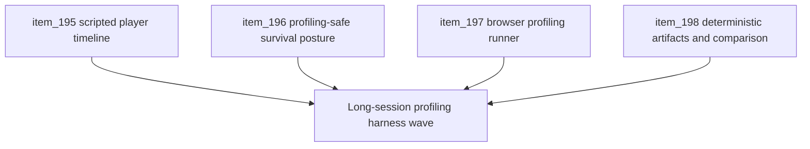

## task_046_orchestrate_scripted_long_session_runtime_profiling_harness_wave - Orchestrate scripted long-session runtime profiling harness wave
> From version: 0.3.1
> Status: Draft
> Understanding: 99%
> Confidence: 98%
> Progress: 0%
> Complexity: High
> Theme: Performance
> Reminder: Update status/understanding/confidence/progress and dependencies/references when you edit this doc.

# Context
- Derived from backlog items `item_195_define_a_scripted_runtime_player_input_timeline_for_long_session_automation`, `item_196_define_a_profiling_safe_invincibility_and_survival_posture_for_automated_runtime_runs`, `item_197_define_a_long_session_browser_profiling_runner_for_memory_and_runtime_metrics`, and `item_198_define_deterministic_runtime_profiling_artifacts_and_comparison_posture`.
- Related request(s): `req_054_define_a_scripted_long_session_runtime_profiling_and_player_simulation_harness`.
- The repository already has short browser smoke validation and prior runtime memory investigation, but it still lacks a durable way to drive multi-minute runtime sessions under deterministic player simulation and collect profiling artifacts over time.

# Dependencies
- Blocking: `task_043_orchestrate_runtime_memory_structure_generation_and_settings_polish_wave`.
- Unblocks: stronger memory-leak investigation, repeatable long-session runtime profiling, and deeper automated runtime-regression validation beyond the current short smoke window.

# Plan
- [ ] 1. Define and implement a declarative scripted runtime player-input timeline that can drive long active sessions after browser boot/navigation.
- [ ] 2. Define and implement profiling-safe survival controls such as invincibility/no-death and scenario-selectable spawn pressure.
- [ ] 3. Define and implement a separate long-session browser profiling runner for runtime memory and metrics sampling.
- [ ] 4. Define and implement deterministic profiling artifacts with stable JSON outputs and comparison-friendly replay posture.
- [ ] 5. Update repository-facing docs, including `README.md`, so the long-session profiling harness and its usage are discoverable.
- [ ] 6. Validate long-session runtime behavior, profiling outputs, and docs traceability end to end.
- [ ] FINAL: Create dedicated git commit(s) for this orchestration scope.

# Links
- Backlog item(s): `item_195_define_a_scripted_runtime_player_input_timeline_for_long_session_automation`, `item_196_define_a_profiling_safe_invincibility_and_survival_posture_for_automated_runtime_runs`, `item_197_define_a_long_session_browser_profiling_runner_for_memory_and_runtime_metrics`, `item_198_define_deterministic_runtime_profiling_artifacts_and_comparison_posture`
- Request(s): `req_054_define_a_scripted_long_session_runtime_profiling_and_player_simulation_harness`

# Validation
- `npm run ci`
- `npm run test:browser:smoke`
- `node scripts/testing/runLongSessionProfile.mjs --scenario traversal-baseline --duration 120s`
- `python3 logics/skills/logics-doc-linter/scripts/logics_lint.py`

# Definition of Done (DoD)
- [ ] Covered backlog items are implemented or explicitly split further with updated traceability.
- [ ] The repo can drive at least one deterministic long-session scripted runtime scenario beyond the current smoke-test duration.
- [ ] Profiling-safe survival posture exists for uninterrupted automated runs.
- [ ] A separate long-session browser profiling runner samples runtime or memory signals over time and writes stable artifacts.
- [ ] Profiling artifacts are comparison-friendly across repeated runs.
- [ ] The dedicated long-session profiling runner has been executed successfully at least once with a multi-minute or equivalent extended session.
- [ ] `README.md` and related docs explain how to run and interpret the profiling harness.
- [ ] Documentation traceability remains synchronized across requests, backlog items, tasks, and repository-facing docs where needed.
- [ ] Regular git commits have been created during implementation rather than deferring all history to one final catch-up commit.
- [ ] Dedicated git commit(s) have been created for the completed orchestration scope.
- [ ] Status is `Done` and progress is `100%`.
