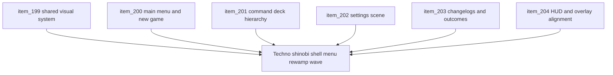

## task_047_orchestrate_techno_shinobi_shell_menu_rewamp_wave - Orchestrate techno shinobi shell menu rewamp wave
> From version: 0.3.2
> Status: Done
> Understanding: 99%
> Confidence: 100%
> Progress: 100%
> Complexity: High
> Theme: UI
> Reminder: Update status/understanding/confidence/progress and dependencies/references when you edit this doc.

# Context
- Derived from backlog items `item_199_define_a_techno_shinobi_visual_system_for_shell_menus_and_runtime_chrome`, `item_200_define_a_stronger_front_door_composition_for_main_menu_and_new_game_initiation`, `item_201_define_a_field_console_command_deck_hierarchy_for_runtime_controls`, `item_202_define_a_techno_dojo_settings_scene_for_desktop_control_editing`, `item_203_define_archive_and_outcome_scene_composition_rules_for_changelogs_defeat_and_victory`, and `item_204_define_player_hud_and_shell_overlay_alignment_within_the_techno_shinobi_menu_family`.
- Related request(s): `req_055_rework_all_shell_menus_with_a_techno_shinobi_visual_direction`.
- Related product brief(s): `prod_001_minimal_overlay_and_feedback_for_early_runtime`, `prod_003_high_density_top_down_survival_action_direction`, `prod_005_visual_identity_dark_fantasy_with_synthetic_energy_accents`.
- Related architecture decision(s): `adr_016_define_shell_scene_state_and_meta_surface_ownership`, `adr_022_keep_product_meta_flow_shell_owned_while_runtime_state_remains_game_preserved`.
- The repository already has a functional shell family and a stronger runtime loop, but the current menu system still reads as a set of adjacent tactical-console surfaces rather than one premium, game-native UI family. This wave should unify the shell around a deliberate `Techno-shinobi` visual system, upgrade the entry flow, restructure the runtime command deck, specialize `Settings`, differentiate archive and outcome scenes, and align live runtime chrome with the same family.

# Dependencies
- Blocking: `task_044_orchestrate_main_menu_polish_and_first_crystal_progression_wave`, `task_045_orchestrate_shell_cleanup_and_externalized_tuning_contracts_wave`.
- Unblocks: a stronger Emberwake shell identity, more legible runtime controls, better shell-to-runtime visual continuity, and a more showcase-ready menu family on desktop and mobile.

# Plan
- [x] 1. Define and implement the shared `Techno-shinobi` visual system across shell tokens, typography, surfaces, emphasis rules, and reusable shell component roles.
- [x] 2. Define and implement a stronger front-door composition for `Main menu` and `New game`, including clearer entry hierarchy and a more deliberate initiation posture.
- [x] 3. Define and implement the field-console rewamp for the runtime `Command deck`, including desktop and mobile hierarchy.
- [x] 4. Define and implement the `Techno dojo` posture for `Settings > Desktop controls`, including clearer editing-state and action-state hierarchy.
- [x] 5. Define and implement archive and outcome scene differentiation for `Changelogs`, `Defeat`, and `Victory`.
- [x] 6. Define and implement HUD and adjacent overlay alignment so player-facing runtime chrome belongs to the same shell family without bloating the hot path.
- [x] 7. Validate desktop and mobile shell behavior, runtime readability, and doc traceability end to end.
- [x] CHECKPOINT: leave each completed slice commit-ready and update linked Logics docs before continuing.
- [x] FINAL: Create dedicated git commit(s) for the completed orchestration scope.

# Delivery checkpoints
- Each completed wave should leave the repository in a coherent, commit-ready state.
- Update the linked Logics docs during the wave that changes the behavior, not only at final closure.
- Prefer a reviewed commit checkpoint at the end of each meaningful wave instead of accumulating several undocumented partial states.

# AC Traceability
- AC1 -> Backlog coverage: `item_199`, `item_200`, `item_201`, `item_202`, `item_203`, `item_204`. Proof: linked backlog slices are implemented or explicitly split further.
- AC2 -> Visual direction: shared shell tokens, typography, surface language, and component roles land coherently. Proof target: `src/app/styles/theme.css`, `src/app/styles/app.css`, shell component CSS.
- AC3 -> Scene differentiation: `Main menu`, `New game`, `Settings`, `Changelogs`, `Defeat`, and `Victory` no longer read as one repeated card shell. Proof target: shell scene implementation and manual review.
- AC4 -> Action hierarchy: primary progression, navigation, utility, and runtime-control affordances are visually distinct. Proof target: shell scene actions and command-deck hierarchy.
- AC5 -> Runtime chrome alignment: HUD and selected overlays align with the shell family without harming clarity. Proof target: runtime HUD/overlay components and manual runtime review.
- AC6 -> Responsive behavior: desktop and mobile preserve hierarchy across the rewamp. Proof target: responsive CSS and manual viewport verification.

# Decision framing
- Product framing: Required
- Product signals: navigation and discoverability, engagement loop, experience scope
- Product follow-up: Existing product briefs already cover the shell identity direction; keep them linked as the wave evolves.
- Architecture framing: Consider
- Architecture signals: runtime and boundaries
- Architecture follow-up: Confirm the rewamp stays inside existing shell/runtime ownership boundaries and create an ADR only if layout/control changes force a structural boundary decision.

# Links
- Product brief(s): `prod_001_minimal_overlay_and_feedback_for_early_runtime`, `prod_003_high_density_top_down_survival_action_direction`, `prod_005_visual_identity_dark_fantasy_with_synthetic_energy_accents`
- Architecture decision(s): `adr_016_define_shell_scene_state_and_meta_surface_ownership`, `adr_022_keep_product_meta_flow_shell_owned_while_runtime_state_remains_game_preserved`
- Backlog item(s): `item_199_define_a_techno_shinobi_visual_system_for_shell_menus_and_runtime_chrome`, `item_200_define_a_stronger_front_door_composition_for_main_menu_and_new_game_initiation`, `item_201_define_a_field_console_command_deck_hierarchy_for_runtime_controls`, `item_202_define_a_techno_dojo_settings_scene_for_desktop_control_editing`, `item_203_define_archive_and_outcome_scene_composition_rules_for_changelogs_defeat_and_victory`, `item_204_define_player_hud_and_shell_overlay_alignment_within_the_techno_shinobi_menu_family`
- Request(s): `req_055_rework_all_shell_menus_with_a_techno_shinobi_visual_direction`

# Validation
- `npm run ci`
- `npm run test:browser:smoke`
- `python3 logics/skills/logics-doc-linter/scripts/logics_lint.py`
- Manual desktop and mobile verification of `Main menu`, `New game`, `Settings`, `Changelogs`, `Defeat`, `Victory`, runtime `Command deck`, and player HUD/overlay readability.

# Definition of Done (DoD)
- [x] Covered backlog items are implemented or explicitly split further with updated traceability.
- [x] The shell menu family reads as one coherent `Techno-shinobi` system rather than adjacent tactical-console variants.
- [x] `Main menu`, `New game`, `Settings`, `Changelogs`, `Defeat`, and `Victory` each have clearer scene-specific composition.
- [x] The runtime `Command deck` has stronger hierarchy on desktop and mobile without losing current capability.
- [x] Player-facing runtime chrome aligns with the new family while remaining compact and legible during play.
- [x] Validation commands are executed and results are captured.
- [x] Linked request/backlog/task docs are updated during completed waves and at closure.
- [x] Dedicated git commit(s) have been created for the completed orchestration scope.
- [x] Status is `Done` and progress is `100%`.

# Report
- Shared shell tokens and surface roles now push a darker `Techno-shinobi` posture across shell scenes and runtime chrome, including calmer ink backgrounds, steel/cyan/ember signaling, and stricter component hierarchy.
- `Main menu`, `New game`, `Settings`, `Changelogs`, `Defeat`, and `Victory` now use differentiated scene headers, status chips, subsurfaces, and action groupings instead of one repeated shell card treatment.
- The runtime `Command deck` now reads as a field console with a clearer trigger, panel header, hero action, section grouping, and a mobile bottom-sheet variant that preserves hierarchy.
- `Settings > Desktop controls` now behaves like a compact technical workbench, with a scroll-safe scene body, stable back navigation visibility, and denser rebinding groups.
- The player HUD and adjacent runtime overlay chrome now align with the same family, and mobile hides the HUD while the command deck is open to preserve local clarity.
- A runtime React loop surfaced during validation around defeat recap updates; the orchestration fixed it by stabilizing the runtime-state callback passed from `AppShell`.
- Validation passed with:
- `npm run ci`
- `npm run test:browser:smoke`
- `npm run logics:lint`
- Manual browser verification passed on desktop and mobile for `Main menu`, `New game`, `Settings`, `Changelogs`, runtime `Command deck`, defeat presentation, and HUD readability, with artifacts captured under `output/playwright/`.
