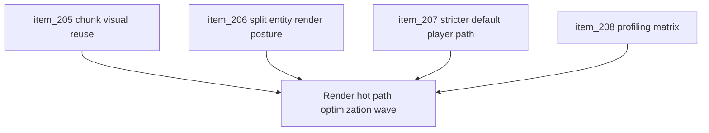

## task_048_orchestrate_runtime_render_hot_path_optimization_for_world_and_entity_drawing - Orchestrate runtime render hot-path optimization for world and entity drawing
> From version: 0.5.0
> Status: Done
> Understanding: 97%
> Confidence: 95%
> Progress: 100%
> Complexity: High
> Theme: Performance
> Reminder: Update status/understanding/confidence/progress and dependencies/references when you edit this doc.

# Context
- Derived from backlog items `item_205_define_a_bounded_chunk_visual_reuse_strategy_for_player_runtime_world_rendering`, `item_206_define_a_split_entity_render_layer_posture_for_stable_shapes_and_transient_combat_fx`, `item_207_define_a_stricter_default_player_path_for_runtime_diagnostics_and_overlap_work`, and `item_208_define_a_before_after_runtime_profiling_matrix_for_render_hot_path_changes`.
- Related request(s): `req_056_define_a_runtime_render_hot_path_optimization_wave_for_world_and_entity_drawing`.
- Related product brief(s): `prod_001_minimal_overlay_and_feedback_for_early_runtime`, `prod_002_readable_world_traversal_and_presence`, `prod_003_high_density_top_down_survival_action_direction`.
- Related architecture decision(s): `adr_019_keep_engine_pixi_as_adapter_and_game_as_runtime_scene_composer`, `adr_025_keep_shell_chrome_event_driven_and_sample_diagnostics_off_the_runtime_hot_path`, `adr_028_budget_player_runtime_and_debug_visuals_as_separate_render_modes`, `adr_033_adopt_deterministic_movement_oriented_pseudo_physics_instead_of_a_full_physics_engine`, `adr_037_reuse_player_runtime_chunk_base_visuals_through_a_bounded_prerender_cache`, `adr_038_split_entity_player_rendering_into_stable_geometry_and_transient_combat_overlays`.
- Long-session profiling on 2026-03-23 showed stable runtime FPS across `eastbound-drift`, `traversal-baseline`, and `square-loop`, with little catch-up pressure. That shifts the next optimization wave away from simulation cadence and toward player-runtime render hot paths: chunk/world redraw, entity redraw density, and stricter diagnostics gating.

# Dependencies
- Blocking: `task_038_orchestrate_runtime_hot_path_optimization_for_pseudo_physics_and_world_queries`, `task_046_orchestrate_scripted_long_session_runtime_profiling_harness_wave`.
- Unblocks: cheaper steady-state player rendering, safer future content density, cleaner profiling evidence for runtime render work, and follow-up combat/world presentation additions that do not immediately inflate frame cost.

# Plan
- [x] 1. Define and implement bounded chunk-visual reuse so player-runtime world rendering stops rebuilding static chunk base visuals tile by tile each frame.
- [x] 2. Define and implement a split entity render posture so stable geometry is cheaper than transient combat overlays and feedback.
- [x] 3. Tighten diagnostics and overlap-work gating so debug-only costs stay off the default player path unless explicitly requested.
- [x] 4. Run before/after profiling across `eastbound-drift`, `traversal-baseline`, and `square-loop`, and capture how FPS, frame pacing, and memory posture changed.
- [x] 5. Update linked request, backlog, ADR, and task docs as the wave lands so traceability stays synchronized with the implementation.
- [x] 6. Validate the completed wave through repository checks, runtime smoke verification, and profiling artifacts.
- [x] CHECKPOINT: leave each completed optimization slice commit-ready before moving to the next one.
- [x] FINAL: Create dedicated git commit(s) for the completed orchestration scope.

# Delivery checkpoints
- Land world/chunk reuse as a coherent slice with bounded lifecycle rules before mixing it with entity-visual changes.
- Keep entity-render simplification and diagnostics-gating changes independently reviewable where practical.
- Update profiling evidence after each meaningful performance slice instead of waiting until the very end.
- Keep docs synchronized during the wave so the repo always reflects the current optimization posture.

# AC Traceability
- AC1 -> Backlog coverage: `item_205`, `item_206`, `item_207`, `item_208`. Proof: linked backlog slices are implemented or explicitly split further.
- AC2 -> World hot path: player-runtime chunk base rendering no longer rebuilds equivalent static visuals every frame. Proof target: `src/game/world/render/WorldScene.tsx`, related render-resource implementation, profiling comparison.
- AC3 -> Entity hot path: stable entity visuals and transient combat overlays are no longer coupled into one dense redraw posture. Proof target: `src/game/entities/render/EntityScene.tsx`, related runtime presentation structure, profiling comparison.
- AC4 -> Diagnostics gating: debug overlays and overlap-heavy work remain off the default player path unless diagnostics are explicitly enabled. Proof target: runtime gating conditions, diagnostics panel behavior, profiling notes.
- AC5 -> Validation posture: before/after evidence compares the existing long-session scenarios and interprets FPS, frame pacing, and memory together. Proof target: profiling artifacts under `output/playwright/long-session/` and task validation notes.

# Request AC Traceability
- req_056_define_a_runtime_render_hot_path_optimization_wave_for_world_and_entity_drawing coverage: AC6, AC7, AC8. Proof: `task_048_orchestrate_runtime_render_hot_path_optimization_for_world_and_entity_drawing` closes the linked request chain for `req_056_define_a_runtime_render_hot_path_optimization_wave_for_world_and_entity_drawing` and carries the delivery evidence for `item_208_define_a_before_after_runtime_profiling_matrix_for_render_hot_path_changes`.

# Decision framing
- Product framing: Required
- Product signals: runtime feel, readability under load, experience scope
- Product follow-up: preserve combat and traversal readability while optimizing; do not accept wins that only look good in telemetry but degrade player legibility.
- Architecture framing: Required
- Architecture signals: runtime and boundaries, performance and scalability
- Architecture follow-up: keep world/entity render-resource ownership aligned with the new ADRs and avoid leaking Pixi resource lifecycle into game-state ownership.

# Links
- Product brief(s): `prod_001_minimal_overlay_and_feedback_for_early_runtime`, `prod_002_readable_world_traversal_and_presence`, `prod_003_high_density_top_down_survival_action_direction`
- Architecture decision(s): `adr_019_keep_engine_pixi_as_adapter_and_game_as_runtime_scene_composer`, `adr_025_keep_shell_chrome_event_driven_and_sample_diagnostics_off_the_runtime_hot_path`, `adr_028_budget_player_runtime_and_debug_visuals_as_separate_render_modes`, `adr_033_adopt_deterministic_movement_oriented_pseudo_physics_instead_of_a_full_physics_engine`, `adr_037_reuse_player_runtime_chunk_base_visuals_through_a_bounded_prerender_cache`, `adr_038_split_entity_player_rendering_into_stable_geometry_and_transient_combat_overlays`
- Backlog item(s): `item_205_define_a_bounded_chunk_visual_reuse_strategy_for_player_runtime_world_rendering`, `item_206_define_a_split_entity_render_layer_posture_for_stable_shapes_and_transient_combat_fx`, `item_207_define_a_stricter_default_player_path_for_runtime_diagnostics_and_overlap_work`, `item_208_define_a_before_after_runtime_profiling_matrix_for_render_hot_path_changes`
- Request(s): `req_056_define_a_runtime_render_hot_path_optimization_wave_for_world_and_entity_drawing`

# Validation
- `npm run ci`
- `npm run test:browser:smoke`
- `node scripts/testing/runLongSessionProfile.mjs --scenario eastbound-drift --duration 2m`
- `node scripts/testing/runLongSessionProfile.mjs --scenario traversal-baseline --duration 2m`
- `node scripts/testing/runLongSessionProfile.mjs --scenario square-loop --duration 2m`
- `python3 logics/skills/logics-doc-linter/scripts/logics_lint.py`
- Manual runtime verification that combat/traversal readability remains acceptable after render simplification.

# Definition of Done (DoD)
- [x] Covered backlog items are implemented or explicitly split further with updated traceability.
- [x] Player-runtime world rendering reuses static chunk visuals through a bounded posture instead of steady-state tile-by-tile rebuild.
- [x] Entity rendering separates stable geometry from transient combat overlays or equivalent redraw domains.
- [x] Diagnostics and overlap-heavy work stay off the default player path unless explicitly enabled.
- [x] Before/after profiling evidence exists for `eastbound-drift`, `traversal-baseline`, and `square-loop`.
- [x] Validation commands are executed and results are captured in the task or linked artifacts.
- [x] Linked request, backlog, ADR, and task docs are updated during the wave and at closure.
- [x] Dedicated git commit(s) have been created for the completed orchestration scope.
- [x] Status is `Done` and progress is `100%`.

# Implementation notes
- World rendering now keeps chunk base visuals in local chunk space with stable retained draw callbacks, which removes repeated steady-state tile geometry rebuild while a chunk remains mounted.
- The first attempt at a broader off-screen `cacheAsTexture` warm cache was intentionally rolled back because it degraded the long linear `eastbound-drift` profile.
- Entity rendering now uses local coordinates inside positioned containers, keeps pickup visuals on a memoized stable path, and avoids the heavier multi-node entity graph that also regressed profiling.
- `useEntityWorld` now skips overlap detection and chunk indexing on the default player path and only enables those diagnostics computations when explicitly requested.

# Report
- `traversal-baseline` preserved FPS around `120` while reducing post-30s heap from a `56.67-234.74 MB` band ending at `190.33 MB` to a `20.25-66.57 MB` band ending at `42.01 MB`.
- `square-loop` preserved FPS around `120` while reducing post-30s heap from a `60.11-253.67 MB` band ending at `172.96 MB` to a `21.93-77.79 MB` band ending at `61.6 MB`.
- `eastbound-drift` remained below the historical baseline after the wave, so the task explicitly rejected the more aggressive off-screen chunk-cache posture instead of hiding the regression.
- Validation passed with:
- `npm run ci`
- `npm run test:browser:smoke`
- `node scripts/testing/runLongSessionProfile.mjs --scenario eastbound-drift --duration 2m`
- `node scripts/testing/runLongSessionProfile.mjs --scenario traversal-baseline --duration 2m`
- `node scripts/testing/runLongSessionProfile.mjs --scenario square-loop --duration 2m`
- `python3 logics/skills/logics-doc-linter/scripts/logics_lint.py`
