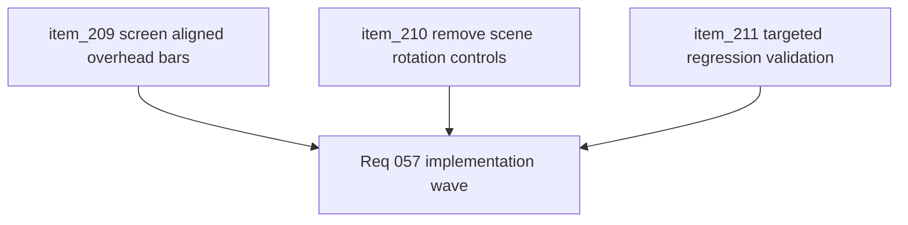

## task_049_orchestrate_screen_aligned_entity_feedback_and_scene_rotation_control_removal - Orchestrate screen-aligned entity feedback and scene-rotation control removal
> From version: 0.4.0
> Status: Draft
> Understanding: 98%
> Confidence: 97%
> Progress: 0%
> Complexity: Medium
> Theme: UI
> Reminder: Update status/understanding/confidence/progress and dependencies/references when you edit this doc.

# Context
- Derived from backlog items `item_209_define_a_screen_aligned_overhead_progress_bar_posture_for_combat_entities`, `item_210_remove_scene_rotation_controls_from_supported_player_input_and_settings`, and `item_211_define_targeted_regression_validation_for_entity_bar_alignment_and_rotation_control_removal`.
- Related request(s): `req_057_define_a_screen_aligned_progress_bar_posture_for_runtime_entities`.
- Related product brief(s): `prod_001_minimal_overlay_and_feedback_for_early_runtime`, `prod_003_high_density_top_down_survival_action_direction`.
- Related architecture decision(s): `adr_016_define_shell_scene_state_and_meta_surface_ownership`, `adr_025_keep_shell_chrome_event_driven_and_sample_diagnostics_off_the_runtime_hot_path`, `adr_028_budget_player_runtime_and_debug_visuals_as_separate_render_modes`, `adr_038_split_entity_player_rendering_into_stable_geometry_and_transient_combat_overlays`.
- `0.4.0` improved runtime render structure, but it also introduced a readability regression in combat overhead bars and left scene-rotation controls exposed in player-facing settings/input even though that interaction is no longer intended to remain supported.

# Dependencies
- Blocking: `task_048_orchestrate_runtime_render_hot_path_optimization_for_world_and_entity_drawing`.
- Unblocks: cleaner combat readability during turning, tighter player-facing control posture, and future settings cleanup that does not carry unsupported camera affordances.

# Plan
- [ ] 1. Restore screen-aligned overhead bars for combat entities without undoing the `0.4.0` local-space entity-render posture.
- [ ] 2. Remove scene-rotation controls from supported player input and from the editable `Settings` surface.
- [ ] 3. Update related control-binding defaults, validation, storage handling, and tests so the reduced control set is coherent across the repo.
- [ ] 4. Run targeted regression validation covering entity-bar readability during turning and removal of player-facing scene-rotation controls.
- [ ] 5. Update linked request, backlog, and task docs as the wave lands so traceability stays synchronized with implementation.
- [ ] 6. Validate the completed wave through repository tests and manual runtime verification.
- [ ] CHECKPOINT: leave each slice commit-ready before moving to the next one.
- [ ] FINAL: Create dedicated git commit(s) for the completed orchestration scope.

# Delivery checkpoints
- Land the bar-alignment correction as a coherent render slice before mixing in settings/control cleanup if practical.
- Keep player-input removal and settings-surface cleanup independently reviewable where possible.
- Update validation as soon as behavior changes land so stale tests do not accumulate.
- Keep docs synchronized during the wave instead of backfilling traceability afterward.

# AC Traceability
- AC1 -> Backlog coverage: `item_209`, `item_210`, `item_211`. Proof: linked backlog slices are implemented or explicitly split further.
- AC2 -> Entity readability: overhead bars remain horizontally readable while combat entities rotate. Proof target: `src/game/entities/render/EntityScene.tsx`, runtime verification.
- AC3 -> Control cleanup: scene-rotation bindings are removed from `Settings` and no longer supported as player-facing runtime controls. Proof target: settings/input files and tests.
- AC4 -> Validation posture: targeted automated and manual checks cover both visual bar alignment and removed controls. Proof target: tests plus runtime notes.

# Decision framing
- Product framing: Required
- Product signals: readability, usability
- Product follow-up: keep the wave small and targeted; do not let a narrow readability/control cleanup turn into an open-ended camera redesign.
- Architecture framing: Consider
- Architecture signals: runtime and boundaries
- Architecture follow-up: preserve the `0.4.0` render split unless implementation forces a broader reconsideration.

# Links
- Product brief(s): `prod_001_minimal_overlay_and_feedback_for_early_runtime`, `prod_003_high_density_top_down_survival_action_direction`
- Architecture decision(s): `adr_016_define_shell_scene_state_and_meta_surface_ownership`, `adr_025_keep_shell_chrome_event_driven_and_sample_diagnostics_off_the_runtime_hot_path`, `adr_028_budget_player_runtime_and_debug_visuals_as_separate_render_modes`, `adr_038_split_entity_player_rendering_into_stable_geometry_and_transient_combat_overlays`
- Backlog item(s): `item_209_define_a_screen_aligned_overhead_progress_bar_posture_for_combat_entities`, `item_210_remove_scene_rotation_controls_from_supported_player_input_and_settings`, `item_211_define_targeted_regression_validation_for_entity_bar_alignment_and_rotation_control_removal`
- Request(s): `req_057_define_a_screen_aligned_progress_bar_posture_for_runtime_entities`

# Validation
- `npm run test -- EntityScene DesktopControlSettingsSection useCameraController desktopControlBindings`
- `npm run ci`
- Manual runtime verification that health and charge bars stay horizontal while entities rotate.
- Manual verification that `Settings` no longer exposes scene-rotation bindings.

# Definition of Done (DoD)
- [ ] Covered backlog items are implemented or explicitly split further with updated traceability.
- [ ] Combat overhead bars remain screen-aligned while staying anchored above combat entities.
- [ ] Player-facing scene-rotation bindings and settings affordances are removed.
- [ ] Related tests and validation reflect the reduced supported control set.
- [ ] Validation commands are executed and results are captured in the task or linked artifacts.
- [ ] Linked request, backlog, and task docs are updated during the wave and at closure.
- [ ] Dedicated git commit(s) have been created for the completed orchestration scope.
- [ ] Status is `Done` and progress is `100%`.
