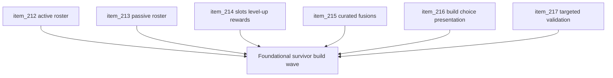

## task_050_orchestrate_the_foundational_survivor_build_system_wave - Orchestrate the foundational survivor build system wave
> From version: 0.4.0
> Status: Draft
> Understanding: 98%
> Confidence: 97%
> Progress: 0%
> Complexity: High
> Theme: Gameplay
> Reminder: Update status/understanding/confidence/progress and dependencies/references when you edit this doc.

# Context
- Derived from backlog items `item_212_define_a_first_foundational_active_weapon_roster_and_adapt_the_current_attack_into_the_starter_weapon`, `item_213_define_a_first_foundational_passive_item_roster_with_clear_fusion_key_families`, `item_214_define_a_slot_limited_level_up_and_run_reward_model_for_build_growth`, `item_215_define_a_curated_first_wave_of_active_passive_fusions_and_readiness_rules`, `item_216_define_player_facing_build_choice_and_fusion_payoff_presentation_for_the_first_survivor_loop`, and `item_217_define_targeted_validation_for_the_foundational_survivor_build_system`.
- Related request(s): `req_058_define_a_foundational_survivor_build_system_for_weapons_passives_fusions_and_run_progression`.
- Related product brief(s): `prod_001_minimal_overlay_and_feedback_for_early_runtime`, `prod_003_high_density_top_down_survival_action_direction`, `prod_005_visual_identity_dark_fantasy_with_synthetic_energy_accents`, `prod_006_foundational_survivor_weapon_roster_for_emberwake`, `prod_007_foundational_passive_item_direction_for_emberwake`, `prod_008_active_passive_fusion_direction_for_emberwake`, `prod_009_level_up_slots_and_run_progression_model_for_emberwake`.
- Related architecture decision(s): `adr_019_keep_engine_pixi_as_adapter_and_game_as_runtime_scene_composer`, `adr_033_adopt_deterministic_movement_oriented_pseudo_physics_instead_of_a_full_physics_engine`, `adr_038_split_entity_player_rendering_into_stable_geometry_and_transient_combat_overlays`, `adr_039_structure_the_first_survivor_build_loop_around_separate_active_and_passive_slots`, `adr_040_use_curated_active_passive_fusions_as_the_foundational_build_payoff_layer`.
- Emberwake now has product direction for the full first survivor build loop, but not yet the implementation-facing orchestration that turns active weapons, passive items, curated fusion payoffs, and run progression into one coherent delivery wave.

# Dependencies
- Blocking: `task_040_orchestrate_game_over_recap_and_proximity_loot_wave`, `task_044_orchestrate_main_menu_polish_and_first_crystal_progression_wave`.
- Unblocks: a real survivor-like build loop, future tuning of active/passive content, later wave expansion for additional weapons and passives, and meaningful fusion payoff content.

# Plan
- [ ] 1. Implement the first foundational active roster and adapt the current frontal attack into the formal starter weapon.
- [ ] 2. Implement the first foundational passive roster with clear build-shaping and fusion-key families.
- [ ] 3. Implement the slot-limited level-up and reward loop that acquires and upgrades active/passive content during a run.
- [ ] 4. Implement the first curated active + passive fusion payoff layer and its readiness rules.
- [ ] 5. Implement player-facing build choice, slot-state, and fusion payoff presentation so the system is readable in practice.
- [ ] 6. Run targeted validation across content, progression flow, fusion payoff, and player-facing readability.
- [ ] 7. Update linked request, backlog, ADR, and task docs as the wave lands so traceability stays synchronized with implementation.
- [ ] CHECKPOINT: leave each completed slice commit-ready before moving to the next one.
- [ ] FINAL: Create dedicated git commit(s) for the completed orchestration scope.

# Delivery checkpoints
- Land the starter weapon and active/passive content posture early so progression work targets stable content primitives.
- Keep run progression/slot logic independently reviewable from content definitions where practical.
- Add the fusion payoff layer only after baseline acquisition and upgrade flow are working.
- Treat build presentation as part of delivery, not as optional polish left to the end.
- Keep docs synchronized during the wave so the repo stays implementation-ready and reviewable.

# AC Traceability
- AC1 -> Backlog coverage: `item_212`, `item_213`, `item_214`, `item_215`, `item_216`, `item_217`. Proof: linked backlog slices are implemented or explicitly split further.
- AC2 -> Content posture: active and passive rosters are implemented at a small but coherent first-wave scale. Proof target: content definitions, starter setup, and level-up pool logic.
- AC3 -> Progression posture: active/passive slots, level-up choice flow, and reward posture are implemented coherently. Proof target: build-state model, level-up flow, and reward logic.
- AC4 -> Payoff posture: curated active + passive fusions exist with explicit readiness logic. Proof target: fusion rules, payoff triggers, and runtime behavior.
- AC5 -> Presentation posture: player-facing build choices and payoff moments are readable. Proof target: UI/runtime presentation and manual verification.
- AC6 -> Validation posture: targeted automated and manual checks cover the first build loop end to end. Proof target: test commands, smoke flow, and runtime notes.

# Decision framing
- Product framing: Required
- Product signals: engagement loop, readability, progression, experience scope
- Product follow-up: keep the first wave narrow and shippable; resist expanding into a huge content roster before the baseline loop is proven.
- Architecture framing: Required
- Architecture signals: runtime and boundaries
- Architecture follow-up: keep slot and fusion logic aligned with ADRs `039` and `040` instead of allowing local one-off rules to accumulate.

# Links
- Product brief(s): `prod_001_minimal_overlay_and_feedback_for_early_runtime`, `prod_003_high_density_top_down_survival_action_direction`, `prod_005_visual_identity_dark_fantasy_with_synthetic_energy_accents`, `prod_006_foundational_survivor_weapon_roster_for_emberwake`, `prod_007_foundational_passive_item_direction_for_emberwake`, `prod_008_active_passive_fusion_direction_for_emberwake`, `prod_009_level_up_slots_and_run_progression_model_for_emberwake`
- Architecture decision(s): `adr_019_keep_engine_pixi_as_adapter_and_game_as_runtime_scene_composer`, `adr_033_adopt_deterministic_movement_oriented_pseudo_physics_instead_of_a_full_physics_engine`, `adr_038_split_entity_player_rendering_into_stable_geometry_and_transient_combat_overlays`, `adr_039_structure_the_first_survivor_build_loop_around_separate_active_and_passive_slots`, `adr_040_use_curated_active_passive_fusions_as_the_foundational_build_payoff_layer`
- Backlog item(s): `item_212_define_a_first_foundational_active_weapon_roster_and_adapt_the_current_attack_into_the_starter_weapon`, `item_213_define_a_first_foundational_passive_item_roster_with_clear_fusion_key_families`, `item_214_define_a_slot_limited_level_up_and_run_reward_model_for_build_growth`, `item_215_define_a_curated_first_wave_of_active_passive_fusions_and_readiness_rules`, `item_216_define_player_facing_build_choice_and_fusion_payoff_presentation_for_the_first_survivor_loop`, `item_217_define_targeted_validation_for_the_foundational_survivor_build_system`
- Request(s): `req_058_define_a_foundational_survivor_build_system_for_weapons_passives_fusions_and_run_progression`

# Validation
- `npm run test`
- `npm run ci`
- `npm run test:browser:smoke`
- Manual runtime verification that the player can:
- start with the intended starter weapon
- acquire active and passive picks through level-ups
- hit active and passive slot pressure
- trigger at least one curated fusion payoff in a readable way
- Manual verification that the build-state presentation remains understandable on desktop and mobile-sized viewports.

# Definition of Done (DoD)
- [ ] Covered backlog items are implemented or explicitly split further with updated traceability.
- [ ] The first active and passive rosters exist in a coherent, bounded first-wave form.
- [ ] The run-level slot and level-up loop is functional and readable.
- [ ] At least one curated fusion payoff path is implemented under explicit readiness rules.
- [ ] Build choice and fusion payoff presentation are readable in practice.
- [ ] Validation commands are executed and results are captured in the task or linked artifacts.
- [ ] Linked request, backlog, ADR, and task docs are updated during the wave and at closure.
- [ ] Dedicated git commit(s) have been created for the completed orchestration scope.
- [ ] Status is `Done` and progress is `100%`.
