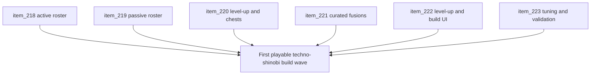

## task_051_orchestrate_the_first_playable_techno_shinobi_build_content_wave - Orchestrate the first playable techno-shinobi build content wave
> From version: 0.4.0
> Status: Draft
> Understanding: 98%
> Confidence: 97%
> Progress: 0%
> Complexity: High
> Theme: Gameplay
> Reminder: Update status/understanding/confidence/progress and dependencies/references when you edit this doc.

# Context
- Derived from backlog items `item_218_define_the_first_exact_techno_shinobi_active_roster_and_starter_weapon_delivery`, `item_219_define_the_first_exact_techno_shinobi_passive_roster_and_fusion_key_delivery`, `item_220_define_first_pass_level_up_pool_and_chest_rules_for_the_techno_shinobi_build_loop`, `item_221_define_the_first_curated_techno_shinobi_fusion_delivery_and_readiness_rules`, `item_222_define_player_facing_level_up_and_build_tracking_ui_for_the_first_techno_shinobi_loop`, and `item_223_define_first_playable_tuning_and_validation_for_the_techno_shinobi_build_wave`.
- Related request(s): `req_059_define_a_first_playable_techno_shinobi_build_content_wave`.
- Related product brief(s): `prod_003_high_density_top_down_survival_action_direction`, `prod_005_visual_identity_dark_fantasy_with_synthetic_energy_accents`, `prod_006_foundational_survivor_weapon_roster_for_emberwake`, `prod_007_foundational_passive_item_direction_for_emberwake`, `prod_008_active_passive_fusion_direction_for_emberwake`, `prod_009_level_up_slots_and_run_progression_model_for_emberwake`, `prod_010_first_playable_techno_shinobi_build_content_and_progression_defaults`.
- Related architecture decision(s): `adr_039_structure_the_first_survivor_build_loop_around_separate_active_and_passive_slots`, `adr_040_use_curated_active_passive_fusions_as_the_foundational_build_payoff_layer`, `adr_041_lock_the_first_playable_survivor_content_wave_to_one_character_and_a_small_curated_techno_shinobi_roster`.
- `req_058` defined the foundational survivor build system. This task narrows that foundation into the first exact techno-shinobi playable loop with concrete content, concrete progression defaults, and concrete player-facing build UI.

# Dependencies
- Blocking: `task_050_orchestrate_the_foundational_survivor_build_system_wave`.
- Unblocks: the first real techno-shinobi build loop, content tuning based on concrete items instead of abstract roles, and later expansion into more weapons, passives, fusions, and character divergence.

# Plan
- [ ] 1. Implement the first exact techno-shinobi active roster and adapt the current frontal attack into `Ash Lash`.
- [ ] 2. Implement the first exact passive roster with clear fusion-key families.
- [ ] 3. Implement the first-pass level-up pool and chest rules for the bounded first roster.
- [ ] 4. Implement the first curated fusion set and its readiness rules.
- [ ] 5. Implement the level-up choice and build-tracking UI posture so the loop is readable in play.
- [ ] 6. Tune the first playable loop and validate starter flow, progression pace, fusion payoff, and techno-shinobi readability.
- [ ] 7. Update linked request, backlog, product, ADR, and task docs as the wave lands so traceability stays synchronized.
- [ ] CHECKPOINT: leave each completed slice commit-ready before moving to the next one.
- [ ] FINAL: Create dedicated git commit(s) for the completed orchestration scope.

# Delivery checkpoints
- Lock the starter weapon and first active/passive names before widening implementation into pool logic and UI.
- Keep progression rules independently reviewable from item behavior where practical.
- Land at least one fully readable fusion payoff path before widening tuning.
- Treat techno-shinobi presentation as part of correctness, not optional flavor.
- Keep the first playable wave bounded; resist widening into meta-progression or multiple characters.

# AC Traceability
- AC1 -> Backlog coverage: `item_218`, `item_219`, `item_220`, `item_221`, `item_222`, `item_223`. Proof: linked slices are implemented or explicitly split further.
- AC2 -> Content posture: the first exact active, passive, and fusion roster is implemented in bounded form. Proof target: content definitions and starter setup.
- AC3 -> Progression posture: level-up pool rules, chest rules, slot pressure, and fusion readiness are functional. Proof target: build-state model and reward logic.
- AC4 -> Presentation posture: the player can read build choices, owned build state, and fusion readiness in a techno-shinobi UI language. Proof target: UI/runtime verification.
- AC5 -> Validation posture: first-pass tuning and targeted checks prove a credible first fun loop. Proof target: commands, smoke flow, and runtime notes.

# Decision framing
- Product framing: Required
- Product signals: onboarding, readability, progression, payoff, experience cohesion
- Product follow-up: keep the wave small and concrete until the first loop is proven fun.
- Architecture framing: Required
- Architecture signals: runtime and boundaries
- Architecture follow-up: keep the concrete content wave aligned with ADRs `039`, `040`, and `041` instead of widening into ad hoc growth.

# Links
- Product brief(s): `prod_003_high_density_top_down_survival_action_direction`, `prod_005_visual_identity_dark_fantasy_with_synthetic_energy_accents`, `prod_006_foundational_survivor_weapon_roster_for_emberwake`, `prod_007_foundational_passive_item_direction_for_emberwake`, `prod_008_active_passive_fusion_direction_for_emberwake`, `prod_009_level_up_slots_and_run_progression_model_for_emberwake`, `prod_010_first_playable_techno_shinobi_build_content_and_progression_defaults`
- Architecture decision(s): `adr_039_structure_the_first_survivor_build_loop_around_separate_active_and_passive_slots`, `adr_040_use_curated_active_passive_fusions_as_the_foundational_build_payoff_layer`, `adr_041_lock_the_first_playable_survivor_content_wave_to_one_character_and_a_small_curated_techno_shinobi_roster`
- Backlog item(s): `item_218_define_the_first_exact_techno_shinobi_active_roster_and_starter_weapon_delivery`, `item_219_define_the_first_exact_techno_shinobi_passive_roster_and_fusion_key_delivery`, `item_220_define_first_pass_level_up_pool_and_chest_rules_for_the_techno_shinobi_build_loop`, `item_221_define_the_first_curated_techno_shinobi_fusion_delivery_and_readiness_rules`, `item_222_define_player_facing_level_up_and_build_tracking_ui_for_the_first_techno_shinobi_loop`, `item_223_define_first_playable_tuning_and_validation_for_the_techno_shinobi_build_wave`
- Request(s): `req_059_define_a_first_playable_techno_shinobi_build_content_wave`

# Validation
- `npm run test`
- `npm run ci`
- `npm run test:browser:smoke`
- Manual runtime verification that the player can:
- start with `Ash Lash`
- acquire new active and passive picks through level-ups
- see readable build-state tracking in the runtime feedback surface
- reach at least one fusion-ready state and resolve at least one first-wave fusion through the intended reward flow
- Manual verification that the level-up and build-tracking UI remains readable on desktop and mobile-sized viewports.

# Definition of Done (DoD)
- [ ] Covered backlog items are implemented or explicitly split further with updated traceability.
- [ ] The first exact techno-shinobi active, passive, and fusion roster exists in bounded playable form.
- [ ] The first-pass level-up pool and chest posture is functional and readable.
- [ ] The level-up and build-tracking UI communicates build state and readiness clearly enough in practice.
- [ ] First-pass tuning and targeted validation are executed and captured in the task or linked artifacts.
- [ ] Linked request, backlog, product, ADR, and task docs are updated during the wave and at closure.
- [ ] Dedicated git commit(s) have been created for the completed orchestration scope.
- [ ] Status is `Done` and progress is `100%`.
