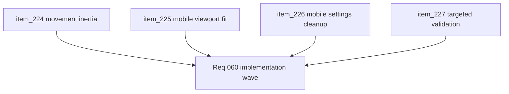

## task_052_orchestrate_movement_inertia_and_mobile_shell_fit_cleanup - Orchestrate movement inertia and mobile shell fit cleanup
> From version: 0.4.0
> Status: Done
> Understanding: 100%
> Confidence: 98%
> Progress: 100%
> Complexity: Medium
> Theme: Gameplay
> Reminder: Update status/understanding/confidence/progress and dependencies/references when you edit this doc.

# Context
- Derived from backlog items `item_224_define_a_light_directional_inertia_posture_for_player_movement_reversals`, `item_225_define_a_mobile_non_pwa_viewport_fit_posture_for_full_shell_visibility`, `item_226_remove_desktop_control_settings_from_the_mobile_shell_surface`, and `item_227_define_targeted_validation_for_movement_inertia_and_mobile_shell_fit`.
- Related request(s): `req_060_define_a_smoother_movement_inertia_and_mobile_shell_fit_wave`.
- Related product brief(s): `prod_001_minimal_overlay_and_feedback_for_early_runtime`, `prod_003_high_density_top_down_survival_action_direction`, `prod_005_visual_identity_dark_fantasy_with_synthetic_energy_accents`.
- Related architecture decision(s): `adr_016_define_shell_scene_state_and_meta_surface_ownership`, `adr_033_adopt_deterministic_movement_oriented_pseudo_physics_instead_of_a_full_physics_engine`.
- The runtime and shell now need a small cross-cutting cleanup wave: smoother reversal feel in movement, full visibility on mobile web outside PWA mode, and removal of desktop-only settings clutter from mobile.
- For the shell/UI portions of this wave, implementation should explicitly use `logics-ui-steering` so mobile cleanup preserves the established shell language.

# Dependencies
- Blocking: `task_051_orchestrate_the_first_playable_techno_shinobi_build_content_wave`.
- Unblocks: cleaner movement feel, more reliable mobile web usability, and a tighter mobile settings surface before broader mobile polish work.

# Plan
- [x] 1. Implement a light directional inertia posture for harsh player movement reversals.
- [x] 2. Implement a mobile non-PWA viewport-fit correction so bottom-edge shell content remains visible.
- [x] 3. Remove or hide desktop-control settings from the mobile shell surface while preserving desktop behavior.
- [x] 4. Run targeted validation covering reversal feel, mobile viewport fit, and desktop/mobile settings behavior.
- [x] 5. Update linked request, backlog, and task docs as the wave lands so traceability stays synchronized.
- [x] CHECKPOINT: leave each completed slice commit-ready before moving to the next one.
- [x] FINAL: Create dedicated git commit(s) for the completed orchestration scope.

# Delivery checkpoints
- Keep the movement-feel correction bounded to reversal behavior first.
- Treat non-PWA mobile browser fit as a correctness issue, not optional polish.
- Keep mobile settings cleanup narrowly focused on relevance and clutter reduction.
- Use `logics-ui-steering` for shell/settings UI changes so the mobile result stays intentional and coherent.
- Update validation as behavior lands so regressions stay visible.

# AC Traceability
- AC1 -> Backlog coverage: `item_224`, `item_225`, `item_226`, `item_227`. Proof: linked slices are implemented or explicitly split further.
- AC2 -> Movement feel: harsh direction reversals no longer snap as brutally. Proof target: movement logic changes and runtime verification.
- AC3 -> Mobile shell fit: non-PWA mobile pages remain fully visible, including bottom-edge content. Proof target: shell/CSS changes and mobile verification.
- AC4 -> Settings cleanup: desktop-control settings are hidden on mobile and preserved on desktop. Proof target: settings behavior and tests where practical.
- AC5 -> Validation posture: targeted automated and manual checks cover movement feel and mobile usability. Proof target: command list and runtime notes.
- AC6 -> UI steering posture: shell and settings changes are implemented with `logics-ui-steering` guidance and manually reviewed for coherence. Proof target: implementation notes and manual review.

# Decision framing
- Product framing: Required
- Product signals: feel, usability, presentation quality
- Product follow-up: keep this wave narrow; do not let it expand into a broad movement or responsive-shell rewrite, and use `logics-ui-steering` to keep UI cleanup intentional.
- Architecture framing: Consider
- Architecture signals: runtime and boundaries
- Architecture follow-up: keep the movement correction compatible with the deterministic movement posture unless a later wave explicitly revisits that decision.

# Links
- Product brief(s): `prod_001_minimal_overlay_and_feedback_for_early_runtime`, `prod_003_high_density_top_down_survival_action_direction`, `prod_005_visual_identity_dark_fantasy_with_synthetic_energy_accents`
- Architecture decision(s): `adr_016_define_shell_scene_state_and_meta_surface_ownership`, `adr_033_adopt_deterministic_movement_oriented_pseudo_physics_instead_of_a_full_physics_engine`
- Backlog item(s): `item_224_define_a_light_directional_inertia_posture_for_player_movement_reversals`, `item_225_define_a_mobile_non_pwa_viewport_fit_posture_for_full_shell_visibility`, `item_226_remove_desktop_control_settings_from_the_mobile_shell_surface`, `item_227_define_targeted_validation_for_movement_inertia_and_mobile_shell_fit`
- Request(s): `req_060_define_a_smoother_movement_inertia_and_mobile_shell_fit_wave`

# Validation
- `npm run test`
- `npm run ci`
- `npm run test:browser:smoke`
- Manual runtime verification that left-right reversal behavior feels bounded and no longer snaps instantly.
- Manual mobile verification in non-PWA browser mode that bottom-edge shell content remains visible.
- Manual verification that desktop-control settings are hidden on mobile and still available on desktop.
- Manual shell/settings review that the final mobile UI remains coherent with `logics-ui-steering` guidance.

# Definition of Done (DoD)
- [x] Covered backlog items are implemented or explicitly split further with updated traceability.
- [x] Player reversal movement has a bounded drift or recovery feel without becoming heavy.
- [x] Non-PWA mobile browser usage shows the full shell without bottom truncation.
- [x] Desktop-control settings are not shown on mobile and remain available on desktop.
- [x] Shell and settings UI changes were guided by `logics-ui-steering` and manually reviewed for coherence.
- [x] Validation commands are executed and results are captured in the task or linked artifacts.
- [x] Linked request, backlog, and task docs are updated during the wave and at closure.
- [x] Dedicated git commit(s) have been created for the completed orchestration scope.
- [x] Status is `Done` and progress is `100%`.

# Implementation notes
- `resolvePseudoPhysicalMovement` now supports a bounded directional inertia profile, and the player movement path uses it only for strong reversals so steering stays responsive while left-right snapping picks up a small drift window.
- `useDocumentViewportLock` now tracks the live visual viewport height and browser-vs-standalone display mode, while `.app-shell` consumes that height variable so non-PWA mobile browsers no longer clip bottom-edge shell content.
- `AppMetaScenePanel` now suppresses desktop-control calibration on mobile settings surfaces and replaces it with a compact shell-consistent notice rather than exposing unusable desktop affordances.

# Report
- Targeted tests passed for `pseudoPhysics`, `AppMetaScenePanel`, `DesktopControlSettingsSection`, `useCameraController`, `PlayerHudCard`, `buildSystem`, runtime integration, and gameplay systems.
- `npm run ci` passed on the completed codebase.
- `npm run test:browser:smoke` passed on the completed codebase.
- Manual mobile browser verification at `390x844` confirmed that main-menu and settings bottom-edge content remain fully visible before PWA installation and that desktop control settings are hidden on mobile.
