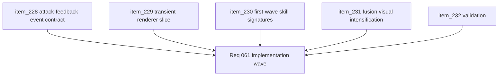

## task_053_orchestrate_the_first_playable_combat_skill_feedback_wave - Orchestrate the first playable combat skill feedback wave
> From version: 0.4.0
> Status: Done
> Understanding: 100%
> Confidence: 98%
> Progress: 100%
> Complexity: High
> Theme: Gameplay
> Reminder: Update status/understanding/confidence/progress and dependencies/references when you edit this doc.

# Context
- Derived from backlog items `item_228_define_a_transient_attack_feedback_event_contract_for_first_wave_playable_weapons`, `item_229_define_a_transient_runtime_renderer_slice_for_weapon_traces_pulses_and_zone_markers`, `item_230_define_readable_first_pass_techno_shinobi_skill_signatures_for_the_six_playable_active_weapons`, `item_231_define_first_pass_fusion_visual_intensification_rules_for_playable_weapon_feedback`, and `item_232_define_targeted_validation_for_first_wave_weapon_feedback_readability_and_runtime_cost`.
- Related request(s): `req_061_define_a_first_combat_skill_feedback_wave_for_playable_weapons`.
- Related product brief(s): `prod_010_first_playable_techno_shinobi_build_content_and_progression_defaults`, `prod_011_techno_shinobi_combat_skill_feedback_direction_for_first_playable_weapons`.
- Related architecture decision(s): `adr_038_split_entity_player_rendering_into_stable_geometry_and_transient_combat_overlays`, `adr_042_separate_weapon_simulation_from_transient_combat_skill_feedback_presentation`.
- The first-wave weapon roster is now implemented in gameplay, but its screen-space combat language is still too weak. This task turns the playable roster into readable techno-shinobi combat feedback without forcing a full projectile-architecture rewrite.

# Dependencies
- Blocking: `task_051_orchestrate_the_first_playable_techno_shinobi_build_content_wave`, `task_052_orchestrate_movement_inertia_and_mobile_shell_fit_cleanup`.
- Unblocks: more readable weapon differentiation, clearer fusion payoff, and later combat/VFX polish waves built on a stable simulation-to-presentation seam.

# Plan
- [x] 1. Implement the transient attack-feedback event contract for first-wave playable weapons.
- [x] 2. Implement the transient runtime renderer slice for traces, pulses, bursts, and temporary zone markers.
- [x] 3. Implement readable first-pass techno-shinobi signatures for the six first-wave active weapons.
- [x] 4. Implement first-pass fusion visual intensification rules while preserving parent-weapon recognition.
- [x] 5. Run targeted validation for readability, fusion payoff visibility, and runtime-cost posture.
- [x] 6. Update linked request, backlog, product, ADR, and task docs as the wave lands so traceability stays synchronized.
- [x] CHECKPOINT: leave each completed slice commit-ready before moving to the next one.
- [x] FINAL: Create dedicated git commit(s) for the completed orchestration scope.

# Delivery checkpoints
- Land the attack-feedback event seam before widening weapon-specific visuals.
- Keep the transient renderer independently reviewable from the six-weapon signature pass.
- Prefer role-readable shape language over spectacle in the first pass.
- Keep fusion visual escalation parameter-driven where possible.
- Update validation as feedback surfaces land so noise and performance regressions stay visible.

# AC Traceability
- AC1 -> Backlog coverage: `item_228`, `item_229`, `item_230`, `item_231`, `item_232`. Proof: linked slices are implemented or explicitly split further.
- AC2 -> Event posture: the runtime exposes a bounded simulation-to-presentation seam for weapon feedback. Proof target: runtime contract and event emission.
- AC3 -> Weapon readability posture: the six first-wave actives gain role-readable combat signatures. Proof target: runtime visuals and manual review.
- AC4 -> Fusion payoff posture: first-wave fusions become visibly escalated forms of known signatures. Proof target: fused runtime review.
- AC5 -> Validation posture: readability and runtime-cost checks are executed and captured. Proof target: command list and profiling notes.

# Decision framing
- Product framing: Required
- Product signals: readability, payoff, weapon learning, combat feel
- Product follow-up: keep this wave bounded to readable first-pass feedback; do not widen into a full projectile-system rewrite or full VFX polish pass.
- Architecture framing: Required
- Architecture signals: runtime and boundaries
- Architecture follow-up: keep the seam aligned with `adr_042` and the transient-overlay posture from `adr_038`.

# Links
- Product brief(s): `prod_010_first_playable_techno_shinobi_build_content_and_progression_defaults`, `prod_011_techno_shinobi_combat_skill_feedback_direction_for_first_playable_weapons`
- Architecture decision(s): `adr_038_split_entity_player_rendering_into_stable_geometry_and_transient_combat_overlays`, `adr_042_separate_weapon_simulation_from_transient_combat_skill_feedback_presentation`
- Backlog item(s): `item_228_define_a_transient_attack_feedback_event_contract_for_first_wave_playable_weapons`, `item_229_define_a_transient_runtime_renderer_slice_for_weapon_traces_pulses_and_zone_markers`, `item_230_define_readable_first_pass_techno_shinobi_skill_signatures_for_the_six_playable_active_weapons`, `item_231_define_first_pass_fusion_visual_intensification_rules_for_playable_weapon_feedback`, `item_232_define_targeted_validation_for_first_wave_weapon_feedback_readability_and_runtime_cost`
- Request(s): `req_061_define_a_first_combat_skill_feedback_wave_for_playable_weapons`

# Validation
- `npm run test -- entitySimulation gameplaySystems emberwakeRuntimeIntegration`
- `npm run typecheck`
- `npm run ci`
- `npm run test:browser:smoke`
- Manual preview verification in an invincible runtime session that the transient feedback layer renders during live combat, with the renderer staying `ready`.
- Manual verification that the transient feedback layer does not replace stable entity rendering and remains compatible with paused level-up overlays.

# Definition of Done (DoD)
- [x] Covered backlog items are implemented or explicitly split further with updated traceability.
- [x] A bounded attack-feedback event seam exists between weapon simulation and presentation.
- [x] The first six active weapons have readable techno-shinobi combat signatures.
- [x] First-wave fusions read as visibly escalated forms of known weapon signatures.
- [x] Validation commands are executed and results are captured in the task or linked artifacts.
- [x] Linked request, backlog, product, ADR, and task docs are updated during the wave and at closure.
- [x] Dedicated git commit(s) have been created for the completed orchestration scope.
- [x] Status is `Done` and progress is `100%`.

# Implementation notes
- Added `CombatSkillFeedbackEvent` to the simulation contract so weapon activity is emitted as compact transient presentation data instead of hardwiring visuals into combat rules.
- Added `CombatSkillFeedbackScene` and wired it through the runtime surface as the dedicated feedback layer above stable world/entity rendering.
- Mapped first-wave weapon roles to readable techno-shinobi signatures: lash ribbon, senbon traces, kunai fan, cinder burst, orbit pulse, and null-canister seal.
- Intensified fused states through palette and density changes keyed by `fusionId`, preserving parent-weapon recognition.
