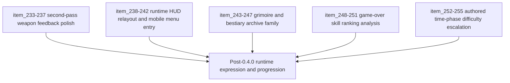

## task_054_orchestrate_post_0_4_0_runtime_expression_and_progression_waves - Orchestrate post-0.4.0 runtime expression and progression waves
> From version: 0.4.0
> Status: Draft
> Understanding: 99%
> Confidence: 98%
> Progress: 0%
> Complexity: High
> Theme: Gameplay
> Reminder: Update status/understanding/confidence/progress and dependencies/references when you edit this doc.

# Context
- Derived from backlog items `item_233_define_a_non_hit_readability_posture_for_polished_weapon_feedback`, `item_234_define_a_stronger_cinder_arc_anticipation_and_travel_signature_without_full_projectiles`, `item_235_define_a_more_present_orbit_sutra_and_null_canister_spatial_ownership_signature`, `item_236_define_clearer_visual_role_separation_between_guided_senbon_and_shade_kunai`, `item_237_define_targeted_validation_for_second_pass_weapon_feedback_polish`, `item_238_define_a_compact_top_left_player_progression_hud_block`, `item_239_define_a_quiet_top_right_fps_text_and_compact_runtime_menu_trigger`, `item_240_define_a_bottom_right_reserved_build_slot_hud_for_active_and_passive_capacity`, `item_241_route_the_mobile_runtime_menu_trigger_to_the_full_screen_shell_surface`, `item_242_define_ui_steering_validation_for_the_runtime_hud_relayout_wave`, `item_243_define_main_menu_codex_archive_entry_posture_for_grimoire_and_bestiary_access`, `item_244_define_a_player_facing_grimoire_scene_for_skill_discovery_and_future_unlock_gating`, `item_245_define_a_player_facing_bestiary_scene_for_discovered_creatures_and_defeat_tracking`, `item_246_define_a_shared_discovery_gating_and_unknown_entry_posture_for_codex_archive_scenes`, `item_247_define_techno_shinobi_codex_archive_presentation_and_validation_for_grimoire_and_bestiary`, `item_248_define_a_game_over_view_toggle_between_recap_and_skill_ranking_analysis`, `item_249_define_a_first_pass_skill_performance_summary_contract_for_post_run_ranking`, `item_250_define_a_compact_skill_ranking_presentation_for_game_over_analysis`, `item_251_define_targeted_validation_for_game_over_skill_analysis_readability_and_metric_credibility`, `item_252_define_an_authored_time_phase_model_for_run_progression_beats`, `item_253_define_first_pass_time_driven_pressure_levers_for_spawn_and_enemy_scaling`, `item_254_define_player_facing_phase_signaling_for_time_driven_run_escalation`, and `item_255_define_targeted_validation_for_time_owned_run_pacing_and_difficulty_escalation`.
- Related request(s): `req_062_define_a_second_combat_skill_feedback_polish_wave_for_underexpressed_weapons`, `req_063_define_a_techno_shinobi_runtime_hud_relayout_and_mobile_menu_entry_wave`, `req_064_define_a_grimoire_scene_for_skill_discovery_and_future_unlock_gating`, `req_065_define_a_bestiary_scene_for_discovered_and_defeated_creatures`, `req_066_define_a_game_over_skill_ranking_view_toggle`, `req_067_define_a_time_driven_run_progression_and_difficulty_escalation_wave`.
- Related product brief(s): `prod_012_second_pass_combat_skill_feedback_polish_for_underexpressed_weapons`, `prod_013_techno_shinobi_runtime_hud_and_menu_entry_direction`, `prod_014_shell_codex_archive_direction_for_grimoire_and_bestiary`, `prod_015_post_run_outcome_analysis_direction_for_skill_performance`, `prod_016_time_owned_run_arc_and_authored_difficulty_phases`.
- Related architecture decision(s): `adr_043_extend_transient_weapon_feedback_with_bounded_anticipation_and_linger_states`, `adr_044_split_runtime_hud_into_anchored_blocks_and_route_mobile_menu_entry_to_the_full_screen_shell_surface`, `adr_045_model_grimoire_and_bestiary_as_shell_owned_discovery_gated_archive_scenes`, `adr_046_expose_post_run_skill_performance_summaries_as_shell_consumable_outcome_data`, `adr_047_structure_first_pass_run_difficulty_escalation_as_authored_time_phases`.
- `0.4.0` shipped the first playable build loop and first-pass combat readability. This orchestration task groups the next expression and progression waves: second-pass weapon readability polish, runtime HUD relayout, codex/archive scenes, post-run skill analysis, and first authored time-based difficulty phases.

# Dependencies
- Blocking: `task_053_orchestrate_the_first_playable_combat_skill_feedback_wave`.
- Unblocks: stronger combat readability, more expressive runtime HUD chrome, shell-owned codex/archive surfaces, more reflective defeat analysis, and a clearer time-owned run arc for future tuning and content expansion.

# Plan
- [ ] 1. Implement the second-pass weapon feedback polish wave, keeping the transient seam and strengthening under-expressed roles without widening into a projectile rewrite.
- [ ] 2. Implement the runtime HUD relayout wave with anchored techno-shinobi HUD blocks, reserved build slots, compact top-right chrome, and mobile full-screen menu entry routing.
- [ ] 3. Implement the shell codex/archive family with `Grimoire` and `Bestiary` scenes plus a shared discovery-gating posture for unknown entries.
- [ ] 4. Implement the game-over skill analysis toggle with a bounded post-run skill-performance summary contract and compact ranking view.
- [ ] 5. Implement the first authored time-phase run escalation wave with bounded pressure levers and light phase signaling.
- [ ] 6. Run targeted validation across combat readability, HUD/UI coherence, archive-surface clarity, outcome analysis credibility, and time-owned pacing.
- [ ] 7. Update linked request, backlog, product, ADR, and task docs as the grouped waves land so traceability stays synchronized.
- [ ] CHECKPOINT: leave each completed slice commit-ready before moving to the next one.
- [ ] FINAL: Create dedicated git commit(s) for the completed orchestration scope.

# Delivery checkpoints
- Keep the second-pass weapon polish on top of the transient feedback seam from `task_053`; do not reopen projectile architecture unless a later subwave proves it necessary.
- For HUD, archive, and outcome surfaces, explicitly use `logics-ui-steering` so the shell language stays techno-shinobi and avoids generic panel drift.
- Keep `Grimoire` and `Bestiary` as sibling archive scenes with shared discovery posture, not as unrelated one-off menus.
- Keep post-run skill analysis compact and credible; prefer one clear ranking metric over multi-metric overload.
- Treat time-driven escalation as authored first-pass pacing, not an invitation to build a large adaptive-director system.

# AC Traceability
- AC1 -> Backlog coverage: `item_233` through `item_255`. Proof: linked slices are implemented or explicitly split further.
- AC2 -> Combat-expression posture: under-expressed weapons gain clearer non-hit, anticipation, and spatial-ownership reads while preserving the transient-feedback architecture. Proof target: runtime visuals and validation notes.
- AC3 -> HUD posture: runtime feedback becomes anchored techno-shinobi HUD chrome with reserved build-slot capacity and mobile-coherent menu entry behavior. Proof target: runtime UI verification on desktop and mobile layouts.
- AC4 -> Archive posture: `Grimoire` and `Bestiary` become shell-owned discovery-gated archive scenes with credible unknown-entry treatment. Proof target: main-menu entry flow and archive-scene behavior.
- AC5 -> Outcome-analysis posture: the defeat screen can switch between recap and a credible skill-ranking view built from bounded outcome summaries. Proof target: outcome UI and data-contract verification.
- AC6 -> Time-owned run posture: the run gains authored time phases, bounded pressure escalation, and readable phase signaling. Proof target: gameplay tuning/model updates and runtime verification.
- AC7 -> Validation posture: grouped validation covers readability, UI coherence, shell navigation, outcome credibility, and pacing. Proof target: command list, smoke checks, and runtime review notes.

# Decision framing
- Product framing: Required
- Product signals: readability, pacing, reflection, discovery, HUD clarity, codex value
- Product follow-up: keep each subwave bounded enough that problems stay attributable and later tuning remains possible.
- Architecture framing: Required
- Architecture signals: runtime and boundaries
- Architecture follow-up: preserve the transient combat-feedback seam, shell-owned archive ownership, shell-consumable outcome data posture, and authored time-phase escalation model.

# Links
- Product brief(s): `prod_012_second_pass_combat_skill_feedback_polish_for_underexpressed_weapons`, `prod_013_techno_shinobi_runtime_hud_and_menu_entry_direction`, `prod_014_shell_codex_archive_direction_for_grimoire_and_bestiary`, `prod_015_post_run_outcome_analysis_direction_for_skill_performance`, `prod_016_time_owned_run_arc_and_authored_difficulty_phases`
- Architecture decision(s): `adr_043_extend_transient_weapon_feedback_with_bounded_anticipation_and_linger_states`, `adr_044_split_runtime_hud_into_anchored_blocks_and_route_mobile_menu_entry_to_the_full_screen_shell_surface`, `adr_045_model_grimoire_and_bestiary_as_shell_owned_discovery_gated_archive_scenes`, `adr_046_expose_post_run_skill_performance_summaries_as_shell_consumable_outcome_data`, `adr_047_structure_first_pass_run_difficulty_escalation_as_authored_time_phases`
- Backlog item(s): `item_233_define_a_non_hit_readability_posture_for_polished_weapon_feedback`, `item_234_define_a_stronger_cinder_arc_anticipation_and_travel_signature_without_full_projectiles`, `item_235_define_a_more_present_orbit_sutra_and_null_canister_spatial_ownership_signature`, `item_236_define_clearer_visual_role_separation_between_guided_senbon_and_shade_kunai`, `item_237_define_targeted_validation_for_second_pass_weapon_feedback_polish`, `item_238_define_a_compact_top_left_player_progression_hud_block`, `item_239_define_a_quiet_top_right_fps_text_and_compact_runtime_menu_trigger`, `item_240_define_a_bottom_right_reserved_build_slot_hud_for_active_and_passive_capacity`, `item_241_route_the_mobile_runtime_menu_trigger_to_the_full_screen_shell_surface`, `item_242_define_ui_steering_validation_for_the_runtime_hud_relayout_wave`, `item_243_define_main_menu_codex_archive_entry_posture_for_grimoire_and_bestiary_access`, `item_244_define_a_player_facing_grimoire_scene_for_skill_discovery_and_future_unlock_gating`, `item_245_define_a_player_facing_bestiary_scene_for_discovered_creatures_and_defeat_tracking`, `item_246_define_a_shared_discovery_gating_and_unknown_entry_posture_for_codex_archive_scenes`, `item_247_define_techno_shinobi_codex_archive_presentation_and_validation_for_grimoire_and_bestiary`, `item_248_define_a_game_over_view_toggle_between_recap_and_skill_ranking_analysis`, `item_249_define_a_first_pass_skill_performance_summary_contract_for_post_run_ranking`, `item_250_define_a_compact_skill_ranking_presentation_for_game_over_analysis`, `item_251_define_targeted_validation_for_game_over_skill_analysis_readability_and_metric_credibility`, `item_252_define_an_authored_time_phase_model_for_run_progression_beats`, `item_253_define_first_pass_time_driven_pressure_levers_for_spawn_and_enemy_scaling`, `item_254_define_player_facing_phase_signaling_for_time_driven_run_escalation`, `item_255_define_targeted_validation_for_time_owned_run_pacing_and_difficulty_escalation`
- Request(s): `req_062_define_a_second_combat_skill_feedback_polish_wave_for_underexpressed_weapons`, `req_063_define_a_techno_shinobi_runtime_hud_relayout_and_mobile_menu_entry_wave`, `req_064_define_a_grimoire_scene_for_skill_discovery_and_future_unlock_gating`, `req_065_define_a_bestiary_scene_for_discovered_and_defeated_creatures`, `req_066_define_a_game_over_skill_ranking_view_toggle`, `req_067_define_a_time_driven_run_progression_and_difficulty_escalation_wave`

# Validation
- `npm run test`
- `npm run ci`
- `npm run test:browser:smoke`
- Manual runtime verification that second-pass feedback polish improves `Cinder Arc`, `Orbit Sutra`, `Null Canister`, and the separation between `Guided Senbon` and `Shade Kunai`.
- Manual desktop/mobile verification of the runtime HUD relayout, reserved slot posture, compact menu trigger, and mobile full-screen shell entry behavior.
- Manual verification that `Grimoire` and `Bestiary` feel like sibling archive scenes, and that unknown entries feel intentionally undiscovered.
- Manual verification that the game-over screen can alternate between recap and skill-ranking analysis without losing clarity.
- Manual or scripted verification that time-based escalation phases are perceptible and affect gameplay pressure in authored beats.

# Definition of Done (DoD)
- [ ] Covered backlog items are implemented or explicitly split further with updated traceability.
- [ ] Second-pass combat skill polish lands without breaking the transient-feedback architecture.
- [ ] Runtime HUD relayout lands with techno-shinobi coherence and mobile-consistent menu entry behavior.
- [ ] `Grimoire` and `Bestiary` exist as shell-owned discovery-gated archive scenes.
- [ ] The game-over screen can toggle to a compact skill-ranking analysis view backed by bounded outcome summaries.
- [ ] The run gains a readable first-pass time-owned escalation arc.
- [ ] Validation commands are executed and results are captured in the task or linked artifacts.
- [ ] Linked request, backlog, product, ADR, and task docs are updated during the wave and at closure.
- [ ] Dedicated git commit(s) have been created for the completed orchestration scope.
- [ ] Status is `Done` and progress is `100%`.
