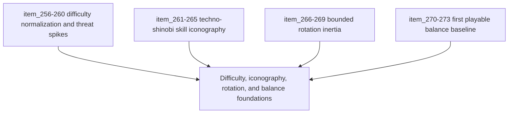

## task_055_orchestrate_difficulty_iconography_rotation_and_balance_foundations - Orchestrate difficulty, iconography, rotation, and balance foundations
> From version: 0.5.0
> Status: Done
> Understanding: 100%
> Confidence: 99%
> Progress: 100%
> Complexity: High
> Theme: Gameplay
> Reminder: Update status/understanding/confidence/progress and dependencies/references when you edit this doc.

# Context
- Derived from backlog items `item_256_define_a_softer_opening_hostile_spawn_posture_for_the_time_owned_run_arc`, `item_257_define_a_more_open_late_run_hostile_population_envelope`, `item_258_define_phase_gated_stronger_enemy_composition_for_run_escalation`, `item_259_define_authored_mini_boss_beats_for_every_five_minutes_of_survival`, `item_260_define_targeted_validation_for_the_normalized_difficulty_curve_and_threat_spikes`, `item_261_define_a_shared_techno_shinobi_icon_language_for_build_facing_skill_assets`, `item_262_define_the_first_active_skill_icon_set_for_the_playable_roster`, `item_263_define_the_first_passive_item_icon_set_for_the_playable_roster`, `item_264_define_fusion_icon_intensification_as_a_derivative_of_base_build_identity`, `item_265_define_icon_asset_delivery_across_hud_grimoire_and_build_choice_surfaces`, `item_266_define_a_simulation_owned_turn_rate_contract_for_player_entity_facing`, `item_267_define_target_heading_and_last_meaningful_facing_rules_under_rotation_inertia`, `item_268_define_a_future_modifier_seam_for_authored_turn_responsiveness_changes`, `item_269_define_targeted_validation_for_player_turning_readability_and_responsiveness`, `item_270_define_first_pass_parity_targets_for_active_passive_and_fusion_build_power`, `item_271_define_first_pass_run_economy_targets_for_xp_level_ups_chests_and_gold`, `item_272_define_pressure_alignment_between_build_growth_and_time_owned_escalation`, and `item_273_define_a_repeatable_balance_validation_matrix_for_the_first_playable_loop`.
- Related request(s): `req_069_define_a_smoother_early_game_and_stronger_time_scaled_enemy_pressure_wave`, `req_070_define_a_techno_shinobi_iconography_wave_for_active_passive_and_fusion_skills`, `req_071_define_a_bounded_entity_rotation_inertia_and_turn_rate_wave`, `req_072_define_a_first_playable_balance_wave_for_build_power_run_economy_and_difficulty_pacing`.
- Related architecture decision(s): `adr_036_externalize_retunable_gameplay_and_system_tuning_as_validated_json_contracts`, `adr_047_structure_first_pass_run_difficulty_escalation_as_authored_time_phases`, `adr_049_structure_time_scaled_enemy_pressure_around_authored_population_opening_composition_tiers_and_mini_boss_beats`, `adr_050_use_a_shared_vector_first_techno_shinobi_icon_family_for_build_facing_skill_representation`, `adr_051_resolve_player_orientation_through_a_bounded_simulation_owned_turn_rate`.
- The next foundational wave after `0.4.0` needs to harden four adjacent layers together: authored difficulty growth, build-facing icon identity, bounded turning feel, and the first real playable balance baseline.

# Dependencies
- Blocking: `task_051_orchestrate_the_first_playable_techno_shinobi_build_content_wave`, `task_052_orchestrate_movement_inertia_and_mobile_shell_fit_cleanup`, `task_054_orchestrate_post_0_4_0_runtime_expression_and_progression_waves`.
- Unblocks: stronger hostile composition, mini-boss pacing, real build-facing iconography, future turn-speed content hooks, and a more credible first playable balance baseline.

# Plan
- [x] 1. Implement the next authored difficulty slice: softer opening pressure, wider late density, stronger enemy composition, and periodic mini-boss beats.
- [x] 2. Implement the techno-shinobi skill iconography family and land it in HUD, `Grimoire`, and build-facing choice surfaces.
- [x] 3. Implement bounded player rotation inertia through a simulation-owned turn-rate posture with future modifier seams.
- [x] 4. Implement the first playable balance pass across build power, run economy, and pressure alignment.
- [x] 5. Run targeted validation for difficulty, icon readability, turning feel, and first-loop balance.
- [x] 6. Update linked requests, backlog items, ADRs, and this task as the wave lands.
- [x] CHECKPOINT: keep each subwave commit-ready before proceeding.
- [x] FINAL: Create dedicated git commit(s) for the completed orchestration scope.

# Delivery checkpoints
- Keep difficulty escalation authored and phase-driven; do not widen into a general adaptive director.
- Use `logics-ui-steering` on iconography delivery so build-facing surfaces stay techno-shinobi rather than generic action-RPG.
- Keep rotation inertia simulation-owned and deterministic; do not fake the effect purely in rendering.
- Use the existing tuning-contract posture so balance changes remain explicit and reviewable.

# AC Traceability
- AC1 -> Backlog coverage: `item_256` through `item_273`.
- AC2 -> Difficulty posture: opening pressure softens, late pressure densifies, stronger enemies enter progressively, and mini-boss beats punctuate the run.
- AC3 -> Iconography posture: actives, passives, and fusions gain a coherent techno-shinobi icon family that lands in real build-facing surfaces.
- AC4 -> Turning posture: player facing gains bounded rotation inertia without losing control clarity.
- AC5 -> Balance posture: build power, economy, and difficulty pacing gain a first authored baseline with repeatable validation.

# Request AC Traceability
- req_069_define_a_smoother_early_game_and_stronger_time_scaled_enemy_pressure_wave coverage: AC1, AC2, AC3, AC4, AC5, AC6, AC7. Proof: `task_055_orchestrate_difficulty_iconography_rotation_and_balance_foundations` closes the linked request chain for `req_069_define_a_smoother_early_game_and_stronger_time_scaled_enemy_pressure_wave` and carries the delivery evidence for `item_260_define_targeted_validation_for_the_normalized_difficulty_curve_and_threat_spikes`.

# Decision framing
- Product framing: Required
- Product signals: pressure pacing, icon readability, turning feel, build viability, reward cadence
- Architecture framing: Required
- Architecture signals: authored escalation, simulation-owned turning, asset family consistency, tuning explicitness

# Links
- Product brief(s): `prod_005_visual_identity_dark_fantasy_with_synthetic_energy_accents`, `prod_010_first_playable_techno_shinobi_build_content_and_progression_defaults`, `prod_016_time_owned_run_arc_and_authored_difficulty_phases`
- Architecture decision(s): `adr_036_externalize_retunable_gameplay_and_system_tuning_as_validated_json_contracts`, `adr_047_structure_first_pass_run_difficulty_escalation_as_authored_time_phases`, `adr_049_structure_time_scaled_enemy_pressure_around_authored_population_opening_composition_tiers_and_mini_boss_beats`, `adr_050_use_a_shared_vector_first_techno_shinobi_icon_family_for_build_facing_skill_representation`, `adr_051_resolve_player_orientation_through_a_bounded_simulation_owned_turn_rate`
- Backlog item(s): `item_256_define_a_softer_opening_hostile_spawn_posture_for_the_time_owned_run_arc`, `item_257_define_a_more_open_late_run_hostile_population_envelope`, `item_258_define_phase_gated_stronger_enemy_composition_for_run_escalation`, `item_259_define_authored_mini_boss_beats_for_every_five_minutes_of_survival`, `item_260_define_targeted_validation_for_the_normalized_difficulty_curve_and_threat_spikes`, `item_261_define_a_shared_techno_shinobi_icon_language_for_build_facing_skill_assets`, `item_262_define_the_first_active_skill_icon_set_for_the_playable_roster`, `item_263_define_the_first_passive_item_icon_set_for_the_playable_roster`, `item_264_define_fusion_icon_intensification_as_a_derivative_of_base_build_identity`, `item_265_define_icon_asset_delivery_across_hud_grimoire_and_build_choice_surfaces`, `item_266_define_a_simulation_owned_turn_rate_contract_for_player_entity_facing`, `item_267_define_target_heading_and_last_meaningful_facing_rules_under_rotation_inertia`, `item_268_define_a_future_modifier_seam_for_authored_turn_responsiveness_changes`, `item_269_define_targeted_validation_for_player_turning_readability_and_responsiveness`, `item_270_define_first_pass_parity_targets_for_active_passive_and_fusion_build_power`, `item_271_define_first_pass_run_economy_targets_for_xp_level_ups_chests_and_gold`, `item_272_define_pressure_alignment_between_build_growth_and_time_owned_escalation`, `item_273_define_a_repeatable_balance_validation_matrix_for_the_first_playable_loop`
- Request(s): `req_069_define_a_smoother_early_game_and_stronger_time_scaled_enemy_pressure_wave`, `req_070_define_a_techno_shinobi_iconography_wave_for_active_passive_and_fusion_skills`, `req_071_define_a_bounded_entity_rotation_inertia_and_turn_rate_wave`, `req_072_define_a_first_playable_balance_wave_for_build_power_run_economy_and_difficulty_pacing`

# Validation
- `npm run test`
- `npm run ci`
- `npm run test:browser:smoke`
- Manual and scripted verification of early/mid/late pressure, stronger-enemy entry, and mini-boss cadence.
- Manual verification of icon readability in HUD, `Grimoire`, and build-choice surfaces.
- Manual verification of player turning feel under sharp reversals and ordinary steering arcs.
- Repeatable first-loop balance checks for build power, economy pacing, and escalation alignment.

# Definition of Done (DoD)
- [x] Covered backlog items are implemented or explicitly split further with updated traceability.
- [x] Authored difficulty normalization, stronger enemy composition, and mini-boss beats land coherently.
- [x] The first techno-shinobi skill iconography family lands in real build-facing UI surfaces.
- [x] Player rotation inertia lands as a bounded simulation-owned turn-rate posture.
- [x] The first authored balance baseline lands with validation evidence.
- [x] Linked requests, backlog items, ADRs, and this task are updated during the wave and at closure.
- [x] Dedicated git commit(s) have been created for the completed orchestration scope.
- [x] Status is `Done` and progress is `100%`.
