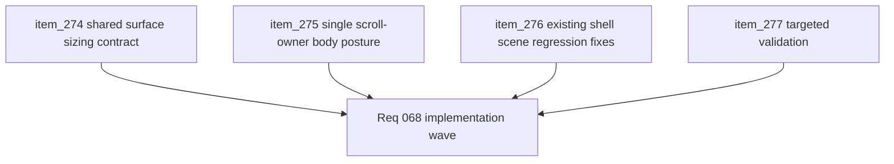

## task_056_orchestrate_viewport_safe_scroll_ownership_for_shell_surfaces - Orchestrate viewport-safe scroll ownership for shell surfaces
> From version: 0.4.0
> Status: Done
> Understanding: 100%
> Confidence: 99%
> Progress: 100%
> Complexity: Medium
> Theme: UI
> Reminder: Update status/understanding/confidence/progress and dependencies/references when you edit this doc.

# Context
- Derived from backlog items `item_274_define_a_shared_viewport_safe_shell_surface_sizing_contract`, `item_275_define_a_single_scroll_owner_scene_body_posture_for_variable_height_shell_content`, `item_276_define_regression_fixes_for_existing_shell_scenes_under_the_viewport_safe_scroll_contract`, and `item_277_define_targeted_validation_for_shell_viewport_fit_scroll_ownership_and_action_reachability`.
- Related request(s): `req_068_define_a_viewport_safe_scroll_ownership_wave_for_shell_surfaces`.
- Related product brief(s): `prod_005_visual_identity_dark_fantasy_with_synthetic_energy_accents`.
- Related architecture decision(s): `adr_016_define_shell_scene_state_and_meta_surface_ownership`, `adr_048_adopt_a_viewport_safe_scroll_owner_contract_for_shell_surfaces`.
- Recent shell waves added more content-rich surfaces, and several of them have already regressed by exceeding the viewport or hiding bottom actions behind missing scroll ownership.
- This wave should convert the shell from ad hoc panel fixes into one repeatable viewport-safe scene contract.
- Shell/UI implementation in this wave should explicitly use `logics-ui-steering` so reachability fixes stay aligned with the techno-shinobi shell identity instead of degrading into generic utility panels.

# Dependencies
- Blocking: `task_054_orchestrate_post_0_4_0_runtime_expression_and_progression_waves`.
- Unblocks: more reliable shell scene additions, safer codex/archive growth, and future panel work that no longer repeats the same clipping failure mode.

# Plan
- [x] 1. Implement the shared viewport-safe shell surface sizing contract.
- [x] 2. Implement the default single-scroll-owner scene-body posture for variable-height shell scenes.
- [x] 3. Apply the contract to the known regression-prone scenes and shell-adjacent auxiliary panels.
- [x] 4. Run targeted validation for desktop, mobile browser, and non-PWA action reachability.
- [x] 5. Update linked request, ADR, backlog items, and this task as the wave lands.
- [x] CHECKPOINT: leave each slice commit-ready before proceeding to the next one.
- [x] FINAL: Create dedicated git commit(s) for the completed orchestration scope.

# Delivery checkpoints
- Keep the wave architectural, not cosmetic.
- Prefer one shared shell pattern over per-scene hacks whenever possible.
- Keep primary actions reachable while the content body absorbs overflow.
- Use `logics-ui-steering` for scene-level shell changes so the viewport-safe result remains consistent with the established techno-shinobi shell family.
- Do not reopen unrelated shell redesign questions while fixing fit and scroll ownership.

# AC Traceability
- AC1 -> Backlog coverage: `item_274`, `item_275`, `item_276`, and `item_277` were delivered as one shell-scroll wave. Proof: the linked backlog items now close together around shared sizing, scroll ownership, regression cleanup, and validation.
- AC2 -> Structural posture: viewport fit and scroll ownership are treated as one shell contract instead of one-off scene patches. Proof: `src/app/styles/app.css` defines the shared shell surface bounds, and `src/app/components/AppMetaScenePanel.tsx` applies the contract across the shell scenes.
- AC3 -> Scene posture: content-heavy shell scenes expose one explicit scroll owner. Proof: `src/app/styles/app.css` provides `.app-meta-scene__scene-body--settings` and `.app-meta-scene__scene-body--scroll`, and `src/app/components/AppMetaScenePanel.tsx` routes `Settings`, `Grimoire`, `Bestiary`, and `Game over` through those bodies.
- AC4 -> Viewport-fit posture: shell surfaces fit within the safe viewport on desktop, mobile browser, and non-PWA layouts. Proof: `src/app/styles/app.css` uses shared shell offsets, `100dvh`/`100svh`, and per-scene bounded heights, while `src/app/components/RuntimeBuildChoicePanel.css` applies the same bounded panel posture to the adjacent runtime shell surface.
- AC5 -> Bounded sizing rule: variable-height shell surfaces prefer bounded heights and `max-height` over unconstrained growth. Proof: `.app-meta-scene` and `.runtime-build-choice` both use bounded panel sizing in `src/app/styles/app.css` and `src/app/components/RuntimeBuildChoicePanel.css`.
- AC6 -> Reachable actions: headers and bottom actions remain outside the scroller while the body absorbs overflow. Proof: `src/app/styles/app.css` uses `grid-template-rows: auto minmax(0, 1fr) auto`, and `src/app/components/AppMetaScenePanel.tsx` renders dedicated action rows after the scroll body.
- AC7 -> Regression coverage: `Settings`, `Changelogs`, `Grimoire`, `Bestiary`, `Game over`, and `Pause` are covered under the new contract. Proof: those scene branches exist in `src/app/components/AppMetaScenePanel.tsx`, and `src/app/components/AppMetaScenePanel.test.tsx` exercises the core navigation and reachability flows.
- AC8 -> Prevention posture: the wave leaves reusable scene-body patterns and targeted validation guardrails for future shell work. Proof: this task retains repeatable validation commands, and the historical landing commits `ea04d9d` and `8230748` anchor the contract in the implementation history.

# Decision framing
- Product framing: Required
- Product signals: reachability, usability, shell polish
- Product follow-up: use `logics-ui-steering` as a review lens for all shell panels touched by the wave.
- Architecture framing: Required
- Architecture signals: shell ownership, shared viewport contract
- Architecture follow-up: align any shared scene-body abstraction with `adr_048_adopt_a_viewport_safe_scroll_owner_contract_for_shell_surfaces`.

# Links
- Product brief(s): `prod_005_visual_identity_dark_fantasy_with_synthetic_energy_accents`
- Architecture decision(s): `adr_016_define_shell_scene_state_and_meta_surface_ownership`, `adr_048_adopt_a_viewport_safe_scroll_owner_contract_for_shell_surfaces`
- Backlog item(s): `item_274_define_a_shared_viewport_safe_shell_surface_sizing_contract`, `item_275_define_a_single_scroll_owner_scene_body_posture_for_variable_height_shell_content`, `item_276_define_regression_fixes_for_existing_shell_scenes_under_the_viewport_safe_scroll_contract`, `item_277_define_targeted_validation_for_shell_viewport_fit_scroll_ownership_and_action_reachability`
- Request(s): `req_068_define_a_viewport_safe_scroll_ownership_wave_for_shell_surfaces`

# Validation
- `npm run logics:lint`
- `npm run test`
- `npm run test:browser:smoke`
- Manual verification on desktop for shell scenes with variable-height content.
- Manual verification on mobile browser and non-PWA contexts that bottom actions remain reachable.
- Manual verification that scroll ownership is explicit and does not trap the user inside nested scrollers.

# Definition of Done (DoD)
- [x] Covered backlog items are implemented or explicitly split further with updated traceability.
- [x] The shell panel family uses one shared viewport-safe sizing contract.
- [x] Variable-content shell scenes expose one clear scroll owner with reachable actions.
- [x] Known regression-prone scenes no longer clip or hide bottom actions across supported viewport contexts.
- [x] Shell/UI changes were guided by `logics-ui-steering` and manually reviewed for coherence.
- [x] Validation commands are executed and results are captured in the task or linked artifacts.
- [x] Linked request, ADR, backlog items, and this task are updated during the wave and at closure.
- [x] Dedicated git commit(s) have been created for the completed orchestration scope.
- [x] Status is `Done` and progress is `100%`.

# Report
- Historical implementation evidence: commit `ea04d9d` landed the shared viewport-bound shell panels, and commit `8230748` tightened archive-layout follow-up work under the same contract.
- Consolidation validation should keep using the linked shell panel CSS, scene-body structure, and scene-level tests as the source of truth for this wave.

# Implementation notes
- `src/app/styles/app.css` now gives the shell panel family one bounded viewport-safe surface contract, plus per-scene bounded heights for the known high-risk shell scenes.
- `src/app/components/AppMetaScenePanel.tsx` makes `Settings`, `Grimoire`, `Bestiary`, and `Game over` explicit scene-body scroll owners while keeping `Back`, `Resume`, and outcome actions outside the scroller.
- `src/app/components/RuntimeBuildChoicePanel.css` uses the same shell-offset and bounded-height posture so the adjacent runtime surface does not regress separately from the shell scenes.
- `src/app/components/AppMetaScenePanel.test.tsx` covers the core shell-scene navigation and reachability flows that anchor the regression checks for this wave.
