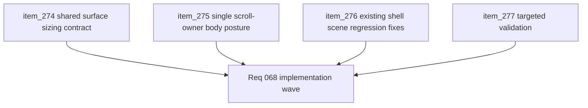

## task_056_orchestrate_viewport_safe_scroll_ownership_for_shell_surfaces - Orchestrate viewport-safe scroll ownership for shell surfaces
> From version: 0.4.0
> Status: Draft
> Understanding: 98%
> Confidence: 97%
> Progress: 0%
> Complexity: Medium
> Theme: UI
> Reminder: Update status/understanding/confidence/progress and dependencies/references when you edit this doc.

# Context
- Derived from backlog items `item_274_define_a_shared_viewport_safe_shell_surface_sizing_contract`, `item_275_define_a_single_scroll_owner_scene_body_posture_for_variable_height_shell_content`, `item_276_define_regression_fixes_for_existing_shell_scenes_under_the_viewport_safe_scroll_contract`, and `item_277_define_targeted_validation_for_shell_viewport_fit_scroll_ownership_and_action_reachability`.
- Related request(s): `req_068_define_a_viewport_safe_scroll_ownership_wave_for_shell_surfaces`.
- Related architecture decision(s): `adr_016_define_shell_scene_state_and_meta_surface_ownership`, `adr_048_adopt_a_viewport_safe_scroll_owner_contract_for_shell_surfaces`.
- Recent shell waves added more content-rich surfaces, and several of them have already regressed by exceeding the viewport or hiding bottom actions behind missing scroll ownership.
- This wave should convert the shell from ad hoc panel fixes into one repeatable viewport-safe scene contract.
- Shell/UI implementation in this wave should explicitly use `logics-ui-steering` so reachability fixes stay aligned with the techno-shinobi shell identity instead of degrading into generic utility panels.

# Dependencies
- Blocking: `task_054_orchestrate_post_0_4_0_runtime_expression_and_progression_waves`.
- Unblocks: more reliable shell scene additions, safer codex/archive growth, and future panel work that no longer repeats the same clipping failure mode.

# Plan
- [ ] 1. Implement the shared viewport-safe shell surface sizing contract.
- [ ] 2. Implement the default single-scroll-owner scene-body posture for variable-height shell scenes.
- [ ] 3. Apply the contract to the known regression-prone scenes and shell-adjacent auxiliary panels.
- [ ] 4. Run targeted validation for desktop, mobile browser, and non-PWA action reachability.
- [ ] 5. Update linked request, ADR, backlog items, and this task as the wave lands.
- [ ] CHECKPOINT: leave each slice commit-ready before proceeding to the next one.
- [ ] FINAL: Create dedicated git commit(s) for the completed orchestration scope.

# Delivery checkpoints
- Keep the wave architectural, not cosmetic.
- Prefer one shared shell pattern over per-scene hacks whenever possible.
- Keep primary actions reachable while the content body absorbs overflow.
- Use `logics-ui-steering` for scene-level shell changes so the viewport-safe result remains consistent with the established techno-shinobi shell family.
- Do not reopen unrelated shell redesign questions while fixing fit and scroll ownership.

# AC Traceability
- AC1 -> Backlog coverage: `item_274`, `item_275`, `item_276`, `item_277`.
- AC2 -> Structural posture: viewport fit and scroll ownership are treated as one shell contract, not one-off patches.
- AC3 -> Scene posture: content-heavy scenes gain one explicit scroll owner with reachable actions.
- AC4 -> Regression coverage: `Settings`, `Changelogs`, `Grimoire`, `Bestiary`, `Game over`, `Pause`, and similar surfaces are reviewed under the new contract.
- AC5 -> Prevention posture: targeted validation makes future regressions harder to reintroduce.

# Decision framing
- Product framing: Required
- Product signals: reachability, usability, shell polish
- Product follow-up: use `logics-ui-steering` as a review lens for all shell panels touched by the wave.
- Architecture framing: Required
- Architecture signals: shell ownership, shared viewport contract
- Architecture follow-up: align any shared scene-body abstraction with `adr_048_adopt_a_viewport_safe_scroll_owner_contract_for_shell_surfaces`.

# Links
- Architecture decision(s): `adr_016_define_shell_scene_state_and_meta_surface_ownership`, `adr_048_adopt_a_viewport_safe_scroll_owner_contract_for_shell_surfaces`
- Backlog item(s): `item_274_define_a_shared_viewport_safe_shell_surface_sizing_contract`, `item_275_define_a_single_scroll_owner_scene_body_posture_for_variable_height_shell_content`, `item_276_define_regression_fixes_for_existing_shell_scenes_under_the_viewport_safe_scroll_contract`, `item_277_define_targeted_validation_for_shell_viewport_fit_scroll_ownership_and_action_reachability`
- Request(s): `req_068_define_a_viewport_safe_scroll_ownership_wave_for_shell_surfaces`

# Validation
- `npm run logics:lint`
- `npm run test`
- `npm run test:browser:smoke`
- Manual verification on desktop for shell scenes with variable-height content.
- Manual verification on mobile browser and non-PWA contexts that bottom actions remain reachable.
- Manual verification that scroll ownership is explicit and does not trap the user inside nested scrollers.

# Definition of Done (DoD)
- [ ] Covered backlog items are implemented or explicitly split further with updated traceability.
- [ ] The shell panel family uses one shared viewport-safe sizing contract.
- [ ] Variable-content shell scenes expose one clear scroll owner with reachable actions.
- [ ] Known regression-prone scenes no longer clip or hide bottom actions across supported viewport contexts.
- [ ] Shell/UI changes were guided by `logics-ui-steering` and manually reviewed for coherence.
- [ ] Validation commands are executed and results are captured in the task or linked artifacts.
- [ ] Linked request, ADR, backlog items, and this task are updated during the wave and at closure.
- [ ] Dedicated git commit(s) have been created for the completed orchestration scope.
