## task_057_orchestrate_remaining_logics_traceability_and_companion_doc_hygiene_wave - Orchestrate remaining Logics traceability and companion-doc hygiene wave
> From version: 0.5.0
> Schema version: 1.0
> Status: Ready
> Understanding: 99%
> Confidence: 96%
> Progress: 0%
> Complexity: High
> Theme: Delivery
> Reminder: Update status/understanding/confidence/progress and dependencies/references when you edit this doc.

# Context
- Derived from backlog item `item_278_consolidate_remaining_logics_traceability_and_companion_doc_hygiene_wave`.
- Source file: `logics/backlog/item_278_consolidate_remaining_logics_traceability_and_companion_doc_hygiene_wave.md`.
- Related request(s): `req_073_consolidate_remaining_logics_traceability_and_companion_doc_hygiene_wave`.
- The first consolidation pass already closed `req_000` through `req_016` and restored real backlog refs on `req_021` through `req_054`.
- The remaining work is now concentrated in workflow hygiene:
  - `485` `ac_missing_task_traceability`
  - `471` `ac_missing_item_traceability`
  - `42` `companion_doc_missing_mermaid`
  - `14` `product_brief_required_missing_ref`
  - `3` `architecture_decision_required_missing_ref`
  - `3` `task_dod_unchecked`
  - `2` `companion_doc_missing_primary_link`
- This wave should eliminate that residual audit noise without reopening product or runtime implementation scope.

```mermaid
%% logics-kind: task
%% logics-signature: task|orchestrate-remaining-logics-traceabilit|item-278-consolidate-remaining-logics-tr|1-freeze-the-audit-baseline-and|python3-logics-skills-logics-py-audit
flowchart LR
    Backlog[item_278 traceability and hygiene] --> Step1[1. Freeze audit baseline and group docs]
    Step1 --> Step2[2. Backfill AC traceability with proof]
    Step2 --> Step3[3. Restore companion structure and refs]
    Step3 --> Step4[4. Repair remaining required refs and DoD]
    Step4 --> Validation[python3 logics skills logics py audit]
    Validation --> Report[Done report]
```

# Plan
- [ ] 1. Freeze the audit baseline and group the affected docs by issue class so the wave stays bounded and measurable.
- [ ] 2. Backfill the remaining request-to-item and request-to-task AC traceability with explicit `Proof:` lines on the affected chains.
- [ ] 3. Restore missing overview mermaids, primary links, and required companion references on the affected product and architecture docs.
- [ ] 4. Repair the remaining required product/ADR refs and unchecked task DoD blocks that still fail the workflow audit.
- [ ] 5. Re-run the workflow audit and Logics lint, then update this request/backlog/task chain with the resulting residuals or closure evidence.
- [ ] CHECKPOINT: leave the current wave commit-ready and update the linked Logics docs before continuing.
- [ ] FINAL: Create dedicated git commit(s) for the completed orchestration scope.

# Delivery checkpoints
- Each completed wave should leave the repository in a coherent, commit-ready state.
- Update the linked Logics docs during the wave that changes the behavior, not only at final closure.
- Prefer a reviewed commit checkpoint at the end of each meaningful wave instead of accumulating several undocumented partial states.
- Keep the wave repository-local to `logics/*`; do not widen into code or product changes while fixing workflow hygiene.

# AC Traceability
- AC1 -> Scope: the orchestration stays bounded to Logics hygiene. Proof: all planned edits target `logics/request`, `logics/backlog`, `logics/tasks`, `logics/product`, and `logics/architecture`.
- AC2 -> Scope: request-to-item and request-to-task traceability debt is explicitly targeted. Proof: current audit baseline reports `485` `ac_missing_task_traceability` and `471` `ac_missing_item_traceability`.
- AC3 -> Scope: companion-doc structure debt is explicitly targeted. Proof: current audit baseline reports `42` `companion_doc_missing_mermaid` and `2` `companion_doc_missing_primary_link`.
- AC4 -> Scope: required ref and DoD cleanup is explicitly targeted. Proof: current audit baseline reports `14` `product_brief_required_missing_ref`, `3` `architecture_decision_required_missing_ref`, and `3` `task_dod_unchecked`.
- AC5 -> Scope: success is audit-driven. Proof: validation is anchored on `python3 logics/skills/logics.py audit` and `npm run logics:lint`.

# Decision framing
- Product framing: Not needed
- Product signals: (none detected)
- Product follow-up: No product brief follow-up is expected based on current signals.
- Architecture framing: Not needed
- Architecture signals: (none detected)
- Architecture follow-up: No architecture decision follow-up is expected; this task is workflow hygiene only.

# Links
- Product brief(s): (none yet)
- Architecture decision(s): (none yet)
- Backlog item: `item_278_consolidate_remaining_logics_traceability_and_companion_doc_hygiene_wave`
- Request(s): `req_073_consolidate_remaining_logics_traceability_and_companion_doc_hygiene_wave`

# AI Context
- Summary: Orchestrate the remaining Logics audit cleanup after request closure and backlog-ref recovery.
- Keywords: logics, traceability, companion docs, workflow audit, hygiene
- Use when: Use when the remaining work is documentation and workflow coherence, not product implementation.
- Skip when: Skip when the work changes gameplay, runtime behavior, UI, or release code.

# Validation
- `python3 logics/skills/logics.py audit`
- `python3 logics/skills/logics.py audit --group-by-doc`
- `npm run logics:lint`
- Targeted spot-checks on edited request/backlog/task chains to confirm `Proof:` traceability lines and companion-doc links are coherent.

# Definition of Done (DoD)
- [ ] Scope implemented and acceptance criteria covered.
- [ ] Validation commands executed and results captured.
- [ ] Linked request/backlog/task docs updated during completed waves and at closure.
- [ ] Each completed wave left a commit-ready checkpoint or an explicit exception is documented.
- [ ] The remaining Logics audit issue classes targeted by this wave are either cleared or explicitly split into follow-up slices with updated counts.
- [ ] Status is `Done` and progress is `100%`.

# Report
