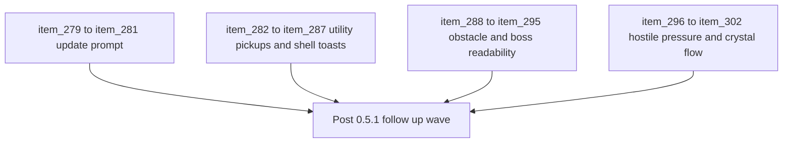

## task_058_orchestrate_post_0_5_1_follow_up_wave_for_updates_pickups_crystal_flow_and_hostile_pressure - Orchestrate post-0.5.1 follow-up wave for updates, pickups, crystal flow, and hostile pressure
> From version: 0.5.1
> Schema version: 1.0
> Status: Ready
> Understanding: 94%
> Confidence: 90%
> Progress: 0%
> Complexity: High
> Theme: Gameplay
> Reminder: Update status/understanding/confidence/progress and dependencies/references when you edit this doc.

# Context
- Derived from backlog items `item_279` through `item_302`, covering the new requests `req_074` to `req_081`.
- This wave bundles the current post-`0.5.1` follow-up work that sits across shell/runtime boundaries:
  - deployed-build update prompting for browser and installed PWA sessions
  - utility pickup lifecycle follow-up
  - shell-owned save feedback toasts
  - blocking-obstacle readability recovery
  - boss escalation and boss-size readability
  - new hostile archetype pressure
  - crystal magnet and attraction-first XP collection flow
- The repository now has a coherent first playable loop, but these follow-ups are still disconnected as separate requests. This orchestration task should land them as one controlled wave with clear validation and doc updates.
- The wave spans both shell-owned surfaces and runtime simulation hot paths, so implementation order matters:
  - shell and browser integration should not regress runtime flows
  - pickup and crystal changes should preserve deterministic readability
  - new hostile and boss changes should stay compatible with the authored time-phase escalation model

# Dependencies
- Blocking: none beyond the shipped `0.5.1` baseline and the already delivered runtime progression foundations from `task_054_orchestrate_post_0_4_0_runtime_expression_and_progression_waves`.
- Unblocks: the next delivery wave that actually implements the new request set without losing cross-request traceability.

# Plan
- [ ] 1. Confirm cross-request scope and group the delivery into coherent shell, pickup, crystal-flow, and hostile-pressure slices.
- [ ] 2. Implement the deployed-build update detection and shell-owned update modal flow from `item_279`, `item_280`, and `item_281`.
- [ ] 3. Implement the utility-pickup and save-feedback shell slices from `item_282` through `item_287`.
- [ ] 4. Implement the obstacle-visibility and boss-readability slices from `item_288` through `item_295`.
- [ ] 5. Implement the new hostile-pressure and crystal-flow slices from `item_296` through `item_302`.
- [ ] 6. Run targeted validation across shell, browser, runtime combat, and pickup-flow surfaces.
- [ ] 7. Update linked requests, backlog items, and this task as each delivery slice lands.
- [ ] CHECKPOINT: leave the current wave commit-ready and update the linked Logics docs before continuing.
- [ ] FINAL: Create dedicated git commit(s) for the completed orchestration scope.

# Delivery checkpoints
- Each completed wave should leave the repository in a coherent, commit-ready state.
- Update the linked Logics docs during the wave that changes the behavior, not only at final closure.
- Prefer a reviewed commit checkpoint at the end of each meaningful wave instead of accumulating several undocumented partial states.
- Keep shell-owned UI work in the DOM/shell layer and runtime-owned behavior in simulation/presentation layers.
- Prefer one shared crystal-attraction contract over parallel one-off implementations for proximity, passive range, and magnet effects.
- Keep boss and hostile changes compatible with the current authored time-phase model instead of introducing an ad hoc encounter director.

# AC Traceability
- AC1 -> Backlog coverage: the wave groups `item_279` through `item_302` into one executable delivery plan. Proof: this task links every newly generated backlog slice for `req_074` to `req_081`.
- AC2 -> Update prompting posture: deployed-build detection, explicit refresh UX, and validation are covered by `item_279`, `item_280`, and `item_281`.
- AC3 -> Utility pickup and toast posture: offscreen utility-pickup expiration plus shell-owned save feedback toasts are covered by `item_282` through `item_287`.
- AC4 -> Readability posture: obstacle visibility, boss scale, and boss readability validation are covered by `item_288` through `item_295`.
- AC5 -> Hostile-pressure posture: the new fast skirmisher, telegraphed charger, and their fairness validation are covered by `item_296`, `item_297`, and `item_298`.
- AC6 -> Crystal-flow posture: the magnet pickup, stronger `vacuum-tabi`, attraction-first crystal travel, and targeted validation are covered by `item_299` through `item_302`.

# Decision framing
- Product framing: Required
- Product signals: combat readability, reward feel, shell feedback, survival pressure
- Product follow-up: keep the wave aligned with `prod_003`, `prod_007`, and `prod_016` instead of treating each request as isolated polish.
- Architecture framing: Required
- Architecture signals: shell/runtime ownership, deterministic pickup flow, hostile-profile integration, update delivery contract
- Architecture follow-up: keep shell update/toast behavior aligned with shell-owned UI decisions, and keep hostile/crystal changes aligned with deterministic runtime and transient feedback ownership.

# Links
- Product brief(s): `prod_003_high_density_top_down_survival_action_direction`, `prod_007_foundational_passive_item_direction_for_emberwake`, `prod_016_time_owned_run_arc_and_authored_difficulty_phases`
- Architecture decision(s): `adr_002_separate_react_shell_from_pixi_runtime_ownership`, `adr_016_define_shell_scene_state_and_meta_surface_ownership`, `adr_017_lazy_load_pixi_runtime_behind_a_shell_owned_boot_boundary`, `adr_032_separate_visual_terrain_blocking_obstacles_and_movement_surface_modifiers`, `adr_033_adopt_deterministic_movement_oriented_pseudo_physics_instead_of_a_full_physics_engine`, `adr_038_split_entity_player_rendering_into_stable_geometry_and_transient_combat_overlays`, `adr_047_structure_first_pass_run_difficulty_escalation_as_authored_time_phases`, `adr_049_structure_time_scaled_enemy_pressure_around_authored_population_opening_composition_tiers_and_mini_boss_beats`
- Backlog item(s): `item_279_define_deployed_build_update_detection_for_browser_and_installed_pwa_sessions`, `item_280_define_a_shell_owned_update_modal_and_explicit_refresh_action_for_new_builds`, `item_281_define_targeted_validation_for_pwa_update_prompting_and_self_refresh_behavior`, `item_282_define_stale_expiration_rules_for_offscreen_gold_and_healing_kit_pickups`, `item_283_define_nearby_pickup_cap_release_and_respawn_behavior_after_utility_pickup_expiration`, `item_284_define_targeted_validation_for_offscreen_utility_pickup_expiration_and_renewed_nearby_spawns`, `item_285_define_a_shell_owned_toast_stack_and_bottom_left_viewport_anchoring_posture`, `item_286_define_save_game_feedback_toast_lifecycle_with_stacking_and_five_second_fade_out`, `item_287_define_targeted_validation_for_shell_toast_delivery_timing_and_stacking_behavior`, `item_288_define_vivid_red_rendering_for_non_traversable_blocking_obstacle_tiles`, `item_289_define_contrast_safeguards_for_blocking_obstacle_readability_across_world_backgrounds`, `item_290_define_targeted_validation_for_blocking_obstacle_visibility_and_map_readability`, `item_291_define_cumulative_post_boss_difficulty_modifiers_on_top_of_authored_time_phases`, `item_292_define_boss_defeat_trigger_plumbing_into_permanent_run_pressure_escalation`, `item_293_define_targeted_validation_for_post_boss_escalation_and_delaying_the_inevitable_pacing`, `item_294_define_a_1_point_5x_render_scale_contract_for_boss_class_hostile_entities`, `item_295_define_targeted_validation_for_boss_silhouette_dominance_and_combat_readability`, `item_296_define_a_small_fast_skirmisher_hostile_profile_and_authored_phase_entry_posture`, `item_297_define_a_telegraphed_charger_hostile_profile_with_one_second_wind_up_and_directional_sprint`, `item_298_define_targeted_validation_for_new_hostile_archetype_readability_fairness_and_avoidance`, `item_299_define_a_magnet_pickup_that_pulls_all_active_xp_crystals_toward_the_player`, `item_300_define_stronger_level_scaled_vacuum_tabi_crystal_attraction_reach`, `item_301_define_attraction_first_crystal_travel_and_arrival_based_xp_consumption`, `item_302_define_targeted_validation_for_magnet_vacuum_and_attraction_based_crystal_collection`
- Request(s): `req_074_define_a_pwa_update_prompt_and_self_refresh_posture_for_deployed_builds`, `req_075_define_offscreen_stale_pickup_expiration_for_gold_and_healing_kit_spawns`, `req_076_define_a_shell_owned_toast_notification_posture_for_save_game_feedback`, `req_077_define_a_vivid_blocking_obstacle_visibility_posture_for_non_traversable_world_tiles`, `req_078_define_a_boss_defeat_driven_permanent_difficulty_escalation_layer`, `req_079_define_a_1_5x_boss_visual_scale_posture_for_runtime_hostiles`, `req_080_define_two_new_hostile_archetypes_for_fast_skirmish_and_telegraphed_charge_pressure`, `req_081_define_a_crystal_magnet_pickup_and_attraction_first_xp_crystal_collection_posture`

# AI Context
- Summary: Orchestrate post-0.5.1 follow-up wave for updates, pickups, crystal flow, and hostile pressure
- Keywords: orchestrate, post-0.5.1, updates, pickups, crystal-flow, hostile-pressure
- Use when: Use when executing the current implementation wave for Orchestrate post-0.5.1 follow-up wave for updates, pickups, crystal flow, and hostile pressure.
- Skip when: Skip when the work belongs to another backlog item or a different execution wave.

# Validation
- `npm run logics:lint`
- `npm run test`
- `npm run test:browser:smoke`
- Manual verification of browser-mode and installed-PWA update prompt behavior.
- Manual verification of toast stacking, bottom-left placement, and five-second fade-out behavior.
- Manual verification of obstacle visibility, boss silhouette readability, and hostile charge avoidability in runtime play.
- Manual verification of crystal attraction, magnet vacuum, and arrival-based XP consumption behavior.

# Definition of Done (DoD)
- [ ] Scope implemented and acceptance criteria covered.
- [ ] Validation commands executed and results captured.
- [ ] Linked request/backlog/task docs updated during completed waves and at closure.
- [ ] Each completed wave left a commit-ready checkpoint or an explicit exception is documented.
- [ ] Status is `Done` and progress is `100%`.

# Report
