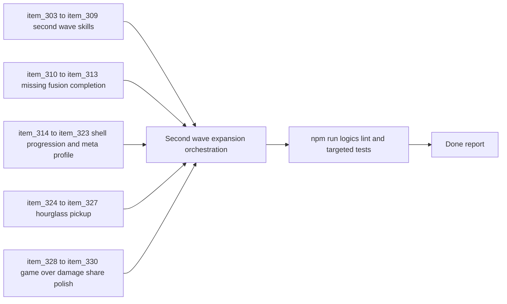

## task_059_orchestrate_second_wave_skills_fusion_completion_meta_progression_hourglass_pickup_and_game_over_damage_share_polish - Orchestrate second wave skills fusion completion meta progression hourglass pickup and game over damage share polish
> From version: 0.5.1
> Schema version: 1.0
> Status: In progress
> Understanding: 98%
> Confidence: 95%
> Progress: 30%
> Complexity: High
> Theme: Gameplay
> Reminder: Update status/understanding/confidence/progress and dependencies/references when you edit this doc.

# Context
- Derived from backlog items `item_303` through `item_330`, covering requests `req_082` through `req_087`.
- This orchestration wave bundles the current next-step product/runtime expansion work that now spans several seams at once:
  - second-wave active and passive skill roster expansion
  - missing first-playable fusion completion
  - shell-owned meta progression with shop and talents
  - cross-run persistent meta-profile ownership for gold, grimoire, and bestiary
  - a new hourglass utility pickup for bounded enemy-pressure suspension
  - game-over damage-share progress-bar polish
- The repository now has a coherent first playable loop, but the newly prepared requests are still disconnected as separate backlog slices. This task should land them as one controlled delivery wave without losing cross-request traceability.
- The work spans runtime combat systems, build-system expansion, shell-owned progression surfaces, persistence boundaries, and post-run UI polish, so delivery order matters:
  - new skills and fusions should land before meta-progression starts unlocking them
  - meta-profile persistence should land with shop and talents so long-term progression is coherent
  - the hourglass pickup should remain bounded and deterministic rather than widening into a global time-system rewrite
  - game-over polish should build on the already exposed post-run damage summaries instead of inventing a parallel metric contract

# Plan
- [x] 1. Confirm cross-request scope, freeze dependencies, and group delivery into coherent waves for skills, fusions, shell progression, meta-profile persistence, hourglass pickup, and game-over polish.
- [x] 2. Implement the second-wave skill roster slices from `item_303` through `item_309`, then leave the repo commit-ready, update linked Logics docs, and create a dedicated commit for the skill-roster wave.
- [x] 3. Implement the missing fusion completion slices from `item_310` through `item_313`, then leave the repo commit-ready, update linked Logics docs, and create a dedicated commit for the fusion-completion wave.
- [ ] 4. Implement the shell-owned shop and talent surface slices from `item_314` through `item_318`, then leave the repo commit-ready, update linked Logics docs, and create a dedicated commit for the shell meta-progression wave.
- [ ] 5. Implement the persistent meta-profile slices from `item_319` through `item_323`, then leave the repo commit-ready, update linked Logics docs, and create a dedicated commit for the cross-run persistence wave.
- [ ] 6. Implement the hourglass utility pickup slices from `item_324` through `item_327`, then leave the repo commit-ready, update linked Logics docs, and create a dedicated commit for the hourglass pickup wave.
- [ ] 7. Implement the game-over damage-share polish slices from `item_328` through `item_330`, then leave the repo commit-ready, update linked Logics docs, and create a dedicated commit for the post-run UI polish wave.
- [ ] 8. Run targeted validation across build-system, runtime combat, shell progression, persistence, utility pickup, and game-over outcome-analysis surfaces.
- [ ] 9. Update linked requests, backlog items, and this task as each wave lands, then close the full chain when validation is complete.
- [ ] CHECKPOINT: leave the current wave commit-ready and update the linked Logics docs before continuing.
- [ ] FINAL: Create dedicated git commit(s) at the end of each completed wave or step, not one giant end-of-task commit.

# Delivery checkpoints
- Each completed wave should leave the repository in a coherent, commit-ready state.
- Update the linked Logics docs during the wave that changes the behavior, not only at final closure.
- Prefer a reviewed commit checkpoint at the end of each meaningful wave instead of accumulating several undocumented partial states.
- Do not batch the whole task into one monolithic commit; create one explicit commit per wave or step:
  - skills roster
  - fusion completion
  - shell shop and talents
  - meta-profile persistence
  - hourglass pickup
  - game-over damage-share polish
- Keep shell-owned UI work in the DOM/shell layer and runtime-owned behavior in simulation/build/presentation layers.
- Keep cross-run persistence changes bounded to the meta-profile contract and avoid leaking profile semantics into the active run-save slot.

# AC Traceability
- AC1 -> Scope: this orchestration groups `item_303` through `item_330` into one executable delivery plan. Proof: this task links every backlog slice generated for `req_082` through `req_087`.
- AC2 -> Skill-roster scope: second-wave active and passive roster expansion plus build-pool integration and validation are covered by `item_303` through `item_309`.
- AC3 -> Fusion scope: missing first-playable fusion completion plus validation are covered by `item_310` through `item_313`.
- AC4 -> Shell meta-progression scope: menu entry, unlock shop, ranked talents, purchase integration, and validation are covered by `item_314` through `item_318`.
- AC5 -> Cross-run persistence scope: shared meta-profile boundary, persistent gold, persistent grimoire, persistent bestiary, and validation are covered by `item_319` through `item_323`.
- AC6 -> Utility pickup scope: rare hourglass pickup posture, bounded time-stop contract, safeguards, and validation are covered by `item_324` through `item_327`.
- AC7 -> Post-run polish scope: damage-share contract, progress-bar presentation, and validation are covered by `item_328` through `item_330`.
- AC8 -> Delivery posture: the task explicitly requires one dedicated commit per completed wave. Proof: the plan and delivery checkpoints require commit-ready state plus a dedicated git commit at the end of each wave or step.

# Decision framing
- Product framing: Required
- Product signals: build variety, fusion payoff, long-term progression, archive coherence, reward pacing, post-run readability
- Product follow-up: keep the implementation aligned with `prod_006` through `prod_016` so roster expansion, meta progression, and outcome analysis remain one coherent player journey.
- Architecture framing: Required
- Architecture signals: shell/runtime ownership, local persistence boundary, deterministic combat and pickup systems, outcome-data contracts
- Architecture follow-up: keep shell-owned progression and archive surfaces aligned with shell/meta ownership decisions, and keep skills, fusions, pickups, and damage-share polish aligned with deterministic runtime and outcome-data seams.

# Links
- Product brief(s): `prod_006_foundational_survivor_weapon_roster_for_emberwake`, `prod_007_foundational_passive_item_direction_for_emberwake`, `prod_008_active_passive_fusion_direction_for_emberwake`, `prod_009_level_up_slots_and_run_progression_model_for_emberwake`, `prod_010_first_playable_techno_shinobi_build_content_and_progression_defaults`, `prod_013_techno_shinobi_runtime_hud_and_menu_entry_direction`, `prod_014_shell_codex_archive_direction_for_grimoire_and_bestiary`, `prod_015_post_run_outcome_analysis_direction_for_skill_performance`, `prod_016_time_owned_run_arc_and_authored_difficulty_phases`
- Architecture decision(s): `adr_016_define_shell_scene_state_and_meta_surface_ownership`, `adr_022_keep_product_meta_flow_shell_owned_while_runtime_state_remains_game_preserved`, `adr_033_adopt_deterministic_movement_oriented_pseudo_physics_instead_of_a_full_physics_engine`, `adr_039_structure_the_first_survivor_build_loop_around_separate_active_and_passive_slots`, `adr_040_use_curated_active_passive_fusions_as_the_foundational_build_payoff_layer`, `adr_041_lock_the_first_playable_survivor_content_wave_to_one_character_and_a_small_curated_techno_shinobi_roster`, `adr_042_separate_weapon_simulation_from_transient_combat_skill_feedback_presentation`, `adr_045_model_grimoire_and_bestiary_as_shell_owned_discovery_gated_archive_scenes`, `adr_046_expose_post_run_skill_performance_summaries_as_shell_consumable_outcome_data`
- Backlog item(s): `item_303_define_a_proximity_and_space_control_active_skill_slice_for_orbiting_blades_and_halo_burst`, `item_304_define_a_ranged_pressure_active_skill_slice_for_chain_lightning_boomerang_arc_and_burning_trail`, `item_305_define_a_control_and_pickup_flow_active_skill_slice_for_frost_nova_and_vacuum_pulse`, `item_306_define_a_defensive_and_execution_passive_skill_slice_for_thorn_mail_execution_sigil_and_emergency_aegis`, `item_307_define_an_economy_and_boss_specialization_passive_skill_slice_for_greed_engine_and_boss_hunter`, `item_308_define_second_wave_build_pool_integration_discovery_and_progression_posture_for_the_new_roster`, `item_309_define_targeted_validation_for_second_wave_survivor_skill_roster_distinctiveness_and_balance_posture`, `item_310_define_the_afterimage_pyre_fusion_slice_for_cinder_arc_and_echo_thread`, `item_311_define_the_event_horizon_fusion_slice_for_null_canister_and_vacuum_tabi`, `item_312_define_first_playable_fusion_roster_completion_posture_for_remaining_passive_keys_and_chest_readiness`, `item_313_define_targeted_validation_for_missing_fusion_completion_readability_and_payoff_integration`, `item_314_define_a_shell_owned_menu_entry_and_scene_posture_for_the_talent_growth_and_unlock_shop_surface`, `item_315_define_a_first_unlock_shop_catalog_for_skills_fusions_and_bonus_archetype_access`, `item_316_define_a_first_ranked_talent_roster_with_escalating_cost_tiers_and_late_survivability_gating`, `item_317_define_purchase_application_and_owned_progression_integration_across_the_shell_and_runtime`, `item_318_define_targeted_validation_for_shell_progression_purchases_persistence_and_escalating_talent_costs`, `item_319_define_a_shared_local_meta_profile_boundary_distinct_from_active_run_save_data`, `item_320_define_persistent_cross_run_gold_balance_ownership_for_meta_progression_economy`, `item_321_define_persistent_grimoire_discovery_progression_across_runs`, `item_322_define_persistent_bestiary_discovery_and_defeat_progression_across_runs`, `item_323_define_targeted_validation_for_cross_run_meta_profile_persistence_of_gold_grimoire_and_bestiary_data`, `item_324_define_a_rare_hourglass_utility_pickup_posture_inside_the_nearby_reward_loop`, `item_325_define_a_bounded_runtime_time_stop_contract_that_suspends_enemy_movement_and_damage_for_three_seconds`, `item_326_define_enemy_pressure_expiry_rarity_and_non_stacking_safeguards_for_the_hourglass_effect`, `item_327_define_targeted_validation_for_hourglass_pickup_suspension_timing_and_player_breathing_room_behavior`, `item_328_define_a_damage_share_percentage_contract_for_game_over_skill_ranking_rows`, `item_329_define_a_background_progress_bar_presentation_posture_for_game_over_skill_ranking_cells`, `item_330_define_targeted_validation_for_damage_share_fill_correctness_readability_and_low_value_row_safety`
- Request(s): `req_082_define_a_second_survivor_style_skill_roster_expansion_wave_for_combat_control_economy_and_survivability`, `req_083_define_a_missing_fusion_completion_wave_for_the_remaining_first_playable_active_passive_pairings`, `req_084_define_a_shell_owned_talent_growth_and_unlock_shop_progression_surface`, `req_085_define_a_persistent_meta_profile_contract_for_gold_bestiary_and_grimoire_progression_across_runs`, `req_086_define_a_time_stop_hourglass_pickup_for_bounded_enemy_pressure_suspension`, `req_087_define_damage_share_progress_bar_cells_for_game_over_skill_ranking_rows`

# AI Context
- Summary: Orchestrate the next large product and runtime wave covering second-wave skills, fusion completion, shell meta progression, cross-run persistence, hourglass pickup, and post-run damage-share polish.
- Keywords: orchestrate, skills, fusions, meta progression, persistence, hourglass, damage share, game over
- Use when: Use when executing the current implementation wave for Orchestrate second wave skills fusion completion meta progression hourglass pickup and game over damage share polish.
- Skip when: Skip when the work belongs to another backlog item or a different execution wave.

# Validation
- `npm run logics:lint`
- `npm run typecheck`
- Targeted `npm run test -- ...` commands for build-system, runtime entity simulation, pickup flow, and shell surfaces touched by each wave
- `npm run test:browser:smoke` after shell/progression and major runtime changes when the affected surfaces justify it
- Manual verification of:
  - second-wave skill readability and build-pool integration
  - fusion readiness and payoff behavior for `Afterimage Pyre` and `Event Horizon`
  - shop/talent purchase flow and escalating cost behavior
  - cross-run persistence of gold, grimoire, and bestiary
  - hourglass pickup breathing-room behavior
  - game-over damage-share progress-bar readability

# Definition of Done (DoD)
- [ ] Scope implemented and acceptance criteria covered.
- [ ] Validation commands executed and results captured.
- [ ] Linked request/backlog/task docs updated during completed waves and at closure.
- [ ] Each completed wave left a commit-ready checkpoint or an explicit exception is documented.
- [ ] Dedicated git commit(s) were created per completed wave or step instead of one monolithic final commit.
- [ ] Status is `Done` and progress is `100%`.

# Report
- Wave 1 complete: shipped the second-wave skill roster across build-system, runtime combat, control effects, and shell/icon feedback seams.
- Validation checkpoint: `npm run typecheck`, `npm run test -- games/emberwake/src/runtime/buildSystem.test.ts src/game/entities/model/entitySimulation.test.ts games/emberwake/src/runtime/entitySimulationIntent.test.ts games/emberwake/src/systems/gameplaySystems.test.ts`, `npm run logics:lint`.
- Wave 2 complete: completed the first-playable fusion matrix with `Afterimage Pyre` and `Event Horizon`, keeping chest readiness and payoff routing inside the existing fusion model.
