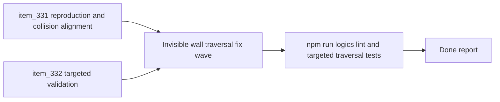

## task_060_orchestrate_intermittent_invisible_wall_blocking_traversal_fix - Orchestrate intermittent invisible wall blocking traversal fix
> From version: 0.6.0
> Schema version: 1.0
> Status: Draft
> Understanding: 92%
> Confidence: 88%
> Progress: 0%
> Complexity: Medium
> Theme: Gameplay
> Reminder: Update status/understanding/confidence/progress and dependencies/references when you edit this doc.

# Context
- Derived from backlog items `item_331_define_deterministic_reproduction_and_collision_alignment_for_intermittent_invisible_wall_blocking_during_player_traversal` and `item_332_define_targeted_validation_for_intermittent_invisible_wall_blocking_fixes`.
- Related request(s): `req_091_define_a_fix_for_intermittent_invisible_wall_blocking_during_player_traversal`.
- Related architecture decision(s): `adr_032_separate_visual_terrain_blocking_obstacles_and_movement_surface_modifiers`, `adr_033_adopt_deterministic_movement_oriented_pseudo_physics_instead_of_a_full_physics_engine`, `adr_035_resolve_entity_collisions_as_lightweight_deterministic_separation`.
- The player-facing bug is simple to describe but easy to mis-fix: movement sometimes stops on terrain that looks normal, open, and non-blocking, with no visible red blocker.
- This wave should not jump straight to retuning values or broad collision redesign. It should first capture a deterministic reproduction path, then fix the smallest proven mismatch between visible traversal and actual blocking semantics, then lock that behavior in with targeted regression validation.
- The likely hot seams are obstacle sampling, pseudo-physical movement resolution, player footprint assumptions, and edge-adjacent traversal behavior.

# Plan
- [ ] 1. Capture a bounded reproduction path for the intermittent invisible-wall symptom and confirm which traversal patterns or map seams trigger it.
- [ ] 2. Inspect obstacle sampling, pseudo-physical movement resolution, and player-footprint behavior to isolate the smallest credible cause.
- [ ] 3. Implement the minimal collision or traversal alignment fix so visually open non-blocking terrain no longer stops the player unexpectedly.
- [ ] 4. Run targeted validation for the captured false-blocking route, diagonal and edge-adjacent traversal, and legitimate blocker behavior.
- [ ] 5. Update `req_091`, `item_331`, `item_332`, and this task with implementation evidence and validation results.
- [ ] CHECKPOINT: leave the current wave commit-ready and update the linked Logics docs before continuing.
- [ ] FINAL: Create a dedicated git commit for the completed orchestration scope.

# Delivery checkpoints
- Keep the wave focused on player-traversal correctness, not cosmetic world changes.
- Prefer one proven fix over several speculative adjustments.
- Preserve legitimate blocker semantics while removing false blocking.
- Update the linked Logics docs during the wave that changes the behavior, not only at final closure.
- Leave the repo in a coherent, commit-ready state once the captured symptom and validation are both covered.

# AC Traceability
- AC1 -> Reproduction and fix scope: `item_331` captures the deterministic reproduction path and collision-alignment implementation. Proof: implementation notes and targeted traversal evidence should be recorded there.
- AC2 -> Validation scope: `item_332` covers the regression scenarios needed to prove the invisible-wall symptom no longer reproduces. Proof: targeted tests and manual route verification should be recorded there.
- AC3 -> Delivery posture: this task keeps the wave bounded to the proven traversal bug and requires one dedicated commit-ready checkpoint at completion. Proof: the plan, validation, and final report anchor that delivery posture.

# Decision framing
- Product framing: Not needed
- Product signals: (none detected)
- Product follow-up: No product brief follow-up is expected based on current signals.
- Architecture framing: Required
- Architecture signals: traversal semantics, blocking-world alignment, deterministic movement resolution
- Architecture follow-up: keep any fix aligned with the existing obstacle-layer and pseudo-physics decisions instead of introducing ad hoc blocking rules.

# Links
- Product brief(s): (none yet)
- Architecture decision(s): `adr_032_separate_visual_terrain_blocking_obstacles_and_movement_surface_modifiers`, `adr_033_adopt_deterministic_movement_oriented_pseudo_physics_instead_of_a_full_physics_engine`, `adr_035_resolve_entity_collisions_as_lightweight_deterministic_separation`
- Backlog item(s): `item_331_define_deterministic_reproduction_and_collision_alignment_for_intermittent_invisible_wall_blocking_during_player_traversal`, `item_332_define_targeted_validation_for_intermittent_invisible_wall_blocking_fixes`
- Request(s): `req_091_define_a_fix_for_intermittent_invisible_wall_blocking_during_player_traversal`

# AI Context
- Summary: Orchestrate intermittent invisible wall blocking traversal fix
- Keywords: orchestrate, intermittent, invisible, wall, blocking, traversal, fix
- Use when: Use when executing the current implementation wave for Orchestrate intermittent invisible wall blocking traversal fix.
- Skip when: Skip when the work belongs to another backlog item or a different execution wave.

# Validation
- `npm run logics:lint`
- `npm run test -- games/emberwake/src/runtime/pseudoPhysics.test.ts games/emberwake/src/runtime/entitySimulationIntent.test.ts src/game/entities/model/entitySimulation.test.ts src/game/world/model/worldGeneration.test.ts`
- Manual verification on at least one previously failing or suspicious traversal route where the player appeared blocked by normal-looking terrain.
- Manual verification that visible red blockers or equivalent legitimate obstacles still stop movement correctly.

# Definition of Done (DoD)
- [ ] Scope implemented and acceptance criteria covered.
- [ ] Validation commands executed and results captured.
- [ ] Linked request/backlog/task docs updated during completed waves and at closure.
- [ ] Each completed wave left a commit-ready checkpoint or an explicit exception is documented.
- [ ] Dedicated git commit created for the completed orchestration scope.
- [ ] Status is `Done` and progress is `100%`.

# Report
