## task_061_orchestrate_growth_owned_and_projected_gain_visibility - Orchestrate growth owned and projected gain visibility
> From version: 0.6.0
> Schema version: 1.0
> Status: Done
> Understanding: 100%
> Confidence: 97%
> Progress: 100%
> Complexity: Low
> Theme: Meta progression
> Reminder: Update status/understanding/confidence/progress and dependencies/references when you edit this doc.

# Context
- Derived from backlog items `item_333_define_owned_and_projected_talent_effect_visibility_on_the_growth_screen` and `item_334_define_targeted_validation_for_growth_owned_and_projected_gain_visibility`.
- Source files: `logics/backlog/item_333_define_owned_and_projected_talent_effect_visibility_on_the_growth_screen.md`, `logics/backlog/item_334_define_targeted_validation_for_growth_owned_and_projected_gain_visibility.md`.
- Related request(s): `req_088_define_current_and_projected_gain_visibility_on_the_growth_screen`.
- Show the permanent effect already owned on the `Growth` screen instead of exposing only rank and price.
- Show the projected benefit of the next purchase before the player spends gold.
- Expose owned completion as a percentage where the lane has a bounded denominator, so progression is readable at a glance.

```mermaid
%% logics-kind: task
%% logics-signature: task|orchestrate-growth-owned-and-projected-g|item-333-define-owned-and-projected-tale|1-confirm-scope-dependencies-and-linked|npm-run-test-src-app
flowchart LR
    Backlog[item_333_define_owned_and_projected_talent] --> Step1[1. Confirm scope dependencies and linked]
    Step1 --> Step2[2. Implement the next coherent delivery]
    Step2 --> Step3[3. Checkpoint the wave in a]
    Step3 --> Validation[Run the relevant automated tests for]
    Validation --> Report[Done report]
```

# Plan
- [x] 1. Confirm scope, dependencies, and linked acceptance criteria.
- [x] 2. Implement the next coherent delivery wave from the backlog item.
- [x] 3. Checkpoint the wave in a commit-ready state, validate it, and update the linked Logics docs.
- [x] CHECKPOINT: leave the current wave commit-ready and update the linked Logics docs before continuing.
- [x] FINAL: Update related Logics docs

# Delivery checkpoints
- Each completed wave should leave the repository in a coherent, commit-ready state.
- Update the linked Logics docs during the wave that changes the behavior, not only at final closure.
- Prefer a reviewed commit checkpoint at the end of each meaningful wave instead of accumulating several undocumented partial states.

# AC Traceability
- AC1 -> Scope: the `Growth` screen now renders explicit `Owned effect` lines on talent cards. Proof: `src/app/components/GrowthScene.tsx`, `src/app/components/AppMetaScenePanel.test.tsx`.
- AC2 -> Scope: percentage-based talents now show owned and next-rank values in percentage terms. Proof: `src/app/model/metaProgression.ts`, `src/app/model/metaProgression.test.ts`, `src/app/components/AppMetaScenePanel.test.tsx`.
- AC3 -> Scope: fixed-value talents remain expressed in honest units such as `HP` and `charge`. Proof: `src/app/model/metaProgression.ts`, `src/app/model/metaProgression.test.ts`.
- AC4 -> Scope: bounded shop ownership progress now includes percentage completion. Proof: `src/app/model/metaProgression.ts`, `src/app/model/metaProgression.test.ts`, `src/app/components/GrowthScene.tsx`.
- AC5 -> Scope: displayed values are derived from `deriveBuildMetaProgression`, keeping UI and runtime modifiers aligned. Proof: `src/app/model/metaProgression.ts`.
- AC6 -> Scope: the wave stayed presentation-only and did not change rank costs, caps, unlock rules, or persistence. Proof: changed-file scope is limited to growth UI/model helpers and tests.
- AC7 -> Scope: targeted validation covers both helper outputs and rendered shell output. Proof: `src/app/model/metaProgression.test.ts`, `src/app/components/AppMetaScenePanel.test.tsx`.
- AC8 -> Scope: current owned values match active ranks. Proof: `src/app/model/metaProgression.test.ts`, `src/app/components/AppMetaScenePanel.test.tsx`.
- AC9 -> Scope: projected next values match the next purchasable rank. Proof: `src/app/model/metaProgression.test.ts`, `src/app/components/AppMetaScenePanel.test.tsx`.
- AC10 -> Scope: capped talents avoid misleading projected-gain copy. Proof: `src/app/components/GrowthScene.tsx`.
- AC11 -> Scope: owned percentages remain aligned with actual purchased shop counts. Proof: `src/app/model/metaProgression.test.ts`, `src/app/components/AppMetaScenePanel.test.tsx`.

# Decision framing
- Product framing: Not needed
- Product signals: (none detected)
- Product follow-up: No product brief follow-up is expected based on current signals.
- Architecture framing: Consider
- Architecture signals: data model and persistence
- Architecture follow-up: Review whether an architecture decision is needed before implementation becomes harder to reverse.

# Links
- Product brief(s): (none yet)
- Architecture decision(s): (none yet)
- Backlog item(s): `item_333_define_owned_and_projected_talent_effect_visibility_on_the_growth_screen`, `item_334_define_targeted_validation_for_growth_owned_and_projected_gain_visibility`
- Request(s): `req_088_define_current_and_projected_gain_visibility_on_the_growth_screen`

# AI Context
- Summary: Define clearer owned bonus and next purchase gain visibility on the shell-owned Growth screen.
- Keywords: growth, talents, owned bonus, projected gain, percentage, shop progress, meta progression
- Use when: Use when framing scope, context, and acceptance checks for clearer owned and projected progression visibility on the Growth screen.
- Skip when: Skip when the work targets another feature, repository, or workflow stage.

# References
- `logics/skills/logics-ui-steering/SKILL.md`

# Validation
- `npm run test -- src/app/model/metaProgression.test.ts src/app/components/AppMetaScenePanel.test.tsx src/app/components/ShellMenu.test.tsx games/emberwake/src/runtime/buildSystem.test.ts`
- `npm run typecheck`
- `npm run logics:lint`

# Definition of Done (DoD)
- [x] Scope implemented and acceptance criteria covered.
- [x] Validation commands executed and results captured.
- [x] Linked request/backlog/task docs updated during completed waves and at closure.
- [x] Each completed wave left a commit-ready checkpoint or an explicit exception is documented.
- [x] Status is `Done` and progress is `100%`.

# Report
- Added shared meta-progression helpers that compute shop ownership percentage plus current and projected talent effects from the same modifier contract used by runtime progression.
- Updated the `Growth` scene so talent cards now expose owned effects, next-rank gains, and projected totals, while bounded shop ownership shows raw count plus percentage completion.
- Kept fixed-value talents in honest units (`HP`, `charge`) and suppressed misleading projected-gain copy when a talent is capped.
