## task_062_orchestrate_shell_label_renaming_for_emberwake_skills_and_talents_surfaces - Orchestrate shell label renaming for Emberwake skills and talents surfaces
> From version: 0.6.0
> Schema version: 1.0
> Status: Done
> Understanding: 100%
> Confidence: 97%
> Progress: 100%
> Complexity: Low
> Theme: UI
> Reminder: Update status/understanding/confidence/progress and dependencies/references when you edit this doc.

# Context
- Derived from backlog items `item_335_define_player_facing_shell_label_replacements_for_the_main_menu_skills_and_talents_surfaces` and `item_336_define_targeted_validation_for_player_facing_shell_label_consistency_across_shell_surfaces`.
- Source files: `logics/backlog/item_335_define_player_facing_shell_label_replacements_for_the_main_menu_skills_and_talents_surfaces.md`, `logics/backlog/item_336_define_targeted_validation_for_player_facing_shell_label_consistency_across_shell_surfaces.md`.
- Related request(s): `req_089_define_clearer_player_facing_shell_labels_for_the_main_menu_skills_and_talents_surfaces`.
- Replace shell-facing wording that still reads like internal UI labels with clearer player-facing labels.
- Rename the main shell title from `Main menu` to `Emberwake`.
- Rename the eyebrow or scene-family label from `Shell entry` to `Main menu`.

```mermaid
%% logics-kind: task
%% logics-signature: task|orchestrate-shell-label-renaming-for-emb|item-335-define-player-facing-shell-labe|1-confirm-scope-dependencies-and-linked|npm-run-test-src-app
flowchart LR
    Backlog[item_335_define_player_facing_shell_label_] --> Step1[1. Confirm scope dependencies and linked]
    Step1 --> Step2[2. Implement the next coherent delivery]
    Step2 --> Step3[3. Checkpoint the wave in a]
    Step3 --> Validation[Run the relevant automated tests for]
    Validation --> Report[Done report]
```

# Plan
- [x] 1. Confirm scope, dependencies, and linked acceptance criteria.
- [x] 2. Implement the next coherent delivery wave from the backlog item.
- [x] 3. Checkpoint the wave in a commit-ready state, validate it, and update the linked Logics docs.
- [x] CHECKPOINT: leave the current wave commit-ready and update the linked Logics docs before continuing.
- [x] FINAL: Update related Logics docs

# Delivery checkpoints
- Each completed wave should leave the repository in a coherent, commit-ready state.
- Update the linked Logics docs during the wave that changes the behavior, not only at final closure.
- Prefer a reviewed commit checkpoint at the end of each meaningful wave instead of accumulating several undocumented partial states.

# AC Traceability
- AC1 -> Scope: the main shell title now renders as `Emberwake`. Proof: `src/app/components/AppMetaScenePanel.tsx`, `src/app/components/ShellMenu.tsx`, `src/app/components/AppMetaScenePanel.test.tsx`, `src/app/components/ShellMenu.test.tsx`.
- AC2 -> Scope: the shell-level supporting wording now renders as `Main menu` rather than `Shell entry`. Proof: `src/app/components/AppMetaScenePanel.tsx`, `src/app/components/ShellMenu.tsx`.
- AC3 -> Scope: player-facing `Grimoire` copy was replaced by `Skills`. Proof: `src/app/components/AppMetaScenePanel.tsx`, `src/app/components/ShellMenu.tsx`, `src/app/components/AppMetaScenePanel.test.tsx`.
- AC4 -> Scope: player-facing `Growth` copy was replaced by `Talents`. Proof: `src/app/components/AppMetaScenePanel.tsx`, `src/app/components/ShellMenu.tsx`, `src/app/components/AppMetaScenePanel.test.tsx`, `src/app/components/ShellMenu.test.tsx`.
- AC5 -> Scope: the wave stayed bounded to visible shell copy without renaming internal scene IDs or persistence contracts. Proof: changed-file scope is limited to visible shell components and tests.
- AC6 -> Scope: validation covers the renamed labels across headers, scene titles, and shell action/menu entry points. Proof: `src/app/components/AppMetaScenePanel.test.tsx`, `src/app/components/ShellMenu.test.tsx`.

# Decision framing
- Product framing: Consider
- Product signals: navigation and discoverability
- Product follow-up: Review whether a product brief is needed before scope becomes harder to change.
- Architecture framing: Consider
- Architecture signals: data model and persistence
- Architecture follow-up: Review whether an architecture decision is needed before implementation becomes harder to reverse.

# Links
- Product brief(s): (none yet)
- Architecture decision(s): (none yet)
- Backlog item(s): `item_335_define_player_facing_shell_label_replacements_for_the_main_menu_skills_and_talents_surfaces`, `item_336_define_targeted_validation_for_player_facing_shell_label_consistency_across_shell_surfaces`
- Request(s): `req_089_define_clearer_player_facing_shell_labels_for_the_main_menu_skills_and_talents_surfaces`

# AI Context
- Summary: Define clearer player-facing shell wording for the front-door title, main-menu eyebrow, skills archive label, and talents progression label.
- Keywords: emberwake, main menu, shell entry, grimoire, growth, skills, talents, copy
- Use when: Use when framing scope, context, and acceptance checks for a bounded shell-label renaming wave.
- Skip when: Skip when the work targets another feature, repository, or workflow stage.

# References
- `logics/skills/logics-ui-steering/SKILL.md`

# Validation
- `npm run test -- src/app/model/metaProgression.test.ts src/app/components/AppMetaScenePanel.test.tsx src/app/components/ShellMenu.test.tsx games/emberwake/src/runtime/buildSystem.test.ts`
- `npm run typecheck`
- `npm run logics:lint`

# Definition of Done (DoD)
- [x] Scope implemented and acceptance criteria covered.
- [x] Validation commands executed and results captured.
- [x] Linked request/backlog/task docs updated during completed waves and at closure.
- [x] Each completed wave left a commit-ready checkpoint or an explicit exception is documented.
- [x] Status is `Done` and progress is `100%`.

# Report
- Replaced player-facing shell copy so the main shell title is now `Emberwake`, the supporting shell-entry wording is `Main menu`, `Grimoire` is surfaced as `Skills`, and `Growth` is surfaced as `Talents`.
- Kept the wave strictly at the visible-copy layer by editing shell components and tests only, without renaming scene identifiers such as `main-menu`, `grimoire`, or `growth`.
- Added regression coverage across the main shell panel and shell command deck so the renamed labels stay consistent across the visible shell surfaces.
