## task_063_orchestrate_guided_senbon_lower_damage_and_faster_cadence_tuning - Orchestrate guided senbon lower damage and faster cadence tuning
> From version: 0.6.0
> Schema version: 1.0
> Status: Done
> Understanding: 100%
> Confidence: 97%
> Progress: 100%
> Complexity: Low
> Theme: Gameplay
> Reminder: Update status/understanding/confidence/progress and dependencies/references when you edit this doc.

# Context
- Derived from backlog items `item_337_define_guided_senbon_damage_and_cadence_tuning_adjustment` and `item_338_define_targeted_validation_for_guided_senbon_lower_damage_and_faster_cadence`.
- Source files: `logics/backlog/item_337_define_guided_senbon_damage_and_cadence_tuning_adjustment.md`, `logics/backlog/item_338_define_targeted_validation_for_guided_senbon_lower_damage_and_faster_cadence.md`.
- Related request(s): `req_090_define_a_targeted_guided_senbon_balance_adjustment_for_lower_damage_and_faster_cadence`.
- Reduce `Guided Senbon` base damage by 25 percent.
- Reduce the time between `Guided Senbon` attacks by 25 percent so the skill fires more often.
- Keep the change tightly scoped to one targeted balance adjustment rather than reopening a broad first-wave weapon rebalance.

```mermaid
%% logics-kind: task
%% logics-signature: task|orchestrate-guided-senbon-lower-damage-a|item-337-define-guided-senbon-damage-and|1-confirm-scope-dependencies-and-linked|npm-run-test-src-app
flowchart LR
    Backlog[item_337_define_guided_senbon_damage_and_c] --> Step1[1. Confirm scope dependencies and linked]
    Step1 --> Step2[2. Implement the next coherent delivery]
    Step2 --> Step3[3. Checkpoint the wave in a]
    Step3 --> Validation[Run the relevant automated tests for]
    Validation --> Report[Done report]
```

# Plan
- [x] 1. Confirm scope, dependencies, and linked acceptance criteria.
- [x] 2. Implement the next coherent delivery wave from the backlog item.
- [x] 3. Checkpoint the wave in a commit-ready state, validate it, and update the linked Logics docs.
- [x] CHECKPOINT: leave the current wave commit-ready and update the linked Logics docs before continuing.
- [x] FINAL: Update related Logics docs

# Delivery checkpoints
- Each completed wave should leave the repository in a coherent, commit-ready state.
- Update the linked Logics docs during the wave that changes the behavior, not only at final closure.
- Prefer a reviewed commit checkpoint at the end of each meaningful wave instead of accumulating several undocumented partial states.

# AC Traceability
- AC1 -> Scope: `Guided Senbon` base damage was reduced from `15` to `11`, matching the nearest integer posture to the requested `-25%`. Proof: `games/emberwake/src/runtime/buildSystem.ts`, `games/emberwake/src/runtime/buildSystem.test.ts`.
- AC2 -> Scope: `Guided Senbon` base cooldown was reduced from `24` to `18` ticks, which is exactly `-25%` on the time between attacks. Proof: `games/emberwake/src/runtime/buildSystem.ts`, `games/emberwake/src/runtime/buildSystem.test.ts`.
- AC3 -> Scope: the slice stayed bounded to `Guided Senbon`; no other weapon definitions changed. Proof: `games/emberwake/src/runtime/buildSystem.ts`.
- AC4 -> Scope: the weapon kept its `auto-target` role, range, target count, and role line while only cadence and damage changed. Proof: `games/emberwake/src/runtime/buildSystem.ts`.
- AC5 -> Scope: targeted runtime validation now proves the intended tuning change from the authored source of truth. Proof: `games/emberwake/src/runtime/buildSystem.test.ts`.
- AC6 -> Scope: the weapon now deals less damage per attack than before. Proof: `games/emberwake/src/runtime/buildSystem.test.ts`.
- AC7 -> Scope: the weapon now attacks more frequently than before. Proof: `games/emberwake/src/runtime/buildSystem.test.ts`.
- AC8 -> Scope: the authored tuning source and resolved runtime behavior stay aligned after the change. Proof: `games/emberwake/src/runtime/buildSystem.ts`, `games/emberwake/src/runtime/buildSystem.test.ts`.

# Decision framing
- Product framing: Not needed
- Product signals: (none detected)
- Product follow-up: No product brief follow-up is expected based on current signals.
- Architecture framing: Consider
- Architecture signals: data model and persistence
- Architecture follow-up: Review whether an architecture decision is needed before implementation becomes harder to reverse.

# Links
- Product brief(s): (none yet)
- Architecture decision(s): (none yet)
- Backlog item(s): `item_337_define_guided_senbon_damage_and_cadence_tuning_adjustment`, `item_338_define_targeted_validation_for_guided_senbon_lower_damage_and_faster_cadence`
- Request(s): `req_090_define_a_targeted_guided_senbon_balance_adjustment_for_lower_damage_and_faster_cadence`

# AI Context
- Summary: Define a narrow Guided Senbon tuning change that reduces damage per hit and shortens time between attacks.
- Keywords: guided senbon, balance, damage, cooldown, cadence, tuning, gameplay
- Use when: Use when framing scope, context, and acceptance checks for a bounded Guided Senbon micro-balance change.
- Skip when: Skip when the work targets another feature, repository, or workflow stage.

# Validation
- `npm run test -- src/app/model/metaProgression.test.ts src/app/components/AppMetaScenePanel.test.tsx src/app/components/ShellMenu.test.tsx games/emberwake/src/runtime/buildSystem.test.ts`
- `npm run typecheck`
- `npm run logics:lint`

# Definition of Done (DoD)
- [x] Scope implemented and acceptance criteria covered.
- [x] Validation commands executed and results captured.
- [x] Linked request/backlog/task docs updated during completed waves and at closure.
- [x] Each completed wave left a commit-ready checkpoint or an explicit exception is documented.
- [x] Status is `Done` and progress is `100%`.

# Report
- Tuned `Guided Senbon` directly at the authored build-system source from `15` base damage to `11` and from `24` base cooldown ticks to `18`.
- Kept the skill identity intact by preserving its `auto-target` attack kind, range, target count, and role line.
- Added a targeted runtime-stats test so future tuning changes will immediately catch any drift in damage or cadence.
