## task_064_orchestrate_long_session_js_heap_retention_investigation_and_reduction - Orchestrate long-session JS heap retention investigation and reduction
> From version: 0.6.0
> Schema version: 1.0
> Status: Done
> Understanding: 100%
> Confidence: 97%
> Progress: 100%
> Complexity: High
> Theme: Runtime
> Reminder: Update status/understanding/confidence/progress and dependencies/references when you edit this doc.

# Context
- Derived from backlog items `item_339_define_long_session_runtime_profiling_isolation_and_retained_js_owner_attribution_for_heap_growth`, `item_340_define_targeted_runtime_view_and_overlay_churn_reduction_for_long_session_js_heap_retention`, and `item_341_define_instrumentation_and_validation_for_long_session_js_heap_retention_reduction`.
- Source files:
- `logics/backlog/item_339_define_long_session_runtime_profiling_isolation_and_retained_js_owner_attribution_for_heap_growth.md`
- `logics/backlog/item_340_define_targeted_runtime_view_and_overlay_churn_reduction_for_long_session_js_heap_retention.md`
- `logics/backlog/item_341_define_instrumentation_and_validation_for_long_session_js_heap_retention_reduction.md`
- Related request(s): `req_092_define_a_js_heap_retention_investigation_and_reduction_wave_for_long_runtime_profiling_sessions`.
- The current long-session profiling posture is stable enough to rerun, compare, and reduce the remaining JS heap signal in bounded waves.
- This orchestration task should keep the work evidence-led:
- first isolate and attribute the retained owners
- then reduce the highest-value proven hotspots
- finally rerun long-session validation and report what changed

```mermaid
%% logics-kind: task
%% logics-signature: task|orchestrate-long-session-js-heap-retenti|item-339-define-long-session-runtime-pro|1-confirm-the-current-baseline-linked|npm-run-typecheck
flowchart LR
    Backlog[item_339_define_long_session_runtime_pro] --> Step1[1. Confirm the current baseline and linke]
    Step1 --> Step2[2. Implement profiling isolation and owner]
    Step2 --> Step3[3. Implement the targeted runtime churn]
    Step3 --> Step4[4. Rerun profiling validate the results]
    Step4 --> Validation[Run the relevant automated tests and]
    Validation --> Report[Done report]
```

# Plan
- [x] 1. Confirm the current baseline, linked acceptance criteria, and profiling artifacts that anchor the wave.
- [x] 2. Implement the profiling isolation and retained-owner attribution slice from `item_339`.
- [x] 3. Implement the targeted runtime view and overlay churn-reduction slice from `item_340`.
- [x] 4. Implement the instrumentation and validation slice from `item_341`, rerun the long-session profiler, and compare artifacts.
- [x] CHECKPOINT: leave the current wave commit-ready and update the linked Logics docs before continuing.
- [x] FINAL: Update related Logics docs

# Delivery checkpoints
- Each completed wave should leave the repository in a coherent, commit-ready state.
- Update the linked Logics docs during the wave that changes the behavior, not only at final closure.
- Prefer a reviewed commit checkpoint at the end of each meaningful wave instead of accumulating several undocumented partial states.

# AC Traceability
- AC1 -> `item_339`: profiling comparison remains reproducible across the main and reduced-pressure scenarios. Proof target: profiling scripts, captured artifacts, and task report.
- AC2 -> `item_339`: the wave captures enough evidence to compare heap, runtime tick stability, and live runtime population. Proof target: profiling summaries and task report.
- AC3 -> `item_339`: retained constructors are attributed to meaningful code ownership before broad optimization. Proof target: attribution notes and linked changed surface.
- AC4 -> `item_340`: the main implementation wave reduces proven runtime view and overlay churn hotspots. Proof target: changed runtime files and validation notes.
- AC5 -> `item_340`: behavior and diagnostics remain correct after churn reduction. Proof target: targeted tests and profiling reruns.
- AC6 -> `item_341`: targeted instrumentation correlates heap growth with concrete runtime counters and caches. Proof target: profiling bridge, summary artifacts, and task report.
- AC7 -> `item_341`: rerun validation confirms both the absence of the old stall pattern and a reduced or better-explained heap signal. Proof target: long-session JSON artifacts and task report.

# Decision framing
- Product framing: Not needed
- Product signals: (none detected)
- Product follow-up: No product brief follow-up is expected based on current signals.
- Architecture framing: Not needed
- Architecture signals: (none detected)
- Architecture follow-up: No architecture decision follow-up is expected based on current signals.

# Links
- Product brief(s): (none yet)
- Architecture decision(s): (none yet)
- Backlog item(s): `item_339_define_long_session_runtime_profiling_isolation_and_retained_js_owner_attribution_for_heap_growth`, `item_340_define_targeted_runtime_view_and_overlay_churn_reduction_for_long_session_js_heap_retention`, `item_341_define_instrumentation_and_validation_for_long_session_js_heap_retention_reduction`
- Request(s): `req_092_define_a_js_heap_retention_investigation_and_reduction_wave_for_long_runtime_profiling_sessions`

# AI Context
- Summary: Orchestrate the profiling isolation, churn reduction, and validation waves for the remaining long-session JS heap signal.
- Keywords: heap, retention, orchestration, runtime, profiling, validation, churn, memory
- Use when: Use when executing the long-session JS heap-retention delivery chain end to end.
- Skip when: Skip when the work belongs to another backlog item or a different execution wave.

# Validation
- `npm run typecheck`
- `npm run test -- src/game/entities/hooks/useEntityWorld.test.tsx src/app/components/AppMetaScenePanel.test.tsx games/emberwake/src/runtime/entitySimulation.test.ts games/emberwake/src/runtime/entitySimulationIntent.test.ts`
- `npm run test:browser:profile:pendulum -- --duration 120s`
- `npm run logics:lint`

# Definition of Done (DoD)
- [x] Scope implemented and acceptance criteria covered.
- [x] Validation commands executed and results captured.
- [x] Linked request/backlog/task docs updated during completed waves and at closure.
- [x] Each completed wave left a commit-ready checkpoint or an explicit exception is documented.
- [x] Status is `Done` and progress is `100%`.

# Report
- 2026-03-29: Confirmed the current baseline from `output/playwright/long-session/latest.json`: the 120 s `left-right-pendulum` run still grows JS heap by about 98.9 MB with zero stalled samples and modest live counts (`entityCount.max = 50`, `pickupCount.max = 21`, `floatingDamageNumberCount.max = 18`).
- 2026-03-29: Added a bounded attribution toolchain for the next slice:
- `npm run build:profile` now emits a readable, sourcemapped profiling bundle when `VITE_PROFILE_READABLE_BUNDLE=1`.
- `npm run test:browser:profile:analyze` now summarizes long-session artifacts and compares `start/mid/end` heap snapshots by constructor-family growth so the next reduction wave can target proven JS churn instead of widening blindly.
- 2026-03-29: Reduced two proven hot-path churn points from the runtime view layer:
- `games/emberwake/src/runtime/emberwakeGameModule.ts` no longer renormalizes gameplay and simulation state inside `present()` before every frame presentation pass, and it now builds hostile diagnostics plus render entities in a single loop.
- `src/game/entities/hooks/useEntityWorld.ts`, `src/game/entities/render/EntityScene.tsx`, and the runtime-shell boundary now pass raw simulated entities plus a selected-entity id instead of cloning each visible entity just to carry `isSelected`.
- 2026-03-29: Added targeted instrumentation and validation controls for the heap-retention wave:
- `src/app/hooks/useRuntimeTelemetryBridge.ts` now exposes `trackedEntityCount`, `visibleEntityCount`, and `levelUpChoiceCount`.
- `src/app/model/runtimeProfilingBridge.ts`, `src/app/components/ActiveRuntimeShellContent.tsx`, and `scripts/testing/runLongSessionProfile.mjs` now let the profiling harness choose a level-up option directly, which removed the observed paused-runtime stall during validation.
- 2026-03-29 validation:
- `npm run lint` -> passed.
- `npm run typecheck` -> passed.
- `npm run test -- src/game/entities/hooks/useEntityWorld.test.tsx games/emberwake/src/runtime/emberwakeRuntimeIntegration.test.ts src/app/components/AppMetaScenePanel.test.tsx games/emberwake/src/runtime/entitySimulationIntent.test.ts` -> passed (30 tests).
- `npm run logics:lint` -> passed.
- `node scripts/testing/runLongSessionProfile.mjs --scenario left-right-pendulum --duration 120s --loop` -> `output/playwright/long-session/left-right-pendulum-2026-03-29T11-15-46-758Z.json`; `heapUsedBytes.delta = 79,740,527`, `stalledSampleCount = 0`, `runtimeTick.final = 28,066`.
- `node scripts/testing/runLongSessionProfile.mjs --scenario eastbound-drift --duration 120s --loop` -> `output/playwright/long-session/eastbound-drift-2026-03-29T11-18-11-699Z.json`; `heapUsedBytes.delta = 46,105,141`, `stalledSampleCount = 0`, `runtimeTick.final = 14,089`.
- `output/playwright/long-session/latest-pendulum-analysis.json` shows the final pendulum run reduced heap growth by `19,145,261` bytes versus the earlier `left-right-pendulum-2026-03-29T10-32-48-699Z.json` baseline while keeping `stalledSampleCount = 0`.
- `output/playwright/long-session/latest-eastbound-vs-pendulum-analysis.json` shows the reduced-pressure eastbound run coming in `33,635,386` bytes below the final pendulum run with zero stalled samples in both artifacts.
