## task_065_orchestrate_the_first_graphical_asset_integration_strategy_and_delivery_plan - Orchestrate the first graphical asset integration strategy and delivery plan
> From version: 0.6.1
> Schema version: 1.0
> Status: Done
> Understanding: 99%
> Confidence: 96%
> Progress: 100%
> Complexity: High
> Theme: UI
> Reminder: Update status/understanding/confidence/progress and dependencies/references when you edit this doc.

# Context
Derived from backlog item `item_342_define_a_first_graphical_asset_integration_strategy_for_runtime_and_shell_surfaces`.

The current repo is in a useful transition state:
- the asset pipeline conventions already exist
- the runtime and shell still render many important surfaces through placeholders, inline SVGs, and procedural Pixi graphics
- performance work from `0.6.1` means visual ambition must now grow inside explicit startup, activation, and long-session guardrails

This orchestration task should not begin with a blind asset dump. It should move through bounded waves:
1. confirm the decorative inventory and first-wave priorities
2. land the contract and resolver direction from the asset ADR, including the default drop-in file workflow
3. integrate the first runtime readability pack
4. expand into shell identity surfaces only after the runtime pack proves readable and budget-safe

The task intentionally keeps product and architecture framing visible through the linked brief and ADR before implementation hardens a poor asset ownership model.

```mermaid
%% logics-kind: task
%% logics-signature: task|orchestrate-the-first-graphical-asset-in|item-342-asset-strategy|1-confirm-the-decorative-inventory-linke|npm-run-lint
flowchart LR
    Backlog[item_342_asset_strategy] --> Step1[1. Confirm the decorative inventory]
    Step1 --> Step2[2. Implement asset contracts and fallback]
    Step2 --> Step3[3. Deliver the first runtime readability pack]
    Step3 --> Step4[4. Extend into shell identity surfaces]
    Step4 --> Validation[Validate budgets readability and docs]
    Validation --> Report[Done report]
```

# Plan
- [x] 1. Confirm the decorative inventory, linked acceptance criteria, and the first-wave priority pack from `item_342`, `prod_017`, and `adr_052`.
- [x] 2. Implement the shared asset ownership and resolver groundwork:
- keep the pipeline content-driven through asset ids and metadata
- make the common path work by file drop only when the file follows the naming contract
- preserve placeholder and procedural fallbacks
- keep runtime, map, overlay, and shell-facing assets explicitly separated
- reserve manifest or sidecar metadata for non-default assets only
- [x] 3. Implement the first runtime readability wave:
- player
- core hostile families
- pickups
- projectile or hit-feedback elements
- critical obstacle and terrain readability
- [x] 4. Implement the first shell identity follow-up only after the runtime wave is budget-safe:
- build-facing icons or illustrations that are still missing
- codex or progression scene identity surfaces
- bounded scene headers or artwork where it improves recognition
- [x] 5. Validate the wave, checkpoint it in commit-ready states, and update all linked Logics docs with the actual outcomes and follow-up needs.
- [x] CHECKPOINT: leave the current wave commit-ready and update the linked Logics docs before continuing.
- [x] FINAL: Update related Logics docs

# Delivery checkpoints
- Each completed wave should leave the repository in a coherent, commit-ready state.
- Update the linked Logics docs during the wave that changes the behavior, not only at final closure.
- Prefer a reviewed commit checkpoint at the end of each meaningful wave instead of accumulating several undocumented partial states.

# AC Traceability
- AC1 -> `item_342`: the implementation starts from an explicit decorative inventory and priority matrix. Proof target: updated docs and first-wave file changes.
- AC2 -> `item_342`: the first delivery wave remains a runtime readability pack. Proof target: changed runtime surfaces and validation notes.
- AC3 -> `item_342`: ownership stays content-driven rather than ad hoc. Proof target: resolver, catalog, and asset reference changes.
- AC4 -> `item_342`: the common delivery path supports drop-in files with deterministic resolution. Proof target: resolver rules, naming contract, and fallback behavior.
- AC5 -> `item_342`: placeholder and procedural fallbacks remain available during rollout. Proof target: fallback behavior and validation notes.
- AC6 -> `item_342`: visual changes preserve startup and runtime budgets. Proof target: `performance:validate`, smoke checks, and targeted runtime validation.
- AC7 -> `item_342`: the delivery remains aligned with the product brief and ADR. Proof target: linked docs and any updated notes.
- AC8 -> `item_342`: the task ships the bounded first wave rather than overexpanding into a full art overhaul. Proof target: implemented surface stays inside the scoped wave.

# Decision framing
- Product framing: Required
- Product signals: readability-first prioritization, shell identity, wave sequencing, low-friction asset ingestion
- Product follow-up: Keep `prod_017` aligned whenever the target surfaces or wave order changes.
- Architecture framing: Required
- Architecture signals: asset ids, automatic resolution, loading, fallbacks, runtime and shell contracts
- Architecture follow-up: Keep `adr_052` aligned whenever the catalog shape, resolver layer, or loading posture changes.

# Links
- Product brief(s): `prod_017_graphical_asset_direction_for_runtime_readability_and_shell_identity`
- Architecture decision(s): `adr_052_adopt_a_content_driven_graphical_asset_pipeline_for_runtime_and_shell_surfaces`
- Backlog item: `item_342_define_a_first_graphical_asset_integration_strategy_for_runtime_and_shell_surfaces`
- Request(s): `req_093_define_a_first_graphical_asset_integration_strategy_for_runtime_and_shell_surfaces`

# AI Context
- Summary: Orchestrate the first bounded Emberwake asset-integration implementation wave from strategy through validation and documentation updates.
- Keywords: asset pipeline, runtime readability, shell identity, pixi, fallback, catalog, resolver, validation
- Use when: Use when executing the current graphical asset delivery wave and keeping the linked product and architecture docs synchronized.
- Skip when: Skip when the work belongs to another backlog item or a different execution wave.

# Validation
- `npm run lint`
- `npm run typecheck`
- `npm run test`
- `npm run performance:validate`
- `npm run test:browser:smoke`
- `npm run logics:lint`

# Definition of Done (DoD)
- [x] Scope implemented and acceptance criteria covered.
- [x] Validation commands executed and results captured.
- [x] Linked request/backlog/task docs updated during completed waves and at closure.
- [x] Each completed wave left a commit-ready checkpoint or an explicit exception is documented.
- [x] Status is `Done` and progress is `100%`.

# Report
- The shared resolver layer now keeps asset ownership content-driven through `assetId`, explicit catalog fallbacks, and deterministic runtime-to-placeholder candidate resolution in `src/assets/assetResolver.ts` and `src/assets/assetCatalog.ts`.
- The first runtime readability wave is live through authored drop-in assets and bounded render integration for the player, six hostile families, six pickups, and four terrain surfaces.
- Runtime entity presentation now uses sprite-backed rendering when an authored asset exists while preserving procedural overlays, hit feedback, selection affordances, bars, and fallback drawing paths in `src/game/entities/render/EntityScene.tsx`.
- World chunk presentation now resolves terrain art by `assetId` and layers authored chunk art under obstacle and surface-modifier readability overlays in `src/game/world/render/WorldScene.tsx` and `games/emberwake/src/content/world/chunkDebugData.ts`.
- Shell follow-up remained bounded to codex identity: `src/app/components/CodexArchiveScene.tsx` now resolves a header banner asset and creature-card previews from the shared catalog without widening into a broader shell art pass.
- Validation passed with:
- `npm run lint`
- `npm run typecheck`
- `npm run test`
- `npm run performance:validate`
- `npm run test:browser:smoke`
- `npm run logics:lint`
- Additional targeted validation passed with:
- `npm run test -- src/assets/assetResolver.test.ts src/app/components/AppMetaScenePanel.test.tsx src/game/debug/data/officialDebugScenario.test.ts`
- The wave stayed bounded: projectile or hit-feedback art remains procedural for now, which preserves the scoped readability pack and keeps future VFX work available as a dedicated follow-up slice.
