## task_066_orchestrate_first_wave_asset_production_specifications_and_prompt_packs - Orchestrate first-wave asset production specifications and prompt packs
> From version: 0.6.1
> Schema version: 1.0
> Status: Done
> Understanding: 99%
> Confidence: 98%
> Progress: 100%
> Complexity: Medium
> Theme: UI
> Reminder: Update status/understanding/confidence/progress and dependencies/references when you edit this doc.

# Context
Derived from backlog item `item_343_define_asset_production_specifications_and_prompt_packs_for_the_first_graphical_wave`.

The asset strategy and pipeline contract now exist, but the operator still needs a production-ready pack before creating first-wave files. This task should convert the first-wave asset list into something executable:
- a reusable production sheet template
- filled first-wave asset entries
- a shared style guide
- copy-paste prompt packs

The task should stay grounded in the existing asset pipeline:
- `assetId` remains the naming pivot
- destination paths should already match the drop-in contract
- prompt guidance should preserve readability-first priorities from `prod_017`
- technical constraints should respect the contract in `adr_052`

```mermaid
%% logics-kind: task
%% logics-signature: task|orchestrate-first-wave-asset-production-|item-343-define-asset-production-specifi|1-confirm-the-first-wave-asset-list|npm-run-logics-lint
flowchart LR
    Backlog[item_343_first_wave_production_pack] --> Step1[1. Confirm the first wave asset list]
    Step1 --> Step2[2. Define the production sheet template]
    Step2 --> Step3[3. Generate first wave asset specs]
    Step3 --> Step4[4. Generate prompt packs and style guide]
    Step4 --> Validation[Validate the docs and linked contract]
    Validation --> Report[Done report]
```

# Plan
- [x] 1. Confirm the first-wave asset list, linked acceptance criteria, and the target surfaces already implied by `item_342`, `prod_017`, and `adr_052`.
- [x] 2. Define the reusable production-sheet format, including mandatory fields for:
- asset id
- target surface
- role
- format
- transparency
- source resolution
- composition guidance
- file destination
- prompt fields
- [x] 3. Generate the first-wave asset production entries for the chosen runtime readability pack.
- [x] 4. Generate the shared style guide plus copy-paste prompt packs for the first-wave assets, including avoid-lists or negative guidance where useful.
- [x] 5. Validate the resulting docs, checkpoint the wave in a commit-ready state, and update linked Logics docs with the outcome and any follow-up needs.
- [x] CHECKPOINT: leave the current wave commit-ready and update the linked Logics docs before continuing.
- [x] FINAL: Update related Logics docs

# Delivery checkpoints
- Each completed wave should leave the repository in a coherent, commit-ready state.
- Update the linked Logics docs during the wave that changes the behavior, not only at final closure.
- Prefer a reviewed commit checkpoint at the end of each meaningful wave instead of accumulating several undocumented partial states.

# AC Traceability
- AC1 -> `item_343`: the work starts by defining a reusable production-sheet format. Proof target: asset production template.
- AC2 -> `item_343`: each asset entry carries the required technical fields. Proof target: filled first-wave asset entries.
- AC3 -> `item_343`: the style guide stays aligned with Emberwake's product direction. Proof target: style section and linked `prod_017`.
- AC4 -> `item_343`: the task outputs copy-paste prompts, not only descriptive notes. Proof target: prompt pack entries.
- AC5 -> `item_343`: the task stays compatible with the drop-in file contract. Proof target: destination paths and metadata guidance aligned with `adr_052`.
- AC6 -> `item_343`: the output remains first-wave-only and bounded. Proof target: scoped asset list and follow-up notes.

# Decision framing
- Product framing: Required
- Product signals: style coherence, prompt quality, first-wave readability priorities
- Product follow-up: Keep `prod_017` aligned if the style guide or prompt posture evolves during execution.
- Architecture framing: Required
- Architecture signals: file contract alignment, sidecar guidance, destination path consistency
- Architecture follow-up: Keep `adr_052` aligned if production guidance reveals missing contract details.

# Links
- Product brief(s): `prod_017_graphical_asset_direction_for_runtime_readability_and_shell_identity`
- Architecture decision(s): `adr_052_adopt_a_content_driven_graphical_asset_pipeline_for_runtime_and_shell_surfaces`
- Backlog item: `item_343_define_asset_production_specifications_and_prompt_packs_for_the_first_graphical_wave`
- Request(s): `req_094_define_asset_production_specifications_and_prompt_packs_for_the_first_graphical_wave`
- Spec(s): `spec_001_define_first_wave_asset_production_pack`

# AI Context
- Summary: Orchestrate the first-wave production-specification pack so Emberwake operators know exactly what to generate and how to generate it.
- Keywords: production sheet, prompt pack, style guide, resolution, transparency, asset path, first wave
- Use when: Use when executing the first-wave asset production-guidance wave and keeping it aligned with the existing asset strategy docs.
- Skip when: Skip when the work belongs to another backlog item or a different execution wave.

# Validation
- `npm run logics:lint`

# Definition of Done (DoD)
- [x] Scope implemented and acceptance criteria covered.
- [x] Validation commands executed and results captured.
- [x] Linked request/backlog/task docs updated during completed waves and at closure.
- [x] Each completed wave left a commit-ready checkpoint or an explicit exception is documented.
- [x] Status is `Done` and progress is `100%`.

# Report
- `logics/specs/spec_001_define_first_wave_asset_production_pack.md` now acts as the operator-facing production pack for the first graphical wave.
- The spec defines a reusable production-sheet template with the required fields for `assetId`, surface, role, format, transparency, source canvas, destination path, composition, style, avoid-list, sidecar guidance, and prompt text.
- The filled roster covers the first bounded wave only: player runtime silhouette, six hostile runtime silhouettes, six pickups, and four terrain surfaces.
- The prompt posture stays aligned with the drop-in pipeline contract by mapping each entry to its exact destination path and by calling out when transparent `png` delivery is required versus opaque terrain art.
- The shared style guide keeps the runtime posture readability-first and techno-shinobi without locking the pack to one external generation model.
- Validation passed with:
- `npm run logics:lint`
