## task_067_orchestrate_first_wave_generated_asset_processing_promotion_and_in_game_integration - Orchestrate first-wave generated-asset processing promotion and in-game integration
> From version: 0.6.1
> Schema version: 1.0
> Status: Done
> Understanding: 100%
> Confidence: 99%
> Progress: 100%
> Complexity: High
> Theme: UI
> Reminder: Update status/understanding/confidence/progress and dependencies/references when you edit this doc.

# Context
Derived from backlog items `item_344_define_a_repeatable_first_wave_image_generation_and_asset_promotion_workflow` and `item_345_define_first_wave_generated_asset_integration_and_in_game_readability_validation`.

The first-wave prompt pack and drop-in asset pipeline already exist. The remaining work is operational and end-to-end:
- execute the prompts into actual candidate files
- curate the candidate outputs and promote approved variants
- move approved files into the runtime asset folders
- verify the game resolves and displays them correctly
- reject or iterate weak outputs without breaking fallback behavior or runtime budgets

This orchestration task should treat the work as a bounded delivery wave rather than a pure art brainstorm. It needs to manage both the image-generation side and the in-game acceptance side so Emberwake ends the wave with actual generated assets in the repo, not only prompt files and scratch outputs.

```mermaid
%% logics-kind: task
%% logics-signature: task|orchestrate-first-wave-generated-asset-p|item-344-define-a-repeatable-first-wave-|1-confirm-the-first-wave-roster-generati|npm-run-logics-lint
flowchart LR
    Backlog[item_344 and item_345] --> Step1[1. Confirm the first-wave roster and generation workflow]
    Step1 --> Step2[2. Generate and curate candidate assets]
    Step2 --> Step3[3. Promote approved assets into runtime folders]
    Step3 --> Step4[4. Validate in-game readability and fallbacks]
    Step4 --> Validation[Validate budgets smoke and docs]
    Validation --> Report[Done report]
```

# Plan
- [x] 1. Confirm the first-wave roster, generation workflow, and linked acceptance criteria from `req_095`, `item_344`, `item_345`, `spec_001`, and `adr_052`.
- [x] 2. Execute the first-wave image-generation workflow and curate candidate outputs per `assetId`, keeping scratch outputs and promoted variants distinguishable.
- [x] 3. Promote approved generated assets into the existing runtime folders and shell surfaces covered by the first wave without breaking the shared resolver contract.
- [x] 4. Validate the promoted assets in the actual game for silhouette readability, directionality when relevant, pickup and hostile recognition, terrain identity, shell legibility, and fallback preservation.
- [x] 5. Checkpoint the wave in commit-ready states, validate budgets and smoke posture, and update linked Logics docs with actual outcomes plus any rejected or deferred assets.
- [x] CHECKPOINT: leave the current wave commit-ready and update the linked Logics docs before continuing.
- [x] FINAL: Update related Logics docs

# Delivery checkpoints
- Each completed wave should leave the repository in a coherent, commit-ready state.
- Update the linked Logics docs during the wave that changes the behavior, not only at final closure.
- Prefer a reviewed commit checkpoint at the end of each meaningful wave instead of accumulating several undocumented partial states.

# AC Traceability
- AC1 -> `item_344`: repeatable generation workflow. Proof target: generation steps, output organization, and promotion notes.
- AC2 -> `item_344`: scratch vs promoted output ownership. Proof target: generated output paths and promoted runtime asset paths.
- AC3 -> `item_344`: traceable asset variants. Proof target: `assetId`-aligned candidate naming and review notes.
- AC4 -> `item_345`: drop-in runtime integration. Proof target: approved files under `src/assets/.../runtime/` and functioning resolver path.
- AC5 -> `item_345`: in-game readability review. Proof target: runtime and shell review evidence plus retained overlays/fallbacks where needed.
- AC6 -> `item_345`: bounded first-wave delivery. Proof target: implemented roster stays inside the first-wave pack.

# Decision framing
- Product framing: Required
- Product signals: readability acceptance, shell legibility, category recognition
- Product follow-up: Reuse `prod_017` so generated-asset review stays grounded in gameplay readability.
- Architecture framing: Required
- Architecture signals: contracts and integration
- Architecture follow-up: Reuse `adr_052` so generated assets stay within the existing drop-in and fallback contract.

# Links
- Product brief(s): `prod_017_graphical_asset_direction_for_runtime_readability_and_shell_identity`
- Architecture decision(s): `adr_052_adopt_a_content_driven_graphical_asset_pipeline_for_runtime_and_shell_surfaces`
- Backlog item(s): `item_344_define_a_repeatable_first_wave_image_generation_and_asset_promotion_workflow`, `item_345_define_first_wave_generated_asset_integration_and_in_game_readability_validation`
- Request(s): `req_095_process_first_wave_image_generation_prompts_and_integrate_generated_assets_into_the_game`

# AI Context
- Summary: Orchestrate first-wave generated-asset processing promotion and in-game integration
- Keywords: orchestrate, first-wave, generated-asset, processing, promotion, and, in-game, integration
- Use when: Use when executing the current implementation wave for Orchestrate first-wave generated-asset processing promotion and in-game integration.
- Skip when: Skip when the work belongs to another backlog item or a different execution wave.

# Validation
- `npm run logics:lint`
- `npm run lint`
- `npm run typecheck`
- `npm run test`
- `npm run performance:validate`
- `npm run test:browser:smoke`
- Manual runtime and shell review of promoted first-wave generated assets

# Definition of Done (DoD)
- [x] Scope implemented and acceptance criteria covered.
- [x] Validation commands executed and results captured.
- [x] Linked request/backlog/task docs updated during completed waves and at closure.
- [x] Each completed wave left a commit-ready checkpoint or an explicit exception is documented.
- [x] Status is `Done` and progress is `100%`.

# Report
- Added a repeatable first-wave asset workflow in `scripts/assets/firstWaveAssetWorkflow.mjs`, `scripts/assets/generateFirstWaveAssets.mjs`, `scripts/assets/promoteFirstWaveAssets.mjs`, and `scripts/assets/buildFirstWaveGallery.mjs`, with package scripts for generation, promotion, and gallery review.
- Executed the first-wave pack from `spec_001` into traceable candidate sets under `output/imagegen/first-wave/candidates/`, generated a review gallery, and stored promotion choices in `output/imagegen/first-wave/selection.json`.
- Promoted approved outputs into the live runtime contract as `.png` and `.webp` files under `src/assets/entities/runtime/` and `src/assets/map/runtime/`, replacing the covered first-wave `.svg` runtime placeholders.
- Added `src/assets/useResolvedAssetTexture.ts` and updated entity/world rendering so promoted raster assets resolve reliably without the heavier Pixi asset-cache posture that regressed the runtime budget gate.
- Reduced terrain base-fill opacity when terrain textures exist and tightened runtime presentation so the new generated terrain and gameplay surfaces remain visible while the current CSS and runtime budgets stay within guardrail.
- Runtime review accepted the current wave because the player, hostile, pickup, and terrain assets now render in-game; the player direction cone and the XP crystal diamond silhouette remain visible, so the generated wave does not erase the key readability cues called out during review.
- Validation passed with:
  `npm run logics:lint`
  `npm run lint`
  `npm run typecheck`
  `npm run test`
  `npm run build && npm run performance:validate`
  `npm run test:browser:smoke`
