## task_068_orchestrate_directional_entity_presentation_and_runtime_sprite_separation - Orchestrate directional entity presentation and runtime sprite separation
> From version: 0.6.1+lateral
> Schema version: 1.0
> Status: Done
> Understanding: 97%
> Confidence: 99%
> Progress: 100%
> Complexity: High
> Theme: UI
> Reminder: Update status/understanding/confidence/progress and dependencies/references when you edit this doc.

# Context
Derived from backlog items `item_346_define_directional_entity_asset_contract_and_runtime_facing_resolution`, `item_347_define_directional_entity_production_pack_and_generation_workflow`, `item_348_define_runtime_sprite_separation_rules_for_entities_and_pickups_on_dark_biomes`, and `item_349_define_validation_and_tuning_for_directional_entities_and_dark_on_dark_readability`.

The repo now has two ready follow-up requests for the graphical asset wave:
- `req_096` frames the need for directional living-entity presentation, with `right` as the authored default and a reviewed exception path for families such as `needle`
- `req_097` frames the need for bounded runtime sprite separation so gameplay assets remain readable on darker terrain, including pickups such as crystals and gold

This task should orchestrate those requests as one coherent wave rather than as unrelated tweaks. The goal is to land:
- a stable directional entity contract
- an updated directional production and generation posture
- a bounded runtime separation rule for entities and pickups
- a validation and tuning posture that decides what is accepted, deferred, or kept on an exception path

```mermaid
%% logics-kind: task
%% logics-signature: task|orchestrate-directional-entity-presentat|item-346-define-directional-entity-asset|1-confirm-the-directional-entity-contrac|npm-run-logics-lint
flowchart LR
    Backlog[item 346 item 347 item 348 and item 349] --> Step1[1. Confirm directional contract and separation scope]
    Step1 --> Step2[2. Update specs workflow and asset rules]
    Step2 --> Step3[3. Implement runtime facing and sprite separation]
    Step3 --> Step4[4. Validate exceptions readability and tuning]
    Step4 --> Validation[Validate budgets smoke and docs]
    Validation --> Report[Done report]
```

# Plan
- [x] 1. Confirm the directional entity contract, exception posture, sprite-separation scope, and linked acceptance criteria from `req_096`, `req_097`, `item_346`, `item_347`, `item_348`, `item_349`, `spec_001`, `adr_051`, and `adr_052`.
- [x] 2. Update the directional production pack and generation workflow so living entities can be authored and reviewed as directional sets while keeping reviewed single-face exceptions explicit.
- [x] 3. Implement the runtime-facing resolution posture and the bounded sprite-separation treatment for the covered entity and pickup surfaces.
- [x] 4. Validate the wave in actual runtime scenes, including directional credibility, `needle` exception posture, and dark-on-dark readability for player, hostiles, crystals, gold, and the remaining first-wave pickups.
- [x] 5. Checkpoint the wave in commit-ready states, validate project guardrails, and update linked Logics docs with actual accepted, deferred, and exception outcomes.
- [x] CHECKPOINT: leave the current wave commit-ready and update the linked Logics docs before continuing.
- [x] FINAL: Update related Logics docs

# Delivery checkpoints
- Each completed wave should leave the repository in a coherent, commit-ready state.
- Update the linked Logics docs during the wave that changes the behavior, not only at final closure.
- Prefer a reviewed commit checkpoint at the end of each meaningful wave instead of accumulating several undocumented partial states.

# AC Traceability
- AC1 to AC5 -> `item_346`: directional contract, default facing, runtime resolution, fallback, and exception roster.
- AC1 to AC5 -> `item_347`: production pack, prompt posture, per-facing outputs, and reviewed exception workflow.
- AC1 to AC5 -> `item_348`: runtime sprite-separation treatment, category differentiation, alpha-aware behavior, and bounded intensity.
- AC1 to AC5 -> `item_349`: validation posture, reviewed exception handling, tuning outcomes, and guardrail alignment.
- req_096 coverage target: directional contract, fallback, naming, and exception rules land together rather than as disconnected partials.
- req_097 coverage target: player, hostile, and pickup readability improvements remain bounded, alpha-aware, and runtime-first.

# Decision framing
- Product framing: Required
- Product signals: readability, facing credibility, pickup recognition, bounded visual restraint
- Product follow-up: Reuse `prod_017` so the full wave stays gameplay-first.
- Architecture framing: Required
- Architecture signals: orientation ownership, asset contract, resolver behavior, runtime treatment boundaries
- Architecture follow-up: Reuse `adr_051` and `adr_052` so the wave stays aligned with simulation-owned orientation and the content-driven asset pipeline.

# Links
- Product brief(s): `prod_017_graphical_asset_direction_for_runtime_readability_and_shell_identity`
- Architecture decision(s): `adr_051_resolve_player_orientation_through_a_bounded_simulation_owned_turn_rate`, `adr_052_adopt_a_content_driven_graphical_asset_pipeline_for_runtime_and_shell_surfaces`
- Backlog item(s): `item_346_define_directional_entity_asset_contract_and_runtime_facing_resolution`, `item_347_define_directional_entity_production_pack_and_generation_workflow`, `item_348_define_runtime_sprite_separation_rules_for_entities_and_pickups_on_dark_biomes`, `item_349_define_validation_and_tuning_for_directional_entities_and_dark_on_dark_readability`
- Request(s): `req_096_define_cardinal_directional_runtime_assets_for_player_and_hostile_entities`, `req_097_define_a_runtime_sprite_separation_posture_for_dark_on_dark_asset_readability`

# AI Context
- Summary: Orchestrate directional entity presentation and runtime sprite separation
- Keywords: directional entities, right default facing, needle exception, outline, rim light, pickup readability, dark biome
- Use when: Use when executing the combined follow-up wave for directional living-entity presentation and bounded sprite separation.
- Skip when: Skip when the work is limited to only one underlying slice or a different visual wave.

# Validation
- `npm run logics:lint`
- `npm run lint`
- `npm run typecheck`
- `npm run test`
- `npm run build && npm run performance:validate`
- `npm run test:browser:smoke`
- Manual runtime review of directional entity facing, `needle` exception behavior, and dark-on-dark readability for player, hostiles, and pickups

# Definition of Done (DoD)
- [x] Scope implemented and acceptance criteria covered.
- [x] Validation commands executed and results captured.
- [x] Linked request/backlog/task docs updated during completed waves and at closure.
- [x] Each completed wave left a commit-ready checkpoint or an explicit exception is documented.
- [x] Status is `Done` and progress is `100%`.

# Report
- Wave 1 checkpoint was later narrowed to a lateral-only posture: `right` remains authored, `left` is mirrored in runtime when needed, and top/bottom assets are no longer part of the accepted wave.
- Wave 2 implementation: `src/game/entities/render/EntityScene.tsx` resolves entity facings through `src/assets/entityDirectionalRuntime.ts`, keeps `needle` on the single-face rotating posture, and applies category-specific alpha-aware separation to `player`, `hostile`, and `pickup` sprites.
- The accepted runtime contract is now `left/right only` for living entities; `up/down` authored assets are no longer used.
- Validation: `npx vitest run src/assets/entityDirectionalRuntime.test.ts`, `npm run logics:lint`, `npm run lint`, `npm run typecheck`, `npm run test`, `npm run build && npm run performance:validate`, and `npm run test:browser:smoke` all passed during execution.
- Commit checkpoints: `95a5494` captured the directional contract and generation workflow; the final runtime/readability wave is ready for its own follow-up commit.
