## task_069_orchestrate_biome_seam_settings_shell_and_pickup_sizing_polish - Orchestrate biome seam settings shell and pickup sizing polish
> From version: 0.6.1
> Schema version: 1.0
> Status: Ready
> Understanding: 97%
> Confidence: 94%
> Progress: 0%
> Complexity: High
> Theme: UI
> Reminder: Update status/understanding/confidence/progress and dependencies/references when you edit this doc.

# Context
Derived from backlog items `item_350_define_biome_transition_seam_rendering_posture_and_asset_coverage`, `item_352_define_biome_transition_validation_and_phased_runtime_rollout`, `item_353_define_settings_menu_navigation_and_child_surface_structure`, `item_354_define_graphics_settings_toggle_for_runtime_entity_circles_and_rings`, and `item_355_reduce_gold_and_crystal_pickup_runtime_presentation_size_by_half`.

Three ready requests now point to one coherent polish wave:
- `req_098` frames the need to reduce hard biome seams through a bounded runtime treatment rather than a full terrain rewrite
- `req_099` frames the need to turn `Settings` into a real settings menu with `Desktop controls` and `Graphics` child surfaces
- `req_100` frames the need to reduce `gold` and `crystal` pickup presentation size by half without altering pickup gameplay behavior

These slices should be executed together because they all land in adjacent presentation and shell surfaces:
- world rendering and seam readability
- shell navigation and player-facing graphics controls
- pickup presentation proportionality and readability

The goal of this task is to land one coherent UI and presentation wave that:
- introduces the settings-shell structure and graphics option cleanly
- reduces biome seam harshness through a bounded visual treatment
- tunes small reward pickups to sit better in the scene
- preserves gameplay readability, project performance budgets, and Logics traceability

```mermaid
%% logics-kind: task
%% logics-signature: task|orchestrate-biome-seam-settings-shell-an|item-350-define-biome-transition-seam-re|1-confirm-the-linked-acceptance-criteria|npm-run-logics-lint
flowchart LR
    Backlog[item 350 item 352 item 353 item 354 and item 355] --> Step1[1. Confirm the linked acceptance criteria and execution order]
    Step1 --> Step2[2. Implement settings menu and graphics shell posture]
    Step2 --> Step3[3. Implement biome seam treatment and phased rollout]
    Step3 --> Step4[4. Apply gold and crystal pickup size tuning]
    Step4 --> Validation[Validate runtime shell and rendering outcomes]
    Validation --> Report[Done report]
```

# Plan
- [ ] 1. Confirm the linked acceptance criteria, current code paths, and execution order across `item_350`, `item_352`, `item_353`, `item_354`, and `item_355`, including where settings-shell, entity-ring, terrain seam, and pickup sizing behaviors currently live.
- [ ] 2. Implement the settings-shell wave: turn `Settings` into a category surface, route `Desktop controls` and `Graphics` as child surfaces, and define desktop/mobile and back-navigation behavior coherently.
- [ ] 3. Implement the graphics-option wave: add the bounded player-facing toggle for runtime entity circles/rings, define persistence posture, and keep the option aligned with the actual runtime entity-presentation path.
- [ ] 4. Implement the biome-seam wave: land the first bounded seam-rendering treatment, initial seam coverage, fallback posture, and phased rollout behavior in the world rendering path.
- [ ] 5. Implement the pickup-presentation tuning wave: reduce `gold` and `crystal` runtime presentation size by half while keeping gameplay pickup behavior untouched.
- [ ] 6. Validate the combined wave in runtime and shell scenes, tune readability or proportionality regressions, checkpoint each meaningful wave in commit-ready states, and update the linked Logics docs with accepted outcomes and any deferred follow-up.
- [ ] CHECKPOINT: leave the current wave commit-ready and update the linked Logics docs before continuing.
- [ ] FINAL: Update related Logics docs

# Delivery checkpoints
- Each completed wave should leave the repository in a coherent, commit-ready state.
- Update the linked Logics docs during the wave that changes the behavior, not only at final closure.
- Prefer a reviewed commit checkpoint at the end of each meaningful wave instead of accumulating several undocumented partial states.

# AC Traceability
- AC1 to AC6 -> `item_350`: seam-rendering techniques, guardrails, asset/runtime fit, first seam coverage, readability preservation, and fallback posture.
- AC1 to AC5 -> `item_352`: phased seam rollout, runtime review scenes, validation criteria, and tuning triggers.
- AC1 to AC5 -> `item_353`: settings menu structure, child-surface routing, desktop/mobile posture, and navigation coherence.
- AC1 to AC5 -> `item_354`: graphics-option behavior, entity-category coverage, default state, persistence posture, and disabled-state runtime expectation.
- AC1 to AC6 -> `item_355`: bounded half-size reduction for gold and crystal, presentation-only scope, readability preservation, and pickup-separation scaling.
- req_098 coverage target: biome seams become less abrupt through a bounded overlay or strip posture rather than a terrain-engine rewrite.
- req_099 coverage target: settings becomes a real settings menu with a bounded `Graphics` surface controlling the runtime ring treatment.
- req_100 coverage target: gold and crystal become visually smaller without affecting pickup gameplay behavior.

# Decision framing
- Product framing: Required
- Product signals: shell navigation clarity, graphics-option meaning, biome readability, pickup proportionality
- Product follow-up: Reuse `prod_017` for the visual/readability parts of the wave; keep settings-shell wording and option labeling grounded in player-facing clarity.
- Architecture framing: Required
- Architecture signals: asset-pipeline compatibility, runtime render-path ownership, settings persistence, bounded world treatment
- Architecture follow-up: Reuse `adr_052` for asset/runtime posture; document any new settings-persistence or settings-subscreen ownership rules in the task/report unless they force a separate ADR.

# Links
- Product brief(s): `prod_017_graphical_asset_direction_for_runtime_readability_and_shell_identity`
- Architecture decision(s): `adr_052_adopt_a_content_driven_graphical_asset_pipeline_for_runtime_and_shell_surfaces`
- Backlog item(s): `item_350_define_biome_transition_seam_rendering_posture_and_asset_coverage`, `item_352_define_biome_transition_validation_and_phased_runtime_rollout`, `item_353_define_settings_menu_navigation_and_child_surface_structure`, `item_354_define_graphics_settings_toggle_for_runtime_entity_circles_and_rings`, `item_355_reduce_gold_and_crystal_pickup_runtime_presentation_size_by_half`
- Request(s): `req_098_define_a_bounded_biome_transition_visual_treatment_to_reduce_hard_map_seams`, `req_099_define_a_settings_menu_with_desktop_controls_and_graphics_subscreens`, `req_100_reduce_gold_and_crystal_pickup_runtime_presentation_size_by_half`

# AI Context
- Summary: Orchestrate the combined wave for biome seam treatment, settings-menu restructuring, graphics-option delivery, and gold/crystal pickup sizing polish.
- Keywords: biome seams, settings menu, graphics toggle, entity rings, pickup sizing, gold, crystal, runtime polish
- Use when: Use when executing the combined presentation and shell wave for requests 98, 99, and 100.
- Skip when: Skip when the work is limited to only one underlying slice or to a different delivery wave.

# Validation
- `npm run logics:lint`
- `npm run lint`
- `npm run typecheck`
- `npm run test`
- `npm run build && npm run performance:validate`
- `npm run test:browser:smoke`
- Manual runtime review of settings navigation, graphics toggle behavior, biome seam readability, and gold/crystal pickup proportions in live scenes

# Definition of Done (DoD)
- [ ] Scope implemented and acceptance criteria covered.
- [ ] Validation commands executed and results captured.
- [ ] Linked request/backlog/task docs updated during completed waves and at closure.
- [ ] Each completed wave left a commit-ready checkpoint or an explicit exception is documented.
- [ ] Status is `Done` and progress is `100%`.

# Report
