## task_070_orchestrate_follow_up_graphics_settings_runtime_presentation_and_skill_icon_wave - Orchestrate follow-up graphics settings, runtime presentation, and skill icon wave
> From version: 0.6.1
> Schema version: 1.0
> Status: Ready
> Understanding: 98%
> Confidence: 95%
> Progress: 0%
> Complexity: High
> Theme: UI
> Reminder: Update status/understanding/confidence/progress and dependencies/references when you edit this doc.

# Context
Derived from backlog items `item_356_define_crystal_variant_completeness_and_reward_pickup_differentiation`, `item_357_define_generated_image_output_repo_hygiene_and_deversioning_posture`, `item_358_define_graphics_settings_expansion_defaults_and_generic_menu_wording`, `item_359_define_runtime_presentation_polish_for_player_foot_cover_and_debug_circle_layering`, `item_360_define_two_minute_boss_cadence_and_runtime_validation`, `item_361_define_full_skill_icon_generation_workflow_and_asset_coverage`, and `item_362_define_skill_icon_promotion_integration_and_validation`.

`req_101` is intentionally broad, but the wave is coherent once split into bounded slices:
- crystal reward variant completeness
- generated-output repo hygiene
- settings graphics expansion and safer defaults
- player/runtime presentation polish
- boss cadence tuning
- skill icon generation and integration

The goal of this task is to orchestrate that grouped wave without letting it collapse back into one uncontrolled polish pass.

```mermaid
%% logics-kind: task
%% logics-signature: task|orchestrate-follow-up-graphics-settings-|item-356-define-crystal-variant-complete|1-confirm-the-split-acceptance-criteria|npm-run-logics-lint
flowchart LR
    Backlog[item 356 item 357 item 358 item 359 item 360 item 361 and item 362] --> Step1[1. Confirm split acceptance criteria and execution order]
    Step1 --> Step2[2. Deliver crystal and output hygiene wave]
    Step2 --> Step3[3. Deliver settings and runtime presentation wave]
    Step3 --> Step4[4. Deliver boss cadence and skill icon wave]
    Step4 --> Validation[Validate runtime shell assets and docs]
    Validation --> Report[Done report]
```

# Plan
- [ ] 1. Confirm the split acceptance criteria, current code paths, and execution order across items `356` through `362`.
- [ ] 2. Deliver the crystal-variant completeness wave and the `output/imagegen` repo-hygiene wave in commit-ready states.
- [ ] 3. Deliver the settings graphics expansion, safer defaults, parent-menu wording, player-foot effect, and debug-circle layering wave in commit-ready states.
- [ ] 4. Deliver the boss cadence tuning plus the skill-icon generation, promotion, and integration wave in commit-ready states.
- [ ] 5. Validate the combined wave in runtime and shell scenes, including settings discoverability, default toggle posture, crystal readability, boss cadence, player-foot polish, and icon-family consistency.
- [ ] CHECKPOINT: leave each completed wave commit-ready and update linked Logics docs during the wave.
- [ ] FINAL: Update related Logics docs.

# Delivery checkpoints
- Each completed wave should leave the repository in a coherent, commit-ready state.
- Update the linked Logics docs during the wave that changes the behavior, not only at final closure.
- Prefer one reviewed commit checkpoint per meaningful wave instead of accumulating several undocumented partial states.

# AC Traceability
- AC1 to AC5 -> `item_356`: crystal completeness, differentiation, bounded recolor-first posture, explicit generation exceptions, and runtime readability.
- AC1 to AC4 -> `item_357`: `output/imagegen` ignore posture, de-versioning without deletion, and promoted-asset boundaries.
- AC1 to AC5 -> `item_358`: seam toggle, disabled defaults, persistence posture, and generic settings-menu wording.
- AC1 to AC5 -> `item_359`: player-foot cover effect, ash-cloud direction, sprite-first layering, and bounded runtime polish.
- AC1 to AC4 -> `item_360`: strict two-minute boss cadence and runtime validation.
- AC1 to AC4 -> `item_361`: full visible skill-icon roster coverage and image-generation workflow reuse.
- AC1 to AC4 -> `item_362`: icon promotion, UI integration, validation, and explicit deferred exceptions only.
- req_101 coverage target: the grouped follow-up wave is executed through bounded slices rather than as one uncontrolled polish pass.

# Decision framing
- Product framing: Required
- Product signals: settings discoverability, readability, reward recognition, icon-family cohesion, encounter pressure cadence
- Product follow-up: Reuse `prod_017` for the full wave so delivery stays gameplay-first and player-facing.
- Architecture framing: Required
- Architecture signals: asset workflow reuse, shell preference ownership, runtime draw-order and effect boundaries, repo hygiene around generated outputs
- Architecture follow-up: Reuse `adr_052` for asset-pipeline and runtime/shell ownership rather than opening a new ADR unless an execution slice forces a new technical decision.

# Links
- Product brief(s): `prod_017_graphical_asset_direction_for_runtime_readability_and_shell_identity`
- Architecture decision(s): `adr_052_adopt_a_content_driven_graphical_asset_pipeline_for_runtime_and_shell_surfaces`
- Backlog item(s): `item_356_define_crystal_variant_completeness_and_reward_pickup_differentiation`, `item_357_define_generated_image_output_repo_hygiene_and_deversioning_posture`, `item_358_define_graphics_settings_expansion_defaults_and_generic_menu_wording`, `item_359_define_runtime_presentation_polish_for_player_foot_cover_and_debug_circle_layering`, `item_360_define_two_minute_boss_cadence_and_runtime_validation`, `item_361_define_full_skill_icon_generation_workflow_and_asset_coverage`, `item_362_define_skill_icon_promotion_integration_and_validation`
- Request(s): `req_101_define_a_follow_up_graphics_settings_and_runtime_presentation_polish_wave`

# AI Context
- Summary: Orchestrate the next split follow-up wave across crystals, generated-output hygiene, settings graphics, runtime presentation polish, boss cadence, and skill icons.
- Keywords: crystals, imagegen gitignore, settings defaults, biome seam toggle, player foot effect, debug circles, boss cadence, skill icons
- Use when: Use when executing the full req 101 follow-up wave after splitting it into coherent backlog slices.
- Skip when: Skip when the work is narrowly scoped to one of the underlying slices.

# Validation
- `npm run logics:lint`
- `npm run lint`
- `npm run typecheck`
- `npm run test`
- `npm run build && npm run performance:validate`
- `npm run test:browser:smoke`
- Manual runtime and shell review of crystal differentiation, settings defaults, seam-toggle behavior, player-foot polish, boss cadence, and skill icon coverage

# Definition of Done (DoD)
- [ ] Scope implemented and acceptance criteria covered.
- [ ] Validation commands executed and results captured.
- [ ] Linked request/backlog/task docs updated during completed waves and at closure.
- [ ] Each completed wave left a commit-ready checkpoint or an explicit exception is documented.
- [ ] Status is `Done` and progress is `100%`.

# Report
