## task_071_orchestrate_mission_progression_world_ladder_and_main_screen_background_wave - Orchestrate mission, progression, world ladder, main screen background, and run-commit wave
> From version: 0.6.1
> Schema version: 1.0
> Status: Done
> Understanding: 100%
> Confidence: 97%
> Progress: 100%
> Complexity: High
> Theme: Gameplay
> Reminder: Update status/understanding/confidence/progress and dependencies/references when you edit this doc.

# Context
Derived from backlog items `item_363_define_primary_map_mission_zone_selection_and_boss_encounter_structure`, `item_364_define_primary_map_mission_item_collection_and_map_exit_unlock`, `item_365_define_offscreen_mission_and_miniboss_guidance_arrow_posture`, `item_366_define_authored_map_profile_and_unlock_state_contract_for_new_game_selection`, `item_367_define_new_game_map_selection_shell_surface_and_locked_state_presentation`, `item_368_define_dual_track_level_up_offer_generation_for_skill_fusion_and_passive_choices`, `item_369_define_reroll_and_pass_charge_ownership_for_level_up_choices`, `item_370_define_dual_track_level_up_surface_and_validation`, `item_371_define_state_reactive_runtime_entity_bar_visibility_and_fade_behavior`, `item_372_define_watchglass_close_range_laser_gameplay_and_trigger_posture`, `item_373_define_watchglass_red_laser_feedback_and_runtime_validation`, `item_374_define_main_menu_background_character_composition_and_asset_roster`, `item_375_define_main_menu_background_layering_motion_and_readability_treatment`, `item_376_define_five_authored_world_profiles_and_world_based_hostile_scaling`, `item_377_define_per_world_progress_tracking_and_attempt_count_persistence`, `item_378_define_richer_world_selection_cards_with_representative_assets_progress_and_attempts`, `item_379_define_in_run_abandon_surface_confirmation_and_terminal_outcome`, and `item_380_define_no_mid_run_save_load_enforcement_and_attempt_accounting`.

This is an intentionally broad product wave, but it becomes executable once split into bounded seams:
- primary map mission structure, rewards, and objective guidance
- new-game map selection and mission-gated unlock contract
- richer world ladder and world-card progression presentation
- dual-track level-up choices with reroll and pass
- reactive entity-bar readability
- watchglass close-range red laser identity
- main-menu background promotion using runtime character assets
- run-commit posture with explicit abandon and no mid-run save/load

The goal of this task is to orchestrate those seams in a controlled order so progression, mission state, shell selection, and runtime presentation can evolve together without collapsing into one uncontrolled mega-branch.

```mermaid
%% logics-kind: task
%% logics-signature: task|orchestrate-mission-progression-world-la|item-363-define-primary-map-mission-zone|1-confirm-the-split-acceptance-criteria|npm-run-logics-lint
flowchart LR
    Backlog[item 363 through item 380] --> Step1[1. Confirm split acceptance criteria and execution order]
    Step1 --> Step2[2. Deliver mission loop and map unlock foundation]
    Step2 --> Step3[3. Deliver level-up and runtime readability slices]
    Step3 --> Step4[4. Deliver watchglass, main-menu background, and five-world card wave]
    Step4 --> Validation[Validate runtime shell progression and docs]
    Validation --> Report[Done report]
```

# Plan
- [x] 1. Confirm the split acceptance criteria, current code paths, and execution order across items `363` through `380`.
- [x] 2. Deliver the primary map mission loop foundation, map unlock contract, and off-screen guidance wave in coherent commit-ready checkpoints.
- [x] 3. Deliver the dual-track level-up model plus reroll/pass ownership and the reactive entity-bar visibility wave in coherent commit-ready checkpoints.
- [x] 4. Deliver the watchglass close-range laser wave and validate its gameplay and feedback posture.
- [x] 5. Deliver the main-menu background character presentation plus the five-world ladder, progress tracking, and richer world-selection cards.
- [x] 6. Deliver the run-commit posture with in-run abandon and no mid-run save/load.
- [x] 7. Validate the combined wave across runtime, new-game flow, main-menu shell, run-state posture, and Logics docs.
- [x] CHECKPOINT: leave each completed wave commit-ready and update linked Logics docs during the wave.
- [x] FINAL: Update related Logics docs.

# Delivery checkpoints
- Prefer one commit-ready checkpoint per major sub-wave rather than one giant late-stage integration dump.
- Update linked request and backlog docs when a sub-wave lands, not only at final closure.
- Keep world-ladder, mission, and shell work synchronized so progression facts are not implemented twice.

# AC Traceability
- `item_363` to `item_365` -> `req_102`: mission zones, mission items and exit unlock, and off-screen guidance.
- `item_366` and `item_367` -> `req_103`: authored map profiles, unlock persistence, and new-game map selection surface.
- `item_368` to `item_370` -> `req_104`: dual-track level-up generation, reroll/pass ownership, and visible level-up surface.
- `item_371` -> `req_105`: reactive bar visibility and 2-second fade.
- `item_372` and `item_373` -> `req_106`: watchglass close-range laser gameplay and feedback validation.
- `item_374` and `item_375` -> `req_107`: main-menu background composition, asset cycle, layering, and readability.
- `item_376` to `item_378` -> `req_108`: five-world ladder, per-world progress and attempts, and richer world-selection cards.
- `item_379` and `item_380` -> `req_109`: in-run abandon surface and confirmation, plus no mid-run save/load enforcement and concluded-run accounting.

# Decision framing
- Product framing: Required
- Product signals: mission clarity, progression motivation, front-door appeal, combat readability, build-agency quality
- Product follow-up: create companion briefs only if execution reveals a major unresolved product direction conflict.
- Architecture framing: Required
- Architecture signals: mission-state ownership, map-profile persistence, progression choice generation, shell layering, and world-scaling application seams
- Architecture follow-up: prefer reusing existing ADRs and only add new ADRs if execution reveals a real structural fork.

# Links
- Product brief(s): `prod_017_graphical_asset_direction_for_runtime_readability_and_shell_identity`
- Architecture decision(s): `adr_049_structure_time_scaled_enemy_pressure_around_authored_population_opening_composition_tiers_and_mini_boss_beats`, `adr_052_adopt_a_content_driven_graphical_asset_pipeline_for_runtime_and_shell_surfaces`, `adr_039_structure_the_first_survivor_build_loop_around_separate_active_and_passive_slots`, `adr_040_use_curated_active_passive_fusions_as_the_foundational_build_payoff_layer`
- Backlog item(s): `item_363_define_primary_map_mission_zone_selection_and_boss_encounter_structure`, `item_364_define_primary_map_mission_item_collection_and_map_exit_unlock`, `item_365_define_offscreen_mission_and_miniboss_guidance_arrow_posture`, `item_366_define_authored_map_profile_and_unlock_state_contract_for_new_game_selection`, `item_367_define_new_game_map_selection_shell_surface_and_locked_state_presentation`, `item_368_define_dual_track_level_up_offer_generation_for_skill_fusion_and_passive_choices`, `item_369_define_reroll_and_pass_charge_ownership_for_level_up_choices`, `item_370_define_dual_track_level_up_surface_and_validation`, `item_371_define_state_reactive_runtime_entity_bar_visibility_and_fade_behavior`, `item_372_define_watchglass_close_range_laser_gameplay_and_trigger_posture`, `item_373_define_watchglass_red_laser_feedback_and_runtime_validation`, `item_374_define_main_menu_background_character_composition_and_asset_roster`, `item_375_define_main_menu_background_layering_motion_and_readability_treatment`, `item_376_define_five_authored_world_profiles_and_world_based_hostile_scaling`, `item_377_define_per_world_progress_tracking_and_attempt_count_persistence`, `item_378_define_richer_world_selection_cards_with_representative_assets_progress_and_attempts`, `item_379_define_in_run_abandon_surface_confirmation_and_terminal_outcome`, `item_380_define_no_mid_run_save_load_enforcement_and_attempt_accounting`
- Request(s): `req_102_define_a_primary_map_mission_loop_with_three_target_zones_bosses_and_key_items`, `req_103_define_new_game_map_selection_and_mission_gated_map_unlock_progression`, `req_104_define_a_dual_track_level_up_choice_model_with_reroll_and_pass_meta_limits`, `req_105_define_a_state_reactive_entity_bar_visibility_posture_with_two_second_fade`, `req_106_define_a_bounded_close_range_red_laser_attack_for_watchglass`, `req_107_define_a_main_screen_background_presentation_using_runtime_character_and_enemy_assets`, `req_108_define_a_five_world_unlock_ladder_with_world_scaling_and_richer_world_selection_cards`, `req_109_define_a_run_commit_posture_with_in_run_abandon_and_no_mid_run_save_load`

# AI Context
- Summary: Orchestrate the next big mission/progression/front-door wave across map missions, world selection, level-up choices, watchglass laser, main-menu background, five-world progression cards, and run-commit posture.
- Keywords: mission loop, map unlock, world cards, level-up dual track, reroll, pass, watchglass laser, main menu background, abandon, save load
- Use when: Use when executing the combined req 102 to req 109 wave after splitting it into bounded backlog slices.
- Skip when: Skip when the work is narrowly scoped to one of the underlying slices.

# Validation
- `npm run logics:lint`
- `npm run lint`
- `npm run typecheck`
- `npm run test`
- `npm run build && npm run performance:validate`
- `npm run test:browser:smoke`
- Manual runtime and shell review of mission guidance, map selection, world cards, main-menu background readability, level-up choice UX, reactive entity bars, watchglass beam readability, and in-run abandon/no-save-load posture

# Definition of Done (DoD)
- [x] Scope implemented and acceptance criteria covered.
- [x] Validation commands executed and results captured.
- [x] Linked request/backlog/task docs updated during completed waves and at closure.
- [x] Each completed wave left a commit-ready checkpoint or an explicit exception is documented.
- [x] Status is `Done` and progress is `100%`.

# Report
- Delivered in three implementation checkpoints plus this closure pass:
  - `2deaaa3` `Add world ladder shell and run commit foundation`
  - `2bcc089` `Add dual-track level ups and reactive entity bars`
  - `3bf8167` `Add mission runtime loop and main menu backdrop`
- Mission/runtime outcomes: three spaced mission zones, mission boss spawns, mission item drops and collection, exit unlock after three mission items, and an off-screen guidance arrow with mission-first priority and miniboss fallback.
- Progression/front-door outcomes: five authored world profiles, cumulative world scaling from world two onward, richer new-game world cards with assets/progress/attempts, explicit in-run abandon, and no player-facing mid-run save/load continuation.
- Combat/shell outcomes: dual-track level-up offers with reroll/pass charges, state-reactive entity bars with fade, watchglass close-range red laser feedback, and a main-menu background built from large runtime hero/enemy assets.
- Validation executed:
  - `npm run logics:lint`
  - `npm run lint`
  - `npm run typecheck`
  - `npm run test`
  - `npm run build && npm run performance:validate`
  - `npm run test:browser:smoke`
