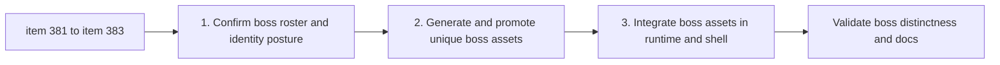

## task_072_orchestrate_unique_boss_asset_generation_and_integration_wave - Orchestrate unique boss asset generation and integration wave
> From version: 0.6.1+cad3c04
> Schema version: 1.0
> Status: Draft
> Understanding: 99%
> Confidence: 97%
> Progress: 0%
> Complexity: Medium
> Theme: Graphics
> Reminder: Update status/understanding/confidence/progress and dependencies/references when you edit this doc.

# Context
Derived from backlog items `item_381_define_exact_boss_asset_roster_and_unique_visual_identity_posture`, `item_382_define_unique_boss_asset_generation_and_promotion_workflow`, and `item_383_define_unique_boss_asset_runtime_shell_integration_and_validation`.

The current boss gameplay layer is in place, but the visual layer still falls back to base hostile families. This task exists to complete the missing boss identity wave in a controlled order:
- first lock the exact boss roster and visual differentiation goals
- then generate and promote unique boss assets
- then wire them into runtime and shell surfaces and validate the result

The wave should stay bounded to the current boss roster:
- `watchglass-prime`
- `mission-boss-sentinel`
- `mission-boss-watchglass`
- `mission-boss-rammer`

# Plan
- [ ] 1. Confirm the exact boss roster and the unique identity posture expected for each boss.
- [ ] 2. Define or refine the boss-specific prompt pack and generate candidate assets for all boss types in scope.
- [ ] 3. Curate and promote the selected boss assets into runtime asset paths.
- [ ] 4. Integrate the promoted boss assets into runtime boss presentation and shell surfaces such as the bestiary and boss-inclusive menu rosters.
- [ ] 5. Validate runtime and shell coverage, then update linked Logics docs.
- [ ] CHECKPOINT: leave generation/promotion and integration as separate commit-ready checkpoints.
- [ ] FINAL: Update related Logics docs.

# Delivery checkpoints
- Prefer one checkpoint for boss roster plus generation/promotion, then one checkpoint for runtime/shell integration.
- Keep bestiary and boss-runtime mapping aligned so shell and gameplay do not diverge visually.

# AC Traceability
- `item_381` -> `req_110`: exact boss roster and unique identity posture.
- `item_382` -> `req_110`: unique boss generation and promotion workflow.
- `item_383` -> `req_110`: runtime and shell integration plus validation.

# Decision framing
- Product framing: Required
- Product signals: boss recognizability, encounter premium feel, shell consistency
- Product follow-up: consider later boss-specific VFX or codex flavor only after asset identity lands.
- Architecture framing: Required
- Architecture signals: boss asset resolution seams in runtime and shell
- Architecture follow-up: prefer extending current asset mapping rather than creating a parallel boss-art pipeline.

# Links
- Product brief(s): `prod_017_graphical_asset_direction_for_runtime_readability_and_shell_identity`
- Architecture decision(s): `adr_052_adopt_a_content_driven_graphical_asset_pipeline_for_runtime_and_shell_surfaces`
- Backlog item(s): `item_381_define_exact_boss_asset_roster_and_unique_visual_identity_posture`, `item_382_define_unique_boss_asset_generation_and_promotion_workflow`, `item_383_define_unique_boss_asset_runtime_shell_integration_and_validation`
- Request(s): `req_110_define_unique_generated_runtime_assets_for_every_boss_type`

# AI Context
- Summary: Orchestrate the bounded wave that gives every current boss type its own promoted runtime asset and integrates those assets into runtime and shell surfaces.
- Keywords: boss assets, watchglass-prime, mission boss, bestiary, runtime integration, promotion
- Use when: Use when executing the unique boss asset wave end to end.
- Skip when: Skip when working only on one narrow boss mechanic or a non-boss hostile asset.

# Validation
- `npm run logics:lint`
- `npm run lint`
- `npm run typecheck`
- `npm run test`
- `npm run test:browser:smoke`
- Manual runtime and shell review of boss encounters, bestiary entries, and boss-inclusive main-menu rotation

# Definition of Done (DoD)
- [ ] Scope implemented and acceptance criteria covered.
- [ ] Validation commands executed and results captured.
- [ ] Linked request/backlog/task docs updated during completed waves and at closure.
- [ ] Each completed wave left a commit-ready checkpoint or an explicit exception is documented.
- [ ] Status is `Done` and progress is `100%`.

# Report
- Pending implementation.
