## task_073_orchestrate_boss_cleanup_seed_archive_and_crystal_persistence_wave - Orchestrate boss, cleanup, seed, archive, and crystal persistence wave
> From version: 0.6.1+b927df6
> Schema version: 1.0
> Status: In Progress
> Understanding: 99%
> Confidence: 96%
> Progress: 20%
> Complexity: High
> Theme: Systems
> Reminder: Update status/understanding/confidence/progress and dependencies/references when you edit this doc.

# Context
Derived from backlog items `item_381` to `item_395`.

This wave brings together seven linked threads that all deepen Emberwake after the recent shell and mission milestone:
- unique boss assets and boss shell/runtime identity
- terminal-run memory cleanup on main-menu return
- deterministic map seed derivation from player name plus selected world
- three distinct crystal generated assets
- a new loot archive shell screen
- per-world mission objective identity
- crystal persistence and compaction posture for long or dense sessions

They are separate enough to split in backlog, but close enough to benefit from one orchestrated implementation order:
- lock visual/data contracts first
- then ship state/seed/archive seams
- then integrate runtime and shell presentation
- then validate long-session and boss-runtime behavior

```mermaid
%% logics-kind: task
%% logics-signature: task|orchestrate-boss-cleanup-seed-archive-an|item-381-define-exact-boss-asset-roster-|1-complete-the-unique-boss-asset|python3-logics-skills-logics-py-flow-syn
flowchart LR
    Backlog[item 381 to item 395] --> Boss[1. Complete unique boss asset wave]
    Boss --> Runtime[2. Land terminal cleanup and seed derivation seams]
    Runtime --> Archive[3. Land loot archive and crystal asset coverage]
    Archive --> Missions[4. Land per-world mission objective identity]
    Missions --> Crystal[5. Land crystal persistence and compaction]
    Crystal --> Validate[Validate runtime, shell, and long-session behavior]
```

# Plan
- [x] 1. Complete the unique boss asset roster, generation, promotion, and runtime/shell integration wave from `item_381` to `item_383`.
- [ ] 2. Implement terminal-run cleanup ownership and teardown validation from `item_384` and `item_385`.
- [ ] 3. Implement derived map seed contract and runtime-session bootstrap from `item_386` and `item_387`.
- [ ] 4. Implement the three-crystal asset wave from `item_388` and `item_389`.
- [ ] 5. Implement the loot archive data/discovery seam plus shell surface from `item_390` and `item_391`.
- [ ] 6. Implement per-world primary mission objective naming and placement integration from `item_392` and `item_393`.
- [ ] 7. Implement crystal persistence, compaction, and validation from `item_394` and `item_395`.
- [ ] CHECKPOINT: keep boss-asset delivery, runtime/session changes, shell/archive changes, and crystal persistence changes as separate commit-ready waves.
- [ ] FINAL: Update linked Logics docs.

# Delivery checkpoints
- Checkpoint A: boss asset wave (`item_381` to `item_383`)
- Checkpoint B: terminal cleanup plus derived seed (`item_384` to `item_387`)
- Checkpoint C: crystal asset trio plus loot archive (`item_388` to `item_391`)
- Checkpoint D: per-world mission objectives plus crystal persistence (`item_392` to `item_395`)

# AC Traceability
- `item_381` to `item_383` -> `req_110`: unique boss asset roster, generation, runtime/shell integration.
- `item_384` to `item_385` -> `req_111`: terminal-run cleanup triggers, teardown, and validation.
- `item_386` to `item_387` -> `req_112`: player/world-derived seed contract and bootstrap.
- `item_388` to `item_389` -> `req_113`: three distinct crystal generated assets.
- `item_390` to `item_391` -> `req_114`: loot archive discovery persistence and shell surface.
- `item_392` to `item_393` -> `req_115`: per-world mission objective identity and placement.
- `item_394` to `item_395` -> `req_116`: crystal persistence, compaction, and long-session validation.

# Decision framing
- Product framing: Required
- Product signals: boss readability, archive discoverability, world identity, crystal trust, stable new-game determinism
- Product follow-up: later side quests, loot archive expansion, and generalized pickup compaction remain out of scope for this wave.
- Architecture framing: Required
- Architecture signals: runtime/session ownership, asset resolution seams, shell scene expansion, world mission metadata, pickup compaction
- Architecture follow-up: add ADRs only if implementation reveals a new persistent seam or teardown contract worth freezing.

# Links
- Product brief(s): `prod_017_graphical_asset_direction_for_runtime_readability_and_shell_identity`
- Architecture decision(s): `adr_052_adopt_a_content_driven_graphical_asset_pipeline_for_runtime_and_shell_surfaces`
- Backlog item(s): `item_381_define_exact_boss_asset_roster_and_unique_visual_identity_posture`, `item_382_define_unique_boss_asset_generation_and_promotion_workflow`, `item_383_define_unique_boss_asset_runtime_shell_integration_and_validation`, `item_384_define_terminal_run_cleanup_triggers_and_runtime_ownership_boundaries`, `item_385_define_terminal_run_cleanup_validation_and_teardown_execution_posture`, `item_386_define_player_world_seed_derivation_contract_and_input_normalization`, `item_387_define_runtime_session_seed_bootstrap_and_deterministic_validation`, `item_388_define_three_crystal_asset_roster_and_family_differentiation_posture`, `item_389_define_three_crystal_asset_generation_promotion_and_runtime_integration`, `item_390_define_loot_archive_roster_taxonomy_and_discovery_persistence`, `item_391_define_loot_archive_main_menu_entry_and_bestiary_style_shell_surface`, `item_392_define_per_world_primary_mission_objective_roster_and_naming`, `item_393_define_per_world_mission_objective_placement_and_guidance_integration`, `item_394_define_crystal_persistence_and_value_preservation_rules`, `item_395_define_far_dense_crystal_compaction_tuning_and_runtime_validation`
- Request(s): `req_110_define_unique_generated_runtime_assets_for_every_boss_type`, `req_111_define_a_terminal_run_memory_cleanup_posture_when_returning_to_main_screen`, `req_112_define_the_map_seed_as_a_function_of_player_name_and_selected_world`, `req_113_define_three_distinct_generated_assets_for_the_three_crystal_types`, `req_114_define_a_loot_archive_screen_with_loot_gated_drop_discovery`, `req_115_define_unique_per_world_primary_mission_objectives_with_distinct_names_and_positions`, `req_116_define_a_crystal_persistence_and_compaction_posture_for_far_and_dense_runtime_pickups`

# AI Context
- Summary: Orchestrate the post-task-072 wave that covers unique boss assets, terminal cleanup, seed derivation, loot archive, per-world mission objective identity, and crystal persistence.
- Keywords: boss assets, cleanup, seed derivation, loot archive, world missions, crystal compaction
- Use when: Use when executing requests 110 to 116 together as a structured multi-checkpoint wave.
- Skip when: Skip when working only on one narrow slice such as a single boss asset or one archive card.

# Validation
- `python3 logics/skills/logics.py flow sync refresh-mermaid-signatures`
- `npm run logics:lint`
- `npm run lint`
- `npm run typecheck`
- `npm run test`
- `npm run build && npm run performance:validate`
- `npm run test:browser:smoke`
- Manual runtime review of boss encounters, loot archive unlocks, world-specific mission objectives, and long-session crystal persistence behavior

# Definition of Done (DoD)
- [ ] Scope implemented and acceptance criteria covered.
- [ ] Validation commands executed and results captured.
- [ ] Linked request/backlog/task docs updated during completed waves and at closure.
- [ ] Each completed wave left a commit-ready checkpoint or an explicit exception is documented.
- [ ] Status is `Done` and progress is `100%`.

# Report
- Checkpoint A completed: unique boss assets were generated, promoted, and integrated into runtime plus shell surfaces.
