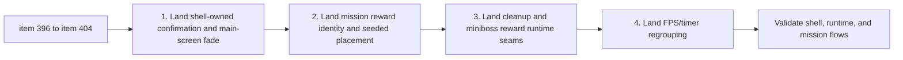

## task_074_orchestrate_shell_confirmation_seeded_missions_and_miniboss_reward_wave - Orchestrate shell confirmation, seeded missions, and miniboss reward wave
> From version: 0.7.0+1b1dda6
> Schema version: 1.0
> Status: Draft
> Understanding: 99%
> Confidence: 97%
> Progress: 0%
> Complexity: High
> Theme: Systems
> Reminder: Update status/understanding/confidence/progress and dependencies/references when you edit this doc.

# Context
Derived from backlog items `item_396` to `item_404`.

This wave ties together six nearby threads that all sit at the shell/runtime seam:
- a dedicated abandon confirmation owned by the live shell
- smoother enemy backdrop transitions on the main screen
- unique mission reward items with seeded mission placement
- stronger terminal runtime memory cleanup
- mini-boss chest rewards with owned-skill upgrades and fallback salvage
- tighter runtime HUD grouping for FPS and timer

They are split in backlog because they touch different seams, but they benefit from one orchestrated wave:
- land shell confirmation and backdrop polish first
- then land mission reward/placement contracts
- then land cleanup and mini-boss reward logic
- finally close with HUD regrouping and validation

# Plan
- [ ] 1. Land the shell-owned abandon confirmation surface from `item_396`.
- [ ] 2. Land the main-screen enemy fade transition from `item_397`.
- [ ] 3. Land unique mission reward item roster and asset integration from `item_398`.
- [ ] 4. Land seeded world-specific mission objective placement from `item_399`.
- [ ] 5. Land terminal runtime texture-cache ownership and release seams from `item_400`.
- [ ] 6. Land memory cleanup validation and main-screen allowlist tuning from `item_401`.
- [ ] 7. Land mini-boss chest reward rules from `item_402`.
- [ ] 8. Land mini-boss reward toast feedback and fallback salvage from `item_403`.
- [ ] 9. Land grouped FPS/timer HUD posture from `item_404`.
- [ ] CHECKPOINT: keep shell UX, mission identity/placement, runtime cleanup, mini-boss rewards, and HUD regrouping as separate commit-ready waves.
- [ ] FINAL: Update linked Logics docs.

# Delivery checkpoints
- Checkpoint A: shell-owned abandon confirmation plus main-screen fade (`item_396` to `item_397`)
- Checkpoint B: mission reward identity plus seeded placement (`item_398` to `item_399`)
- Checkpoint C: terminal cleanup ownership plus validation (`item_400` to `item_401`)
- Checkpoint D: mini-boss chest rewards plus feedback/fallback (`item_402` to `item_403`)
- Checkpoint E: HUD timer/FPS regrouping (`item_404`)

# AC Traceability
- `item_396` -> `req_117`: dedicated runtime shell abandon confirmation.
- `item_397` -> `req_118`: fade transition for rotating main-screen enemy backdrops.
- `item_398` to `item_399` -> `req_119`: unique mission reward items/assets and seeded objective placement.
- `item_400` to `item_401` -> `req_120`: terminal runtime texture cleanup ownership and validation.
- `item_402` to `item_403` -> `req_121`: mini-boss chest rewards, toast feedback, and fallback salvage.
- `item_404` -> `req_122`: timer stacked under FPS in the runtime HUD.

# Decision framing
- Product framing: Required
- Product signals: reward clarity, mission replayability, shell safety, main-screen polish, memory trust, HUD scanability
- Product follow-up: later archive expansion, mission side content, and broader shell polish remain out of scope.
- Architecture framing: Required
- Architecture signals: shell ownership boundaries, seeded mission generation, texture cache lifecycle, runtime reward seams
- Architecture follow-up: add ADRs only if implementation exposes reusable lifecycle or generation seams worth freezing.

# Links
- Product brief(s): (none yet)
- Architecture decision(s): (none yet)
- Backlog item(s): `item_396_define_a_dedicated_runtime_shell_abandon_confirmation_surface`, `item_397_define_a_fade_transition_contract_for_rotating_main_screen_enemy_backdrops`, `item_398_define_unique_primary_mission_reward_item_roster_and_asset_coverage`, `item_399_define_seeded_world_specific_primary_mission_objective_placement`, `item_400_define_terminal_runtime_texture_cache_release_and_asset_ownership_boundaries`, `item_401_define_terminal_memory_cleanup_validation_and_runtime_main_screen_allowlist_tuning`, `item_402_define_miniboss_chest_reward_resolution_and_owned_skill_upgrade_rules`, `item_403_define_miniboss_reward_toast_feedback_and_maxed_build_fallback_salvage`, `item_404_define_a_grouped_runtime_hud_cluster_for_fps_and_timer`
- Request(s): `req_117_define_a_dedicated_in_run_abandon_confirmation_surface_instead_of_the_generic_modal_system`, `req_118_define_a_fade_in_fade_out_transition_posture_for_main_screen_background_entity_rotation`, `req_119_define_unique_per_world_mission_reward_items_and_seeded_objective_positions`, `req_120_define_a_terminal_runtime_texture_and_asset_cache_cleanup_posture_for_main_screen_return`, `req_121_define_a_boss_chest_reward_flow_with_random_skill_upgrades_and_fallback_salvage`, `req_122_define_a_runtime_hud_posture_with_the_timer_stacked_under_the_fps_counter`

# AI Context
- Summary: Orchestrate the next shell/runtime wave spanning dedicated abandon confirmation, main-screen enemy fades, mission reward identity, seeded mission placement, terminal cleanup, mini-boss rewards, and HUD timer/FPS regrouping.
- Keywords: shell confirmation, mission rewards, seeded placement, cleanup, mini-boss chest, hud timer fps
- Use when: Use when executing requests 117 to 122 together as a structured multi-checkpoint wave.
- Skip when: Skip when working on only one isolated shell tweak or one single reward seam.

# Validation
- `python3 logics/skills/logics.py flow sync refresh-mermaid-signatures`
- `npm run logics:lint`
- `npm run lint`
- `npm run typecheck`
- `npm run test`
- `npm run build && npm run performance:validate`
- `npm run test:browser:smoke`
- Manual runtime review of abandon confirmation, mini-boss reward chests, mission reward identity/placement, main-screen enemy fades, and HUD timer/FPS grouping

# Definition of Done (DoD)
- [ ] Scope implemented and acceptance criteria covered.
- [ ] Validation commands executed and results captured.
- [ ] Linked request/backlog/task docs updated during completed waves and at closure.
- [ ] Each completed wave left a commit-ready checkpoint or an explicit exception is documented.
- [ ] Status is `Done` and progress is `100%`.
