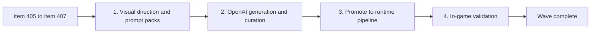

## task_075_orchestrate_per_biome_terrain_asset_variation_generation_promotion_and_validation_wave - Orchestrate per-biome terrain asset variation generation, promotion, and validation wave
> From version: 0.7.2
> Schema version: 1.0
> Status: Ready
> Understanding: 100%
> Confidence: 97%
> Progress: 0%
> Complexity: Medium
> Theme: Graphics
> Reminder: Update status/understanding/confidence/progress and dependencies/references when you edit this doc.

# Context
Derived from backlog items `item_405_define_per_biome_terrain_visual_direction_production_specs_and_prompt_packs`, `item_406_execute_openai_terrain_generation_curation_and_runtime_promotion_for_three_biomes`, and `item_407_validate_promoted_terrain_assets_in_game_for_readability_and_biome_boundary_continuity`.

The four runtime terrain assets currently share the same visual texture — the Ashfield dark cracked volcanic stone with orange ember spots. Worlds 2 through 4 (Emberplain, Glowfen, Obsidian) carry no distinct ground identity, which undermines the visual impact of the unlock ladder and the atmospheric contract each world makes through its authored description.

This task covers the full production loop to fix that:
- first define the visual direction and prompt packs per biome, with explicit edge-continuity and production constraints
- then execute the OpenAI Images generation workflow, curate scratch candidates, and promote approved WebP files into the runtime pipeline
- then validate the promoted assets in-game for entity contrast, pickup legibility, biome-boundary continuity, and world selection card distinctness

The Ashfield asset (`map.terrain.ashfield.runtime.webp`) is locked throughout this task — it is the production reference, not a target for change.

# Plan
- [ ] 1. **Define visual direction and prompt packs** (`item_405`)
  - Document the per-biome visual direction for Emberplain, Glowfen, and Obsidian, grounded in the world descriptions from `worldProfiles.ts`
  - Write the shared production spec: 512×512 px, WebP, no alpha, seamless tile, dark floor, edge-continuity constraint (outer ~10–15% of canvas converges to Ashfield's dark neutral border tone)
  - Write at least one copy-paste prompt per biome ready to submit to the OpenAI Images API
- [ ] 2. **Execute OpenAI generation and curate outputs** (`item_406`)
  - Write or adapt a generation script (reuse `generateFirstWaveAssets.mjs` pattern) to call the OpenAI Images API for each of the three terrain `assetId`s
  - Deposit scratch candidates under `output/imagegen/terrain-variation/<assetId>/`
  - Review candidates — select the winning variant per biome, record in `selection.json`
  - Visually confirm edge-continuity: the border zone of each selected candidate matches Ashfield's dark near-neutral perimeter tone
- [ ] 3. **Promote approved assets into runtime pipeline** (`item_406`)
  - Export / convert each selected variant to WebP at 512×512, no alpha
  - Drop files into `src/assets/map/runtime/` using the canonical names:
    - `map.terrain.emberplain.runtime.webp`
    - `map.terrain.glowfen.runtime.webp`
    - `map.terrain.obsidian.runtime.webp`
  - No source code changes required — the asset catalog already references these paths
- [ ] 4. **Validate in-game** (`item_407`)
  - Launch a runtime session on each of the three new biomes and confirm entities and pickups remain legible
  - Traverse a biome boundary and confirm no hard visual cut line
  - Open the world selection screen and confirm the three new biomes are visually distinguishable from each other and from Ashfield
  - If any asset fails: flag it, refine the prompt, and re-run step 2 for that biome only
- [ ] CHECKPOINT: leave prompt/generation/promotion as one commit-ready checkpoint, validation as a second.
- [ ] FINAL: Update linked Logics docs — set `req_124` items to Done, update backlog items and this task.

# Delivery checkpoints
- Checkpoint A: visual direction documented, prompts written, generation executed, assets promoted to `src/assets/map/runtime/`.
- Checkpoint B: in-game validation passed for all three biomes, Logics docs updated, wave closed.

# AC Traceability
- `item_405` → `req_124` AC1, AC3, AC4: visual direction brief, prompt pack, Ashfield locked.
- `item_406` → `req_124` AC4, AC5, AC6: OpenAI generation executed, scratch + selection.json, assets promoted to runtime.
- `item_407` → `req_124` AC7, AC8: in-game entity/pickup contrast, biome-boundary continuity, world card distinctness.

# Decision framing
- Product framing: Required
- Product signals: world unlock visual impact, biome identity, world selection card clarity
- Product follow-up: consider a dedicated Cinderfall Crown terrain asset in a future art pass if tier-5 identity warrants it.
- Architecture framing: Optional
- Architecture signals: reuse existing generation/promotion script pattern rather than introducing a parallel pipeline
- Architecture follow-up: none expected — the asset catalog and pipeline already support these files.

# Links
- Product brief(s): `prod_017_graphical_asset_direction_for_runtime_readability_and_shell_identity`
- Architecture decision(s): `adr_052_adopt_a_content_driven_graphical_asset_pipeline_for_runtime_and_shell_surfaces`
- Backlog item(s): `item_405_define_per_biome_terrain_visual_direction_production_specs_and_prompt_packs`, `item_406_execute_openai_terrain_generation_curation_and_runtime_promotion_for_three_biomes`, `item_407_validate_promoted_terrain_assets_in_game_for_readability_and_biome_boundary_continuity`
- Request(s): `req_124_define_distinct_per_biome_terrain_asset_variation_for_emberplain_glowfen_and_obsidian`

# AI Context
- Summary: Orchestrate the full wave that replaces the three duplicate terrain assets with distinct per-biome textures generated via OpenAI, curated, promoted into the runtime pipeline, and validated in-game.
- Keywords: terrain, biome variation, openai generation, promotion, runtime asset, emberplain, glowfen, obsidian, ashfield reference, edge-continuity, validation
- Use when: Use when executing the terrain variation wave end to end.
- Skip when: Skip when working on entity sprites, obstacle assets, shell UI, or any other non-terrain asset family.

# Validation
- `npm run logics:lint`
- `npm run lint`
- `npm run typecheck`
- `npm run test`
- Manual in-game review: entity/pickup contrast on each new biome, biome-boundary continuity, world selection card distinctness

# Definition of Done (DoD)
- [ ] Scope implemented and acceptance criteria covered.
- [ ] Validation commands executed and results captured.
- [ ] Linked request/backlog/task docs updated during completed waves and at closure.
- [ ] Each completed wave left a commit-ready checkpoint or an explicit exception is documented.
- [ ] Status is `Done` and progress is `100%`.
