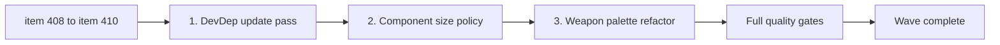

## task_076_orchestrate_codebase_hygiene_wave_for_dependency_updates_component_size_policy_and_weapon_palette_refactor - Orchestrate codebase hygiene wave for dependency updates, component size policy, and weapon palette refactor
> From version: 0.7.2
> Schema version: 1.0
> Status: Ready
> Understanding: 100%
> Confidence: 97%
> Progress: 0%
> Complexity: Medium
> Theme: Delivery
> Reminder: Update status/understanding/confidence/progress and dependencies/references when you edit this doc.

# Context
Derived from backlog items `item_408_execute_quarterly_devdependency_update_pass_for_eslint_vite_jsdom_and_related_packages`, `item_409_define_component_size_threshold_and_extraction_guideline_for_appmetascenepanel_and_activeruntimeshellcontent`, and `item_410_replace_resolveweaponpalette_nested_ternaries_with_a_lookup_table_in_combatskillfeedbackscene`.

A post-0.7.2 codebase audit identified three bounded hygiene items that carry compounding maintenance risk if left unaddressed. None block current gameplay delivery, but each grows more costly with every release cycle. This task covers all three in one controlled wave:
- a quarterly devDependency update pass for six packages at major version distance
- a component size threshold policy for the two largest shell components
- a single-file refactor of the weapon palette dispatch from nested ternaries to a lookup table

The three items are independent and can be executed in any order, but grouping them in one wave keeps the hygiene overhead bounded.

# Plan
- [ ] 1. **Execute devDependency update pass** (`item_408`)
  - Group 1 — ESLint family: update `eslint`, `@eslint/js`, `typescript-eslint` to current stable versions; run `npm run lint` + `npm run typecheck` + `npm run test`; confirm ESLint architectural boundary rules in `eslint.config.js` still enforce correctly
  - Group 2 — Vite family: update `vite`, `vite-plugin-pwa`, `@vitejs/plugin-react` to current stable versions; run `npm run build` + `npm run performance:validate`; document any `vite.config.ts` changes in the commit message
  - Group 3 — Test environment: update `jsdom`, `@types/node`; run `npm run test`; confirm no test environment API regressions
  - Each group lands as a separate commit with configuration changes documented in the message
- [ ] 2. **Define component size threshold and extraction guideline** (`item_409`)
  - Add a short section to `CLAUDE.md`: 1 200 LOC threshold for `AppMetaScenePanel` and `ActiveRuntimeShellContent`, with the extraction guideline (what constitutes a good extraction candidate)
  - No extraction from either file — the deliverable is the documented policy only
- [ ] 3. **Replace `resolveWeaponPalette` nested ternaries** (`item_410`)
  - Replace the nested ternary chain (lines 44–91 in `src/game/render/CombatSkillFeedbackScene.tsx`) with a plain object literal keyed by weapon type
  - Cover all twelve existing weapon variants; verify visual output is identical
  - Run `npm run test` — must pass without modification to any test file
- [ ] CHECKPOINT: each of the three items above is a separate commit-ready checkpoint.
- [ ] FINAL: Update linked Logics docs — set `req_123` status to Done, update backlog items and this task.

# Delivery checkpoints
- Checkpoint A: ESLint family updated and validated.
- Checkpoint B: Vite family updated and validated.
- Checkpoint C: Test environment updated and validated.
- Checkpoint D: Component size policy added to `CLAUDE.md`.
- Checkpoint E: `resolveWeaponPalette` refactored and tests passing.

# AC Traceability
- `item_408` → `req_123` AC1, AC2: dependency update pass, config changes documented, boundary rules preserved.
- `item_409` → `req_123` AC3, AC4: 1 200 LOC threshold and extraction guideline added, no extraction performed.
- `item_410` → `req_123` AC5: lookup table replacement, identical visual output, tests pass unchanged.

# Decision framing
- Product framing: Optional
- Product signals: none visible to players
- Product follow-up: schedule the next quarterly dependency pass after the next major release.
- Architecture framing: Required
- Architecture signals: toolchain health, ESLint boundary rule survival, render dispatch pattern
- Architecture follow-up: if Vite 8 requires non-trivial config changes, document in an ADR addendum.

# Links
- Request(s): `req_123_define_a_codebase_hygiene_wave_for_dependency_updates_component_size_thresholds_and_weapon_palette_readability`
- Backlog item(s): `item_408_execute_quarterly_devdependency_update_pass_for_eslint_vite_jsdom_and_related_packages`, `item_409_define_component_size_threshold_and_extraction_guideline_for_appmetascenepanel_and_activeruntimeshellcontent`, `item_410_replace_resolveweaponpalette_nested_ternaries_with_a_lookup_table_in_combatskillfeedbackscene`

# AI Context
- Summary: Orchestrate the three-item codebase hygiene wave: quarterly devDependency update pass, component size threshold policy, and resolveWeaponPalette lookup table refactor.
- Keywords: devDependency, eslint, vite, jsdom, component size, CLAUDE.md, weapon palette, lookup table, hygiene, maintenance
- Use when: Use when executing the post-0.7.2 codebase hygiene wave end to end.
- Skip when: Skip when working on gameplay, runtime behavior, or asset production.

# Validation
- `npm run logics:lint`
- `npm run lint`
- `npm run typecheck`
- `npm run test`
- `npm run build`
- `npm run performance:validate`

# Definition of Done (DoD)
- [ ] Scope implemented and acceptance criteria covered.
- [ ] Validation commands executed and results captured.
- [ ] Linked request/backlog/task docs updated during completed waves and at closure.
- [ ] Each completed wave left a commit-ready checkpoint or an explicit exception is documented.
- [ ] Status is `Done` and progress is `100%`.
